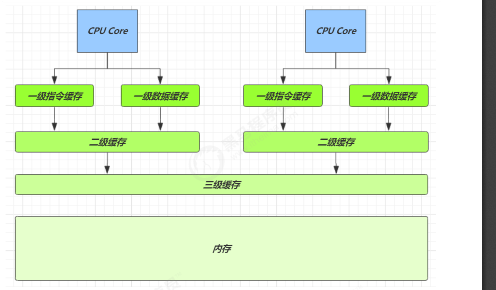
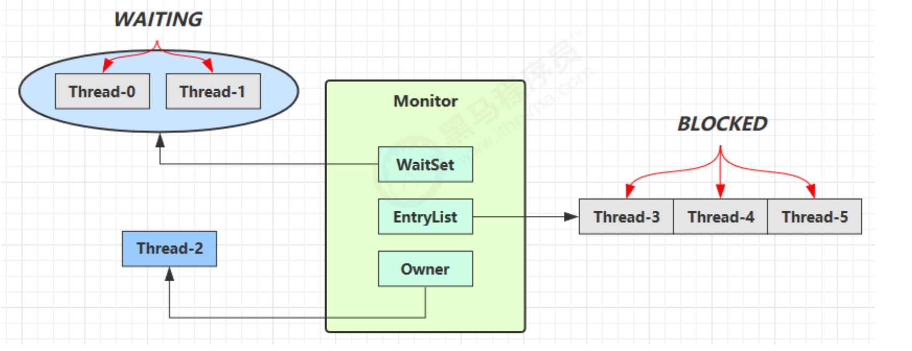
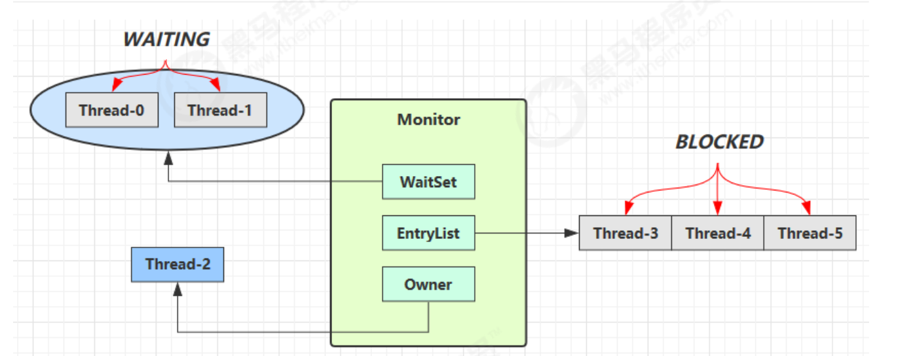
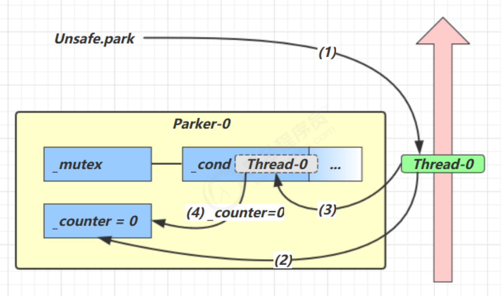

# 原理篇

## [2.并发编程_原理.pdf](../pdf/并发编程_原理.pdf)

### 1.指令级并行原理

#### 1.名词(Clock Cycle Time)

意思是 CPU 能 够识别的最小时间单位

例如，运行一条加法指令一般需要一个时钟周期时间

##### CPI

有的指令需要更多的时钟周期时间，所以引出了 CPI （Cycles Per Instruction）指令平均时钟周期数

##### IPC

IPC（Instruction Per Clock Cycle）即 CPI 的倒数，表示每个时钟周期能够运行的指令数


##### CPU 执行时间

程序的 CPU 执行时间

```
 程序 CPU 执行时间 = 指令数 * CPI * Clock Cycle Time 
```

### 2. 鱼罐头的故事

### 3. 指令重排序优化

### 4. 支持流水线的处理器

### 5. SuperScalar 处理器


## 2.CPU 缓存结构原理

### 1.CPU 缓存结构



### 2.CPU 缓存读

### 3. CPU 缓存一致性


## 3. volatile 原理


### 3.1 如何保证可见性

- 写屏障（sfence）保证在该屏障之前的，对共享变量的改动，都同步到主存当中
- 读屏障（lfence）保证在该屏障之后，对共享变量的读取，加载的是主存中最新数据

### 3.2如何保证有序性

- 写屏障会确保指令重排序时，不会将写屏障之前的代码排在写屏障之后
- 读屏障会确保指令重排序时，不会将读屏障之后的代码排在读屏障之前


还是那句话，不能解决指令交错：

- 写屏障仅仅是保证之后的读能够读到最新的结果，但不能保证读跑到它前面去

- 而有序性的保证也只是保证了本线程内相关代码不被重排序


### 3. double-checked locking 问题


## 4.final 原理

### 4.1. 设置 final 变量的原理

final 变量的赋值也会通过 putfield 指令来完成，同样在这条指令之后也会加入写屏障，保证在其它线程读到 它的值时不会出现为 0 的情况

### 4.2 获取 final 变量的原理


## 5.Monitor 原理

每个 Java 对象都可以关联一个 Monitor 对象，如果使用 synchronized 给对象上锁（重量级）之后，该对象头的 Mark Word 中就被设置指向 Monitor 对象的指针

Monitor 结构如下



- 刚开始 Monitor 中 Owner 为 null 

- 当 Thread-2 执行 synchronized(obj) 就会将 Monitor 的所有者 Owner 置为 Thread-2，Monitor中只能有一 个 Owner

-  在 Thread-2 上锁的过程中，如果 Thread-3，Thread-4，Thread-5 也来执行 synchronized(obj)，就会进入 EntryList BLOCKED Thread-2 执行完同步代码块的内容，然后唤醒 EntryList 中等待的线程来竞争锁，竞争的时是非公平的

-  图中 WaitSet 中的 Thread-0，Thread-1 是之前获得过锁，但条件不满足进入 WAITING 状态的线程，后面讲 wait-notify 时会分析


## 6.synchronized 原理

### 6.1 synchronized 原理进阶

### 6.1.1. 轻量级锁

轻量级锁的使用场景：如果一个对象虽然有多线程要加锁，但加锁的时间是错开的（也就是没有竞争），那么可以 使用轻量级锁来优化

### 6.1.2. 锁膨胀

如果在尝试加轻量级锁的过程中，CAS 操作无法成功，这时一种情况就是有其它线程为此对象加上了轻量级锁（有 竞争），这时需要进行锁膨胀，将轻量级锁变为重量级锁

### 6.1.3. 自旋优化

重量级锁竞争的时候，还可以使用自旋来进行优化，如果当前线程自旋成功（即这时候持锁线程已经退出了同步 块，释放了锁），这时当前线程就可以避免阻塞

### 6.1.4. 偏向锁

### 6.1.5. 锁消除


## 7.wait notify 原理



- Owner 线程发现条件不满足，调用 wait 方法，即可进入 WaitSet 变为 WAITING 状态 
- BLOCKED 和 WAITING 的线程都处于阻塞状态，不占用 CPU 时间片
-  BLOCKED 线程会在 Owner 线程释放锁时唤醒
-  WAITING 线程会在 Owner 线程调用 notify 或 notifyAll 时唤醒，但唤醒后并不意味者立刻获得锁，仍需进入 EntryList 重新竞争


## 8.join 原理

是调用者轮询检查线程 alive 状态

```java
t1.join();
```


等价于下面的代码

```java
        synchronized (t1) {
            // 调用者线程进入 t1 的 waitSet 等待, 直到 t1 运行结束 
            while (t1.isAlive()) {
                t1.wait(0);
            }
        }

```


## 9.park unpark 原理

其实就是基于Unsafe.park实现的




## 10.AQS 原理


### 10.1概述

全称是 AbstractQueuedSynchronizer，是阻塞式锁和相关的同步器工具的框架

特点：

- 用 state 属性来表示资源的状态（分独占模式和共享模式），子类需要定义如何维护这个状态，控制如何获取 锁和释放锁

  - getState - 获取 state 状态 

  - setState - 设置 state 状态 

  - compareAndSetState - cas 机制设置 state 状态 

  - 独占模式是只有一个线程能够访问资源，而共享模式可以允许多个线程访问资源

- 提供了基于 FIFO 的等待队列，类似于 Monitor 的 EntryList
- 条件变量来实现等待、唤醒机制，支持多个条件变量，类似于 Monitor 的 WaitSet


子类主要实现这样一些方法（默认抛出 UnsupportedOperationException）

- tryAcquire
-  tryRelease 
- tryAcquireShared
-  tryReleaseShared 
- isHeldExclusively 


获取锁

```java 
// 如果获取锁失败 
        if (!tryAcquire(arg)) {
            // 入队, 可以选择阻塞当前线程  park unpark 
        }
```


释放锁

```java
        // 如果释放锁成功 
        if (tryRelease(arg)) {
            // 让阻塞线程恢复运行 
        }
```

### 2. 实现不可重入锁

### 自定义同步器

```java
final class MySync extends AbstractQueuedSynchronizer {
    @Override
    protected boolean tryAcquire(int acquires) {
        if (acquires == 1) {
            if (compareAndSetState(0, 1)) {
                setExclusiveOwnerThread(Thread.currentThread());
                return true;
            }
        }
        return false;
    }

    @Override
    protected boolean tryRelease(int acquires) {
        if (acquires == 1) {
            if (getState() == 0) {
                thrownewIllegalMonitorStateException();
            }
            setExclusiveOwnerThread(null);
            setState(0);
            return true;
        }
        return false;
    }

    protected Conditionn ewCondition() {
        return newConditionObject();
    }

    @Override
    protected boolean isHeldExclusively() {
        return getState() == 1;
    }
}
```

### 自定义锁

```java 
class MyLock implements Lock {
    static MySync sync = new MySync();
    @Override // 尝试，不成功，进入等待队列 
    public void lock() {
        sync.acquire(1);
    }

    @Override // 尝试，不成功，进入等待队列，可打断 
    public void lockInterruptibly() throwsInterruptedException {
        sync.acquireInterruptibly(1);
    }

    @Override // 尝试一次，不成功返回，不进入队列 
    public boolean tryLock() {
        return sync.tryAcquire(1);
    }

    @Override // 尝试，不成功，进入等待队列，有时限
    public boolean tryLock(longtime, TimeUnitunit) throwsInterruptedException {
        return sync.tryAcquireNanos(1, unit.toNanos(time));
    }

    @Override // 释放锁 
    public void unlock() {
        sync.release(1);
    }

    @Override // 生成条件变量 
    public Condition newCondition() {
        return sync.newCondition();
    }
}
```

