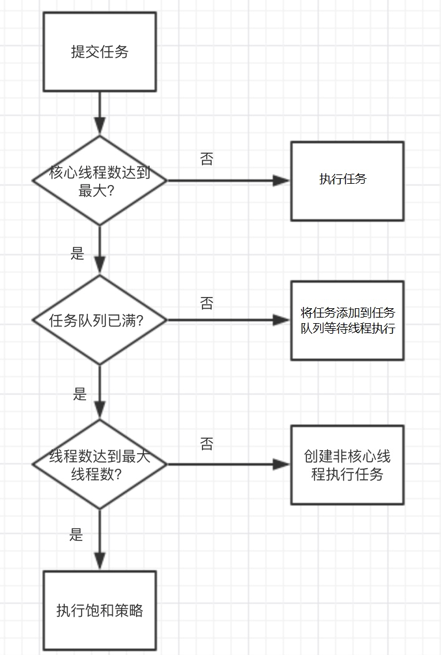

# 线程池

# 线程池学习

#### [线程池研发讲义.ppt](线程池研发讲义.ppt)

#### [郑州校区-张学全-线程池研发大纲_v2019-11-21.xmind](郑州校区-张学全-线程池研发大纲_v2019-11-21.xmind)


## 1.【理解】线程池基本概念

### **1.3**使用线程池有哪些优势

- 1:线程和任务分离,提升线程重用性;

- 2:控制线程并发数量,降低服务器压力,统一管理所有线程;

- 3:提升系统响应速度,假如创建线程用的时间为T1，执行任务用的时间为T2,销毁线程用的时间为T3，那么使用线程池就免去了T1和T3的时间；

  

  

  

  **2.1**Java内置线程池介绍

  

  ## 2.【理解】线程池工作原理

  ### Java内置线程池原理剖析

  我们要想自定义线程池,必须先了解线程池的工作原理,才能自己定义线程池；

  这里我们通过观察java中ThreadPoolExecutor的源码来学习线程池的原理;

  

  ### 2.1.1:ThreadPoolExecutor部分源码

  ```java
  构造方法:
  public ThreadPoolExecutor(int corePoolSize, //核心线程数量
                                int maximumPoolSize,//     最大线程数
                                long keepAliveTime, //       最大空闲时间
                                TimeUnit unit,         //        时间单位
                                BlockingQueue<Runnable> workQueue,   //   任务队列
                                ThreadFactory threadFactory,    // 线程工厂
                                RejectedExecutionHandler handler  //  饱和处理机制
  	) 
  { ... }
  
  ```

  **2.1.3:线程池工作流程总结示意图

  

  

## 3.【掌握】自定义线程池

### **2.2:**自定义线程池参数设计分析

- 1:核心线程数(corePoolSize)

  核心线程数的设计需要依据任务的处理时间和每秒产生的任务数量来确定,例如:执行一个任务需要0.1秒,系统百分之80的时间每秒都会产生100个任务,那么要想在1秒内处理完这100个任务,就需要10个线程,此时我们就可以设计核心线程数为10;当然实际情况不可能这么平均,所以我们一般按照8020原则设计即可,既按照百分之80的情况设计核心线程数,剩下的百分之20可以利用最大线程数处理;

  

- 2:任务队列长度(workQueue)

  任务队列长度一般设计为:核心线程数/单个任务执行时间*2即可;例如上面的场景中,核心线程数设计为10,单个任务执行时间为0.1秒,则队列长度可以设计为200;

  

- 3:最大线程数(maximumPoolSize)

  最大线程数的设计除了需要参照核心线程数的条件外,还需要参照系统每秒产生的最大任务数决定:例如:上述环境中,如果系统每秒最大产生的任务是1000个,那么,最大线程数=(最大任务数-任务队列长度)*单个任务执行时间;既: 最大线程数=(1000-200)*0.1=80个;

  

- 4:最大空闲时间(keepAliveTime)

  这个参数的设计完全参考系统运行环境和硬件压力设定,没有固定的参考值,用户可以根据经验和系统产生任务的时间间隔合理设置一个值即可;

### **2.2:****自定义****线程池****-****实现步骤**

1:编写任务类(MyTask),实现Runnable接口;

2:编写线程类(MyWorker),用于执行任务,需要持有所有任务;

3:编写线程池类(MyThreadPool),包含提交任务,执行任务的能力;


## 4.【应用】java内置线程池

### **2.3:Java****内置线程池****-****ExecutorService****介绍**

ExecutorService接口是java内置的线程池接口,通过学习接口中的方法,可以快速的掌握java内置线程池的基本使用

常用方法:

-  void shutdown()  启动一次顺序关闭，执行以前提交的任务，但不接受新任务。 

-  List\<Runnable\> shutdownNow() 停止所有正在执行的任务，暂停处理正在等待的任务，并返回等待执行的任务列表。 

- \<T\> Future\<T\> submit(Callable\<T\> task)  执行带返回值的任务，返回一个Future对象。 

-  Future\<?\> submit(Runnable task) 执行 Runnable 任务，并返回一个表示该任务的 Future。 

- \<T\> Future\<T\> submit(Runnable task, T result)  执行 Runnable 任务，并返回一个表示该任务的 Future。 


### **2.3:Java****内置线程池****-****ExecutorService****获取**


获取ExecutorService可以利用JDK中的Executors 类中的静态方法,常用获取方式如下:

- static ExecutorService newCachedThreadPool() 创建一个默认的线程池对象,里面的线程可重用,且在第一次使用时才创建 

- static ExecutorService newCachedThreadPool(ThreadFactory threadFactory) 

  ​     线程池中的所有线程都使用ThreadFactory来创建,这样的线程无需手动启动,自动执行; 

- static ExecutorService newFixedThreadPool(int nThreads)  创建一个可重用固定线程数的线程池 

- static ExecutorService newFixedThreadPool(int nThreads, ThreadFactory threadFactory) 

  ​     创建一个可重用固定线程数的线程池且线程池中的所有线程都使用ThreadFactory来创建。 

- static ExecutorService newSingleThreadExecutor() 

  ​    创建一个使用单个 worker 线程的 Executor，以无界队列方式来运行该线程。 

- static ExecutorService newSingleThreadExecutor(Thread

- Factory threadFactory) 

  ​     创建一个使用单个 worker 线程的 Executor，且线程池中的所有线程都使用ThreadFactory来创建。 


### **2.3:Java****内置线程池****-****ScheduledExecutorService**


ScheduledExecutorService是ExecutorService的子接口,具备了延迟运行或定期执行任务的能力,

常用获取方式如下:

- static ScheduledExecutorService newScheduledThreadPool(int corePoolSize)

  创建一个可重用固定线程数的线程池且允许延迟运行或定期执行任务;

- static ScheduledExecutorService newScheduledThreadPool(int corePoolSize, ThreadFactory threadFactory)

​     创建一个可重用固定线程数的线程池且线程池中的所有线程都使用ThreadFactory来创建,且允许延迟运行或定期执行任务; 

- static ScheduledExecutorService newSingleThreadScheduledExecutor() 

​     创建一个单线程执行程序，它允许在给定延迟后运行命令或者定期地执行。 

- static ScheduledExecutorService newSingleThreadScheduledExecutor(ThreadFactory threadFactory) 

​      创建一个单线程执行程序，它可安排在给定延迟后运行命令或者定期地执行。 


### **2.3:Java****内置线程池****-****ScheduledExecutorService**

ScheduledExecutorService常用方法如下:

- <\V\> ScheduledFuture\<V\> schedule(Callable\<V\> callable, long delay, TimeUnit unit) 

​     延迟时间单位是unit,数量是delay的时间后执行callable。 

-  ScheduledFuture\<?\> schedule(Runnable command, long delay, TimeUnit unit) 

​     延迟时间单位是unit,数量是delay的时间后执行command。 

-  ScheduledFuture\<?\> scheduleAtFixedRate(Runnable command, long initialDelay, long period, TimeUnit unit) 

​     延迟时间单位是unit,数量是initialDelay的时间后,每间隔period时间重复执行一次command。 

-  ScheduledFuture\<?\> scheduleWithFixedDelay(Runnable command, long initialDelay, long delay, TimeUnit unit) 

​     创建并执行一个在给定初始延迟后首次启用的定期操作，随后，在每一次执行终止和下一次执行开始之间都存在给定的延迟。 


### **2.3:Java****内置线程池****-****异步计算结果****(Future)**

Future 的常用方法如下:

boolean cancel(boolean mayInterruptIfRunning) 

​     试图取消对此任务的执行。 

-  V get()

​     如有必要，等待计算完成，然后获取其结果。 

-  V get(long timeout, TimeUnit unit) 

​     如有必要，最多等待为使计算完成所给定的时间之后，获取其结果（如果结果可用）。 

-  boolean isCancelled() 

​     如果在任务正常完成前将其取消，则返回 true。 

-  boolean isDone() 

​     如果任务已完成，则返回 true。 


## **线程池总结**

**线程池的使用步骤可以归纳总结为五步** **:**

-  1:利用Executors工厂类的静态方法,创建线程池对象;

-  2:编写Runnable或Callable实现类的实例对象;

-  3:利用ExecutorService的submit方法或ScheduledExecutorService的schedule方 法提交并执行线程任务

-  4:如果有执行结果,则处理异步执行结果(Future)

-  5:调用shutdown()方法,关闭线程池
