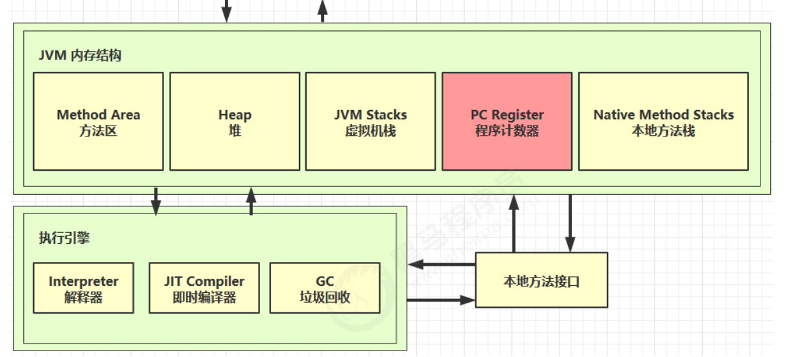
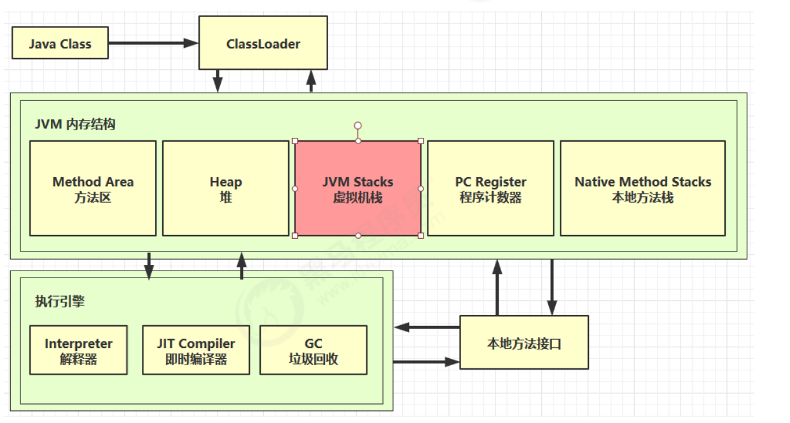
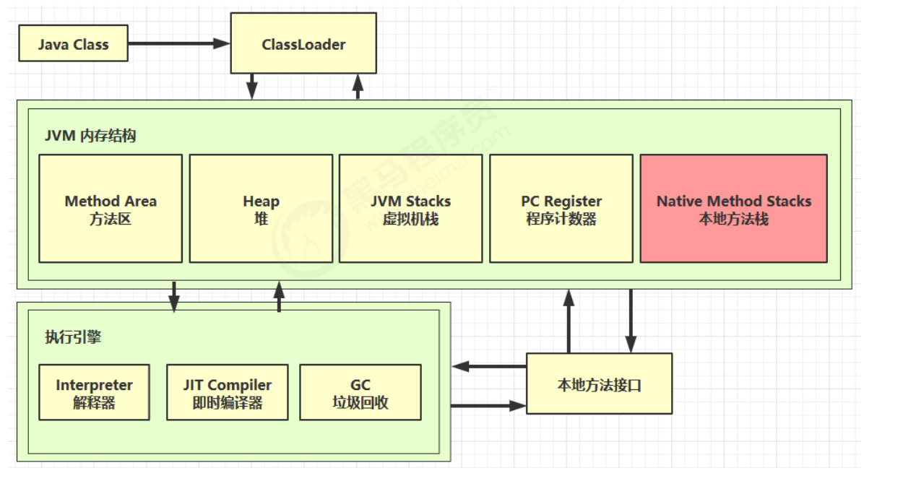
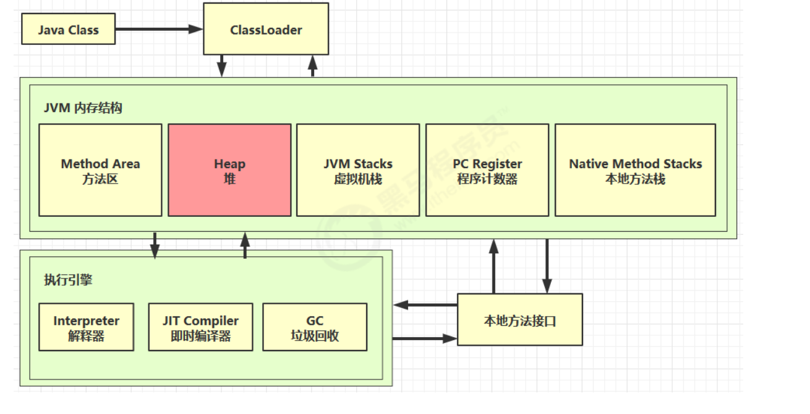
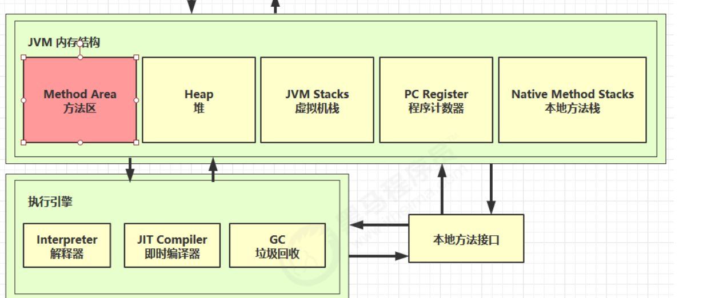
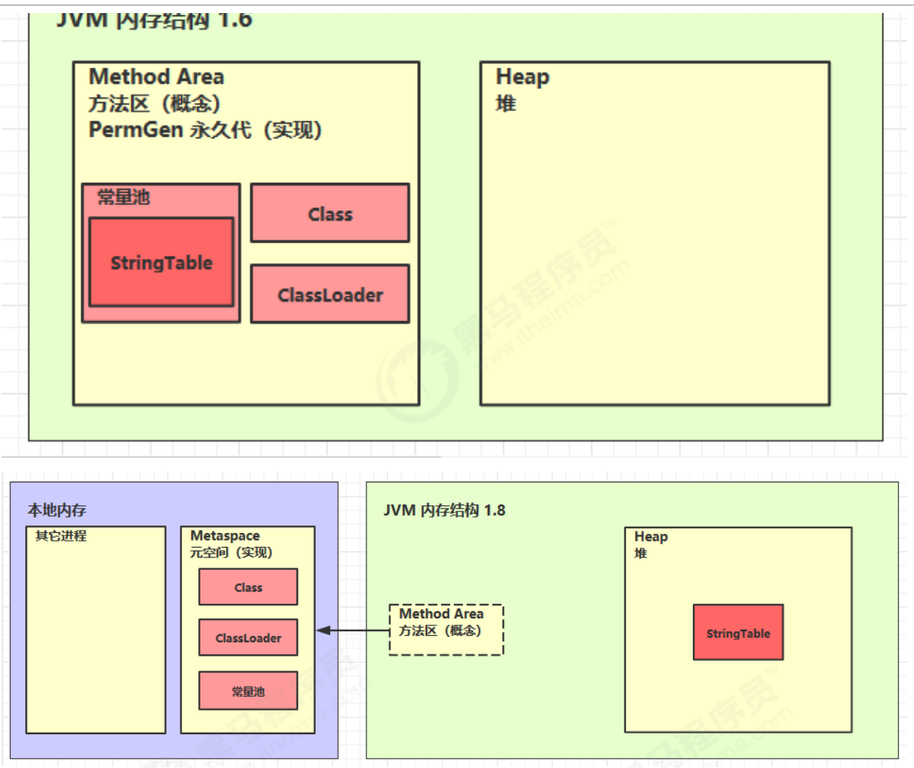

# 内存结构 

###  1. 程序计数器 




**1.1 定义:**

 Program Counter Register 程序计数器（寄存器）

 **作用:**

是记住下一条jvm指令的执行地址

 **特点** 

- 是线程私有的

-  不会存在内存溢出

```java
0: getstatic #20 // PrintStream out = System.out;
3: astore_1 // --
4: aload_1 // out.println(1);
5: iconst_1 // --
6: invokevirtual #26 // --
9: aload_1 // out.println(2);
10: iconst_2 // --
11: invokevirtual #26 // --
14: aload_1 // out.println(3);
15: iconst_3 // --
16: invokevirtual #26 // --
19: aload_1 // out.println(4);
20: iconst_4 // --
21: invokevirtual #26 // --
24: aload_1 // out.println(5);
25: iconst_5 // --
26: invokevir
```


### 2. 虚拟机栈 



2.1 定义 Java Virtual Machine Stacks （Java 虚拟机栈）

每个线程只能有一个活动栈帧，对应着当前正在执行的那个方法

> **问题辨析** 

1. 垃圾回收是否涉及栈内存？ 

2.  栈内存分配越大越好吗？ 

3. 方法内的局部变量是否线程安全？

   -  如果方法内局部变量没有逃离方法的作用访问，它是线程安全的 

   - 如果是局部变量引用了对象，并逃离方法的作用范围，需要考虑线程安全


> **2.2 栈内存溢出** 

- 栈帧过多导致栈内存溢出

- 栈帧过大导致栈内存溢出


#### 2.3 线程运行诊断

**定位:**

 用top定位哪个进程对cpu的占用过高 ps H -eo pid,tid,%cpu | grep 进程id （用ps命令进一步定位是哪个线程引起的cpu占用过高） 

jstack 进程id 可以根据线程id 找到有问题的线程，进一步定位到问题代码的源码行号 


案例2：程序运行很长时间没有结果


### 3.本地方法栈 



主要是用来保存系统原生方法,如C语言写的接口


### 4.堆 



4.1 定义:

-  Heap 堆 通过 new 关键字，创建对象都会使用堆内存

 特点 :

- 它是线程共享的，堆中对象都需要考虑线程安全的问题 

- 有垃圾回收机制


#### 4.2 诊断:堆内存溢出

#### 4.3 堆内存诊断

1. jps 工具 查看当前系统中有哪些 java 进程 
2.  jmap 工具 查看堆内存占用情况 jmap - heap 进程id 
3. jconsole 工具 图形界面的，多功能的监测工具，可以连续监测

#### 案例

垃圾回收后，内存占用仍然很高


### 5.方法区



主要是用来保存源码,如:类结构,字段,方法,常量池,字符串池


**5.2 组成**




#### 5.3 方法区内存溢出

1.8 以前会导致永久代内存溢出

```
永久代内存溢出 java.lang.OutOfMemoryError: PermGen space
* -XX:MaxPermSize=8m
```

1.8 之后会导致元空间内存溢出

```
* 演示元空间内存溢出 java.lang.OutOfMemoryError: Metaspace
* -XX:MaxMetaspaceSize=8m
```

#### 5.4 运行时常量池

- 常量池，就是一张表，虚拟机指令根据这张常量表找到要执行的类名、方法名、参数类型、字面量 等信息 
- 运行时常量池，常量池是 *.class 文件中的，当该类被加载，它的常量池信息就会放入运行时常量 池，并把里面的符号地址变为真实地址


#### 5.5 StringTable 特性

- 常量池中的字符串仅是符号，第一次用到时才变为对象

-  利用串池的机制，来避免重复创建字符串对象

-  字符串变量拼接的原理是 StringBuilder （1.8）

-  字符串常量拼接的原理是编译期优化

- 可以使用 intern 方法，主动将串池中还没有的字符串对象放入串池

  - 1.8 将这个字符串对象尝试放入串池，如果有则并不会放入，如果没有则放入串池， 会把串 池中的对象返回
  - 1.6 将这个字符串对象尝试放入串池，如果有则并不会放入，如果没有会把此对象复制一份， 放入串池， 会把串池中的对象返回

  

  

#### 5.6 StringTable 位置


#### 5.7 StringTable 垃圾回收


#### 5.8 StringTable 性能调优

调整 -XX:StringTableSize=桶个数


### 6.直接内存

#### 6.1 定义 Direct Memory

- 常见于 NIO 操作时，用于数据缓冲区 
- 分配回收成本较高，但读写性能高 
- 不受 JVM 内存回收管理


#### 6.2 分配和回收原理

- 使用了 Unsafe 对象完成直接内存的分配回收，并且回收需要主动调用 freeMemory 方法 

- ByteBuffer 的实现类内部，使用了 Cleaner （虚引用）来监测 ByteBuffer 对象，

一旦 ByteBuffer 对象被垃圾回收，那么就会由 ReferenceHandler 线程通过 Cleaner 的 clean 方法调 用 freeMemory 来释放直接内存
