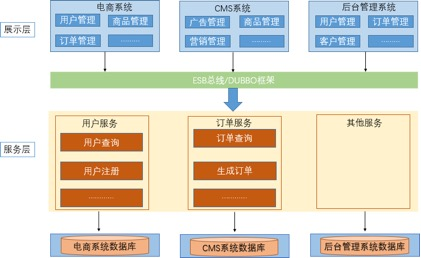
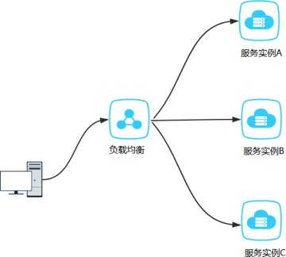

# 1 微服务基础知识

## 1.1 系统架构的演变

随着互联网的发展，网站应用的规模不断扩大，常规的应用架构已无法应对，分布式服务架构以及微服 务架构势在必行，亟需一个治理系统确保架构有条不紊的演进。

### 1.1.1 单体应用架构

Web应用程序发展的早期，大部分web工程(包含前端页面,web层代码,service层代码,dao层代码)是将 所有的功能模块,打包到一起并放在一个web容器中运行。

 

|      |                                          |
| ---- | ---------------------------------------- |
|      |  |

 

比如搭建一个电商系统：客户下订单，商品展示，用户管理。这种将所有功能都部署在一个web容器中 运行的系统就叫做单体架构。

#### 优点：

所有的功能集成在一个项目工程中

项目架构简单，前期开发成本低，周期短，小型项目的首选。

#### 缺点：

全部功能集成在一个工程中，对于大型项目不易开发、扩展及维护。系统性能扩展只能通过扩展集群结点，成本高、有瓶颈。

技术栈受限。

### 1.1.2 垂直应用架构

当访问量逐渐增大，单一应用增加机器带来的加速度越来越小，将应用拆成互不相干的几个应用，以提 升效率

 

**优点**：

项目架构简单，前期开发成本低，周期短，小型项目的首选。通过垂直拆分，原来的单体项目不至于无限扩大

不同的项目可采用不同的技术。

**缺点**：

全部功能集成在一个工程中，对于大型项目不易开发、扩展及维护。系统性能扩展只能通过扩展集群结点，成本高、有瓶颈。

### 1.1.3 分布式SOA架构

#### 1.1.3.1 什么是SOA

SOA 全称为 Service-Oriented Architecture，即面向服务的架构。它可以根据需求通过网络对松散耦合的粗粒度应用组件(服务)进行分布式部署、组合和使用。一个服务通常以独立的形式存在于操作系统进 程中。

站在功能的角度，把业务逻辑抽象成可复用、可组装的服务，通过服务的编排实现业务的快速再生，目 的：把原先固有的业务功能转变为通用的业务服务，实现业务逻辑的快速复用。

通过上面的描述可以发现 SOA 有如下几个特点：分布式、可重用、扩展灵活、松耦合

#### 1.1.3.2 SOA架构

当垂直应用越来越多，应用之间交互不可避免，将核心业务抽取出来，作为独立的服务，逐渐形成稳定 的服务

中心，使前端应用能更快速的响应多变的市场需求

 

**优点**：

抽取公共的功能为服务,提高开发效率

对不同的服务进行集群化部署解决系统压力基于ESB/DUBBO减少系统耦合

**缺点**：

抽取服务的粒度较大

服务提供方与调用方接口耦合度较高

### 1.1.4 微服务架构

 

|      |                                          |
| ---- | ---------------------------------------- |
|      |  |

**优点**：

通过服务的原子化拆分，以及微服务的独立打包、部署和升级，小团队的交付周期将缩短，运维成 本也将大幅度下降

微服务遵循单一原则。微服务之间采用Restful等轻量协议传输。

**缺点**：

微服务过多，服务治理成本高，不利于系统维护。

分布式系统开发的技术成本高（容错、分布式事务等）。

### 1.1.5 SOA与微服务的关系

**SOA**（ Service Oriented Architecture ）“面向服务的架构”:他是一种设计方法，其中包含多个服务， 服务之间通过相互依赖最终提供一系列的功能。一个服务 通常以独立的形式存在与操作系统进程中。各个服务之间 通过网络调用。

**微服务架构****:**其实和 SOA 架构类似,微服务是在 SOA 上做的升华，微服务架构强调的一个重点是“业务需要彻底的组件化和服务化”，原有的单个业务系统会拆分为多个可以独立开发、设计、运行的小应用。 这些小应用之间通过服务完成交互和集成。

 

| **功能** | **SOA**              | **微服务**                   |
| -------- | -------------------- | ---------------------------- |
| 组件大小 | 大块业务逻辑         | 单独任务或小块业务逻辑       |
| 耦合     | 通常松耦合           | 总是松耦合                   |
| 公司架构 | 任何类型             | 小型、专注于功能交叉团队     |
| 管理     | 着重中央管理         | 着重分散管理                 |
| 目标     | 确保应用能够交互操作 | 执行新功能、快速拓展开发团队 |

## 1.2 分布式核心知识

### 1.2.1 分布式中的远程调用

在微服务架构中，通常存在多个服务之间的远程调用的需求。远程调用通常包含两个部分：序列化和通 信协议。常见的序列化协议包括json、xml、hession、protobuf、thrift、text、bytes等，目前主流的远程调用技术有基于HTTP的RESTful接口以及基于TCP的RPC协议。

#### （1） RESTful接口

REST，即Representational State Transfer的缩写，如果一个架构符合REST原则，就称它为RESTful架构。

#### 资源（Resources）

所谓"资源"，就是网络上的一个实体，或者说是网络上的一个具体信息。它可以是一段文本、一张图   片、一首歌曲、一种服务，总之就是一个具体的实在。你可以用一个URI（统一资源定位符）指向它， 每种资源对应一个特定的URI。要获取这个资源，访问它的URI就可以，因此URI就成了每一个资源的地址或独一无二的识别符。REST的名称"表现层状态转化"中，省略了主语。"表现层"其实指的是"资

源"（Resources）的"表现层"。

#### 表现层（Representation）

"资源"是一种信息实体，它可以有多种外在表现形式。我们把"资源"具体呈现出来的形式，叫做它的"表 现层"（Representation）。比如，文本可以用txt格式表现，也可以用HTML格式、XML格式、JSON格  式表现，甚至可以采用二进制格式；图片可以用JPG格式表现，也可以用PNG格式表现。URI只代表资源的实体，不代表它的形式。严格地说，有些网址最后的".html"后缀名是不必要的，因为这个后缀名表示 格式，属于"表现层"范畴，而URI应该只代表"资源"的位置。

#### 状态转化（State Transfer）

访问一个网站，就代表了客户端和服务器的一个互动过程。在这个过程中，势必涉及到数据和状态的变 化。互联网通信协议HTTP协议，是一个无状态协议。这意味着，所有的状态都保存在服务器端。因

此，如果客户端想要操作服务器，必须通过某种手段，让服务器端发生"状态转化"（State  Transfer）。客户端用到的手段，只能是HTTP协议。具体来说，就是HTTP协议里面，四个表示操作方式的动词： GET、POST、PUT、DELETE。它们分别对应四种基本操作：GET用来获取资源，POST用来新建资源

（也可以用于更新资源），PUT用来更新资源，DELETE用来删除资源。

综合上面的解释，我们总结一下什么是**RESTful**架构：

每一个URI代表一种资源；

客户端和服务器之间，传递这种资源的某种表现层；

客户端通过四个HTTP动词，对服务器端资源进行操作，实现"表现层状态转化"。

#### （2） RPC协议

**RPC**（Remote Procedure Call ） 一种进程间通信方式。允许像调用本地服务一样调用远程服务。RPC 框架的主要目标就是让远程服务调用更简单、透明。RPC框架负责屏蔽底层的传输方式（TCP或者UDP）、序列化方式（XML/JSON/二进制）和通信细节。开发人员在使用的时候只需要了解谁在什么 位置提供了什么样的远程服务接口即可，并不需要关心底层通信细节和调用过程。

 

|      |                                          |
| ---- | ---------------------------------------- |
|      |  |

#### （3） 区别与联系

 

| **比较项** | **RESTful** | **RPC**     |
| ---------- | ----------- | ----------- |
| 通讯协议   | HTTP        | 一般使用TCP |
| 性能       | 略低        | 较高        |
| 灵活度     | 高          | 低          |
| 应用       | 微服务架构  | SOA架构     |

 

1、HTTP相对更规范，更标准，更通用，无论哪种语言都支持http协议。如果你是对外开放API，例如 开放平台，外部的编程语言多种多样，你无法拒绝对每种语言的支持，现在开源中间件，基本最先支持 的几个协议都包含RESTful。

2、 RPC 框架作为架构微服务化的基础组件，它能大大降低架构微服务化的成本，提高调用方与服务提供方的研发效率，屏蔽跨进程调用函数（服务）的各类复杂细节。让调用方感觉就像调用本地函数一样 调用远端函数、让服务提供方感觉就像实现一个本地函数一样来实现服务。

### 1.2.2 分布式中的CAP原理

现如今，对于多数大型互联网应用，分布式系统（distributed   system）正变得越来越重要。分布式系统的最大难点，就是各个节点的状态如何同步。CAP 定理是这方面的基本定理，也是理解分布式系统的起点。

CAP理论由 Eric Brewer 在ACM研讨会上提出，而后CAP被奉为分布式领域的重要理论。分布式系统的

CAP理论，首先把分布式系统中的三个特性进行了如下归纳：

 

|      |                                          |
| ---- | ---------------------------------------- |
|      |  |

 

**Consistency****（一致性）**：数据一致更新，所有数据的变化都是同步的         **Availability****（可用性）**：在集群中一部分节点故障后，集群整体是否还能响应客户端的读写请求**Partition tolerance****（分区容忍性）**：某个节点的故障，并不影响整个系统的运行

通过学习CAP理论，我们得知任何分布式系统只可同时满足二点，没法三者兼顾，既然一个分布式系统无法同时满足一致性、可用性、分区容错性三个特点，所以我们就需要抛弃一样：

 

| **选择** | **说 明**                                                    |
| -------- | ------------------------------------------------------------ |
| CA       | 放弃分区容错性，加强一致性和可用性，其实就是传统的关系型数据库的选择 |
| AP       | 放弃一致性（这里说的一致性是强一致性），追求分区容错性和可用性，这是很多分布式 系统设计时的选择，例如很多NoSQL系统就是如此 |
| CP       | 放弃可用性，追求一致性和分区容错性，基本不会选择，网络问题会直接让整个系统不可 用 |

 

需要明确一点的是，在一个分布式系统当中，分区容忍性和可用性是最基本的需求，所以在分布是系统 中，我们的系统最当关注的就是A（可用性）P（容忍性），通过补偿的机制寻求数据的一致性

## 1.3 常见微服务框架

### 1.3.1 SpringCloud

[Spring  Cloud](https://spring.io/projects/spring-cloud)是一系列框架的有序集合。它利用Spring  Boot的开发便利性巧妙地简化了分布式系统基础设施的开发，如服务发现注册、配置中心、消息总线、负载均衡、断路器、数据监控等，都可以用Spring  Boot的开发风格做到一键启动和部署。Spring  Cloud并没有重复制造轮子，它只是将目前各家公司开发的比较成熟、经得起实际考验的服务框架组合起来，通过Spring  Boot风格进行再封装屏蔽掉了复杂的配置和实现原理，最终给开发者留出了一套简单易懂、易部署和易维护的分布式系统开发工具 包。

### 1.3.2 ServiceComb

 

|      |                                          |
| ---- | ---------------------------------------- |
|      |  |

[Apache ServiceComb ](http://servicecomb.apache.org/cn/)是业界第一个Apache微服务顶级项目， 是一个开源微服务解决方案,致力于帮助企业、用户和开发者将企业应用轻松微服务化上云，并实现对微服务应用的高效运维管理。其提供一站 式开源微服务解决方案，融合SDK框架级、0侵入ServiceMesh场景并支持多语言。

### 1.3.3 ZeroC ICE

 

|      |                                          |
| ---- | ---------------------------------------- |
|      |  |

[ZeroC IceGrid ](https://zeroc.com/products/ice)是ZeroC公司的杰作，继承了CORBA的血统，是新一代的面向对象的分布式系统中间件。作为一种微服务架构，它基于RPC框架发展而来，具有良好的性能与分布式能力。

# 2 SpringCloud概述

## 2.1 微服务中的相关概念

### 2.1.1 服务注册与发现

**服务注册**：服务实例将自身服务信息注册到注册中心。这部分服务信息包括服务所在主机IP和提供服务 的Port，以及暴露服务自身状态以及访问协议等信息。

**服务发现**：服务实例请求注册中心获取所依赖服务信息。服务实例通过注册中心，获取到注册到其中的 服务实例的信息，通过这些信息去请求它们提供的服务。

 

### 2.1.2 负载均衡

负载均衡是高可用网络基础架构的关键组件，通常用于将工作负载分布到多个服务器来提高网站、应 用、数据库或其他服务的性能和可靠性。

 

### 2.1.3 熔断

**熔断**这一概念来源于电子工程中的断路器（Circuit  Breaker）。在互联网系统中，当下游服务因访问压力过大而响应变慢或失败，上游服务为了保护系统整体的可用性，可以暂时切断对下游服务的调用。这 种牺牲局部，保全整体的措施就叫做熔断。

 

|      |                                          |
| ---- | ---------------------------------------- |
|      |  |

 

### 2.1.4 链路追踪

随着微服务架构的流行，服务按照不同的维度进行拆分，一次请求往往需要涉及到多个服务。互联网应 用构建在不同的软件模块集上，这些软件模块，有可能是由不同的团队开发、可能使用不同的编程语言 来实现、有可能布在了几千台服务器，横跨多个不同的数据中心。因此，就需要对一次请求涉及的多个 服务链路进行日志记录，性能监控即**链路追踪**

 

### 2.1.5 API网关

随着微服务的不断增多，不同的微服务一般会有不同的网络地址，而外部客户端可能需要调用多个服务 的接口才能完成一个业务需求，如果让客户端直接与各个微服务通信可能出现：

客户端需要调用不同的url地址，增加难度再一定的场景下，存在跨域请求的问题每个微服务都需要进行单独的身份认证

针对这些问题，API网关顺势而生。

**API网关**直面意思是将所有API调用统一接入到API网关层，由网关层统一接入和输出。一个网关的基本 功能有：统一接入、安全防护、协议适配、流量管控、长短链接支持、容错能力。有了网关之后，各个API服务提供团队可以专注于自己的的业务逻辑处理，而API网关更专注于安全、流量、路由等问题。

 

## 2.2                       SpringCloud的介绍

[Spring  Cloud](https://spring.io/projects/spring-cloud)是一系列框架的有序集合。它利用Spring  Boot的开发便利性巧妙地简化了分布式系统基础设施的开发，如**服务发现注册、配置中心、消息总线、负载均衡、断路器、数据监控**等，都可以用Spring  Boot的开发风格做到一键启动和部署。Spring  Cloud并没有重复制造轮子，它只是将目前各家公司开发的比较成熟、经得起实际考验的服务框架组合起来，通过Spring  Boot风格进行再封装屏蔽掉了复杂的配置和实现原理，最终给开发者留出了一套简单易懂、易部署和易维护的分布式系统开发工具 包。

## 2.3 SpringCloud的架构

### 2.3.1 SpringCloud中的核心组件

**Spring Cloud**的本质是在 Spring Boot 的基础上，增加了一堆微服务相关的规范，并对应用上下文

（Application Context）进行了功能增强。既然 Spring Cloud 是规范，那么就需要去实现，目前Spring Cloud 规范已有 Spring官方，Spring Cloud Netflix，Spring Cloud Alibaba等实现。通过组件化的方式，Spring Cloud将这些实现整合到一起构成全家桶式的微服务技术栈。

#### Spring Cloud Netflix组件

| **组件名称** | **作用**       |
| ------------ | -------------- |
| Eureka       | 服务注册中心   |
| Ribbon       | 客户端负载均衡 |
| Feign        | 声明式服务调用 |
| Hystrix      | 客户端容错保护 |
| Zuul         | API服务网关    |

**Spring Cloud Alibaba****组件**

 

| **组件名称** | **作用**       |
| ------------ | -------------- |
| Nacos        | 服务注册中心   |
| Sentinel     | 客户端容错保护 |

**Spring Cloud****原生及其他组件**

 

| **组件**      | **作用**       |
| ------------- | -------------- |
| Consul        | 服务注册中心   |
| Config         | 分布式配置中心 |
| Gateway       | API服务网关    |
| Sleuth/Zipkin | 分布式链路追踪 |

### 2.3.2 SpringCloud的体系结构

 

 

|      |                                          |
| ---- | ---------------------------------------- |
|      |  |

 

从上图可以看出Spring   Cloud各个组件相互配合，合作支持了一套完整的微服务架构。

**注册中心**负责服务的注册与发现，很好将各服务连接起来

**断路器**负责监控服务之间的调用情况，连续多次失败进行熔断保护。

**API****网关**负责转发所有对外的请求和服务

**配置中心**提供了统一的配置信息管理服务,可以实时的通知各个服务获取最新的配置信息

**链路追踪技术**可以将所有的请求数据记录下来，方便我们进行后续分析

各个组件又提供了功能完善的**dashboard****监控平台**,可以方便的监控各组件的运行状况

# 3 案例搭建

使用微服务架构的分布式系统,微服务之间通过网络通信。我们通过服务提供者与服务消费者来描述微服 务间的调用关系。

服务提供者：服务的被调用方，提供调用接口的一方服务消费者：服务的调用方，依赖于其他服务的一方

我们以电商系统中常见的用户下单为例，用户向订单微服务发起一个购买的请求。在进行保存订单之前 需要调用商品微服务查询当前商品库存，单价等信息。在这种场景下，订单微服务就是一个服务消费  者，商品微服务就是一个服务提供者

 

|      |                                          |
| ---- | ---------------------------------------- |
|      |  |

 

## 3.1 数据库表

资料中提供了案例中所需要的数据库表与实体类

#### 用户表

 

|      |          |
| ---- | -------- |
|      |  |

 

**商品表**

 

|      |          |
| ---- | -------- |
|      |  |

 

**订单表**

 

## 3.2 搭建环境

（1） 创建父工程shop_parent

在IDEA中创建父工程 shop_parent 并引入坐标

 

|      |          |
| ---- | -------- |
|      |  |

\<dependency\>

\<groupId\>org.springframework.cloud\</groupId\>

\<artifactId\>spring-cloud-dependencies\</artifactId\>

\<version\>Greenwich.RELEASE\</version\>

\<type\>pom\</type\>

\<scope\>import\</scope\>

\</dependency\>

\</dependencies\>

\</dependencyManagement\>

 

 

\<repositories\>

\<repository\>

\<id\>spring-snapshots\</id\>

\<name\>Spring Snapshots\</name\>

\<url\>http://repo.spring.io/libs-snapshot-local\</url\>

\<snapshots\>

\<enabled\>true\</enabled\>

\</snapshots\>

\</repository\>

\<repository\>

\<id\>spring-milestones\</id\>

\<name\>Spring Milestones\</name\>

\<url\>http://repo.spring.io/libs-milestone-local\</url\>

\<snapshots\>

\<enabled\>false\</enabled\>

\</snapshots\>

\</repository\>

\<repository\>

\<id\>spring-releases\</id\>

\<name\>Spring Releases\</name\>

\<url\>http://repo.spring.io/libs-release-local\</url\>

\<snapshots\>

\<enabled\>false\</enabled\>

\</snapshots\>

\</repository\>

\</repositories\>

\<pluginRepositories\>

\<pluginRepository\>

\<id\>spring-snapshots\</id\>

\<name\>Spring Snapshots\</name\>

\<url\>http://repo.spring.io/libs-snapshot-local\</url\>

\<snapshots\>

\<enabled\>true\</enabled\>

\</snapshots\>

\</pluginRepository\>

\<pluginRepository\>

\<id\>spring-milestones\</id\>

\<name\>Spring Milestones\</name\>

\<url\>http://repo.spring.io/libs-milestone-local\</url\>

\<snapshots\>

\<enabled\>false\</enabled\>

\</snapshots\>

\</pluginRepository\>

\</pluginRepositories\>

 

 

\<build\>

\<plugins\>

\<plugin\>

 

（2） 创建微服务工程模块

创建公共模块 shop_service_common ,用于存放公共的实体类和工具类创建订单微服务模块 shop_service_order

创建商品微服务模块 shop_service_product

创建用户微服务模块 shop_service_user

（3） 设置依赖

工程的依赖结构如图

 

 

|      |                                          |
| ---- | ---------------------------------------- |
|      |  |

 

## 3.3 搭建商品微服务

### 3.3.1 编写实体类

在shop_service_common中创建 cn.itcast.entity.Product 实体类,并配置

 

|      |          |
| ---- | -------- |
|      |  |

这里使用了[lombok](https://www.projectlombok.org/)简化实体类的开发

Lombok能以简单的注解形式来简化java代码，提高开发人员的开发效率

### 3.3.2 编写dao接口

在shop_service_product中创建 cn.itcast.product.dao.ProductDao 接口

 

|      |          |
| ---- | -------- |
|      |  |

 

### 3.3.3 编写service层

在shop_service_product中创建  cn.itcast.product.service.ProductService

 

|      |          |
| ---- | -------- |
|      |  |

 

在shop_service_product中创建 cn.itcast.product.service.ProductServiceImpl 实现类

 

|      |          |
| ---- | -------- |
|      |  |

 

### 3.3.4 编写web层

在shop_service_product中创建  cn.itcast.product.controller.ProductController

 

|      |          |
| ---- | -------- |
|      |  |

 

controller中使用的@GetMapping是一个组合注解,相当与@RequestMapping(method="get")。类似的注解还有@PostMapping，@PutMapping，@DeleteMapping

### 3.3.5 配置启动类

在shop_service_product中创建 cn.itcast.product.ProductApplication 启动类

 

|      |          |
| ---- | -------- |
|      |  |

 

**3.3.6** **配置****yml****文件**

 

|      |          |
| ---- | -------- |
|      |  |

 

## 3.4 其他微服务

用于时间有限且配置逻辑相似，用户微服务和订单微服务。直接从资料中拷贝到项目中完成演示即可。

 

|      |                                          |
| ---- | ---------------------------------------- |
|      |  |

## 3.5 服务调用

前文已经编写了三个基础的微服务，在用户下单时需要调用商品微服务获取商品数据。那应该怎么做 呢？总人皆知商品微服务提供了供人调用的HTTP接口。所以可以再下定单的时候使用http请求的相关 工具类完成，如常见的HttpClient，OkHttp，当然也可以使用Spring提供的RestTemplate

### 3.5.1 RestTemplate介绍

Spring框架提供的RestTemplate类可用于在应用中调用rest服务，它简化了与http服务的通信方式，统 一了RESTful的标准，封装了http链接， 我们只需要传入url及返回值类型即可。相较于之前常用的HttpClient，RestTemplate是一种更优雅的调用RESTful服务的方式。

在Spring应用程序中访问第三方REST服务与使用Spring RestTemplate类有关。RestTemplate类的设计原则与许多其他Spring 模板类(例如JdbcTemplate、JmsTemplate)相同，为执行复杂任务提供了一种具有默认行为的简化方法。

RestTemplate默认依赖JDK提供http连接的能力（HttpURLConnection），如果有需要的话也可以通过setRequestFactory方法替换为例如 Apache HttpComponents、Netty或OkHttp等其它HTTP library。

考虑到RestTemplate类是为调用REST服务而设计的，因此它的主要方法与REST的基础紧密相连就不足为奇了，后者是HTTP协议的方法:HEAD、GET、POST、PUT、DELETE和OPTIONS。例如， RestTemplate类具有headForHeaders()、getForObject()、postForObject()、put()和delete()等方法。

### 3.5.2 RestTemplate方法介绍

 

|      |                                          |
| ---- | ---------------------------------------- |
|      |  |

**3.5.3** **通过****RestTemplate****调用微服务**

（1） 在 shop_service_order工程中ProductApplication启动类 中配置RestTemplate

 

|      |          |
| ---- | -------- |
|      |  |

 

（2） 编写下订单方法

 

|      |          |
| ---- | -------- |
|      |  |

 

### 3.5.4 硬编码存在的问题

至此已经可以通过RestTemplate调用商品微服务的RESTFul  API接口。但是我们把提供者的网络地址

（ip，端口）等硬编码到了代码中，这种做法存在许多问题：

应用场景有局限无法动态调整

那么应该怎么解决呢，就需要通过注册中心动态的对服务注册和服务发现

# 3 服务注册Eureka基础

## 3.1 微服务的注册中心

注册中心可以说是微服务架构中的”通讯录“，它记录了服务和服务地址的映射关系。在分布式架构中， 服务会注册到这里，当服务需要调用其它服务时，就这里找到服务的地址，进行调用。

 

|      |                                          |
| ---- | ---------------------------------------- |
|      |  |

### 3.1.1 注册中心的主要作用

服务注册中心（下称注册中心）是微服务架构非常重要的一个组件，在微服务架构里主要起到了协调者 的一个作用。注册中心一般包含如下几个功能：

\1.  服务发现：

服务注册/反注册：保存服务提供者和服务调用者的信息

服务订阅/取消订阅：服务调用者订阅服务提供者的信息，最好有实时推送的功能服务路由（可选）：具有筛选整合服务提供者的能力。

\2.  服务配置：

配置订阅：服务提供者和服务调用者订阅微服务相关的配置配置下发：主动将配置推送给服务提供者和服务调用者

\3.  服务健康检测

检测服务提供者的健康情况

### 3.1.2 常见的注册中心

#### Zookeeper

zookeeper它是一个分布式服务框架，是Apache  Hadoop  的一个子项目，它主要是用来解决分布式应用中经常遇到的一些数据管理问题，如：统一命名服务、状态同步服务、集群管理、分布式应用配置项 的管理等。简单来说zookeeper=文件系统+监听通知机制。

#### Eureka

Eureka是在Java语言上，基于Restful Api开发的服务注册与发现组件，Springcloud Netflix中的重要组件

#### Consul

Consul是由HashiCorp基于Go语言开发的支持多数据中心分布式高可用的服务发布和注册服务软件， 采用Raft算法保证服务的一致性，且支持健康检查。

#### Nacos

Nacos是一个更易于构建云原生应用的动态服务发现、配置管理和服务管理平台。简单来说 Nacos 就是注册中心 + 配置中心的组合，提供简单易用的特性集，帮助我们解决微服务开发必会涉及到的服务注册与发现，服务配置，服务管理等问题。Nacos 还是 Spring Cloud Alibaba 组件之一，负责**服务注册与 发现**。

最后我们通过一张表格大致了解Eureka、Consul、Zookeeper的异同点。选择什么类型的服务注册与 发现组件可以根据自身项目要求决定。

 

| **组件名** | **语言** | **CAP** | **一致性算法** | **服务健康检查** | **对外暴露接口** |
| ---------- | -------- | ------- | -------------- | ---------------- | ---------------- |
| Eureka     | Java     | AP      | 无             | 可配支持         | HTTP             |
| Consul     | Go       | CP      | Raft           | 支持             | HTTP/DNS         |
| Zookeeper  | Java     | CP      | Paxos          | 支持             | 客户端           |
| Nacos      | Java     | AP      | Raft           | 支持             | HTTP             |

## 3.2 Eureka的概述

### 3.2.1 Eureka的基础知识

Eureka是Netflix开发的服务发现框架，SpringCloud将它集成在自己的子项目spring-cloud-netflix中， 实现SpringCloud的服务发现功能。

 

|      |                                          |
| ---- | ---------------------------------------- |
|      |  |

上图简要描述了Eureka的基本架构，由3个角色组成：

1、Eureka Server

提供服务注册和发现

2、Service Provider

服务提供方

将自身服务注册到Eureka，从而使服务消费方能够找到

3、Service Consumer

服务消费方

从Eureka获取注册服务列表，从而能够消费服务

### 3.2.2 Eureka的交互流程与原理

 

图是来自Eureka官方的架构图，大致描述了Eureka集群的工作过程。图中包含的组件非常多，可能比 较难以理解，我们用通俗易懂的语言解释一下：

Application Service 相当于本书中的服务提供者，Application Client相当于服务消费者； Make Remote Call，可以简单理解为调用RESTful API；

us-east-1c、us-east-1d等都是zone，它们都属于us-east-1这个region；

#### 由图可知，Eureka包含两个组件：Eureka Server 和 Eureka Client，它们的作用如下：

Eureka Client是一个Java客户端，用于简化与Eureka Server的交互；

Eureka Server提供服务发现的能力，各个微服务启动时，会通过Eureka Client向Eureka Server

进行注册自己的信息（例如网络信息），Eureka  Server会存储该服务的信息；

微服务启动后，会周期性地向Eureka  Server发送心跳（默认周期为30秒）以续约自己的信息。如果Eureka Server在一定时间内没有接收到某个微服务节点的心跳，Eureka Server将会注销该微服务节点（默认90秒）；

每个Eureka Server同时也是Eureka Client，多个Eureka Server之间通过复制的方式完成服务注册表的同步；

Eureka Client会缓存Eureka Server中的信息。即使所有的Eureka Server节点都宕掉，服务消费者依然可以使用缓存中的信息找到服务提供者。

综上，Eureka通过心跳检测、健康检查和客户端缓存等机制，提高了系统的灵活性、可伸缩性和可用 性。

## 3.3 搭建Eureka注册中心

### 3.3.1 搭建Eureka服务中心

#### (1) 创建shop_eureka_server子模块

在 shop_parent 下创建子模块 shop_eureka_server

#### (2) 引入maven坐标

 

|      |          |
| ---- | -------- |
|      |  |

 

**(3)** **配置****application.yml**

 

registerWithEureka: 是否将自己注册到Eureka服务中，本身就是所有无需注册

fetchRegistry : 是否从Eureka中获取注册信息

serviceUrlEureka:  客户端与Eureka服务端进行交互的地址

#### (4) 配置启动类

在 cn.itcast.eureka 下创建启动类 EurekaServerApplication

 

|      |          |
| ---- | -------- |
|      |  |

 

EnableEurekaServer : 激活Eureka Server端配置

### 3.3.2 服务注册中心管理后台

 

|      |                                          |
| ---- | ---------------------------------------- |
|      |  |

打开浏览器访问

http://localhost8761

即可进入EurekaServer内置的管理控制台,显示效果如下

## 3.4 服务注册到Eureka注册中心

### 3.4.1 商品服务注册

(1)   商品模块中引入坐标

在 shop_service_product 的pom文件中添加eureka client的相关坐标

 

(2)  配置application.yml文件

在工程的 application.yml 中添加Eureka Server的主机地址

 

|      |          |
| ---- | -------- |
|      |  |

 

(3)  修改启动类添加服务注册注解

 

|      |          |
| ---- | -------- |
|      |  |

 

从Spring Cloud Edgware版本开始， @EnableDiscoveryClient 或 @EnableEurekaClient **可省略**。只需加上相关依赖，并进行相应配置，即可将微服务注册到服务发现组件上。

### 3.4.2 订单服务注册

和商品微服务一样,只需要引入坐标依赖,在工程的 application.yml 中添加Eureka Server的主机地址即可

### 3.4.3 用户服务注册

和商品微服务一样,只需要引入坐标依赖,在工程的 application.yml 中添加Eureka Server的主机地址即可

## 3.5 Eureka中的自我保护

微服务第一次注册成功之后，每30秒会发送一次心跳将服务的实例信息注册到注册中心。通知 Eureka Server 该实例仍然存在。如果超过90秒没有发送更新，则服务器将从注册信息中将此服务移除。

Eureka   Server在运行期间，会统计心跳失败的比例在15分钟之内是否低于85%，如果出现低于的情况

（在单机调试的时候很容易满足，实际在生产环境上通常是由于网络不稳定导致），Eureka Server会将当前的实例注册信息保护起来，同时提示这个警告。保护模式主要用于一组客户端和Eureka  Server 之间存在网络分区场景下的保护。一旦进入保护模式，Eureka   Server将会尝试保护其服务注册表中的

信息，不再删除服务注册表中的数据（也就是不会注销任何微服务）

验证完自我保护机制开启后，并不会马上呈现到web上，而是默认需等待 5  分钟（可以通过

eureka.server.wait-time-in-ms-when-sync-empty 配置），即 5 分钟后你会看到下面的提示信息：

 

|      |                                          |
| ---- | ---------------------------------------- |
|      |  |

#### 如果关闭自我保护

通过设置 eureka.enableSelfPreservation=false 来关闭自我保护功能。

## 3.6 Eureka中的元数据

Eureka的元数据有两种：标准元数据和自定义元数据。

标准元数据：主机名、IP地址、端口号、状态页和健康检查等信息，这些信息都会被发布在服务注 册表中，用于服务之间的调用。

自定义元数据：可以使用eureka.instance.metadata-map配置，符合KEY/VALUE的存储格式。这 些元数据可以在远程客户端中访问。

在程序中可以使用DiscoveryClient  获取指定微服务的所有元数据信息

 

|      |          |
| ---- | -------- |
|      |  |

# 4 服务注册Eureka高级

## 4.1 Eureka Server 高可用集群

在上一个章节，实现了单节点的Eureka Server的服务注册与服务发现功能。Eureka Client会定时连接Eureka Server，获取注册表中的信息并缓存到本地。微服务在消费远程API时总是使用本地缓存中的数据。因此一般来说，即使Eureka  Server发生宕机，也不会影响到服务之间的调用。但如果Eureka Server宕机时，某些微服务也出现了不可用的情况，Eureka  Server中的缓存若不被刷新，就可能会影响到微服务的调用，甚至影响到整个应用系统的高可用。因此，在生成环境中，通常会部署一个高可用 的Eureka Server集群。

Eureka Server可以通过运行多个实例并相互注册的方式实现高可用部署，Eureka Server实例会彼此增量地同步信息，从而确保所有节点数据一致。事实上，节点之间相互注册是Eureka Server的默认行

为。

 

|      |                                          |
| ---- | ---------------------------------------- |
|      |  |

 

### 4.1.1 搭建 Eureka Server高可用集群

#### （1） 修改本机host属性

由于是在个人计算机中进行测试很难模拟多主机的情况，Eureka配置server集群时需要执行host地址。 所以需要修改个人电脑中host地址

 

|      |          |
| ---- | -------- |
|      |  |

 

**（2）** **修改** shop_eureka_server **工程中的****yml****配置文件，添加如下配置属性**

 

|      |          |
| ---- | -------- |
|      |  |

 

在配置文件中通过连字符（---）将文件分为三个部分，第一部分为应用名称，第二部分和第三部 分是根据不同的profiles选项动态添加，可以在IDEA启动时进行激活配置

 

|      |                                          |
| ---- | ---------------------------------------- |
|      |  |

使用IDEA启动历次EurekaServerApplicaion分别激活eureka1和eureka2配置。访问http://eureka1:87 61和http://eureka1:8762/。会发现注册中心 SHOP-EUREKA-SERVER 已经有两个节点，并且registered-replicas (相邻集群复制节点)中已经包含对方。

 

|      |                                          |
| ---- | ---------------------------------------- |
|      |  |

### 4.1.2 服务注册到Eureka Server集群

如果需要将微服务注册到Eureka  Server集群只需要修改yml配置文件即可

 

|      |          |
| ---- | -------- |
|      |  |

以商品微服务为例，修改defaultZone配置添加多个Eureka   Server的地址

## 4.2 Eureka中的常见问题

### 4.2.1 服务注册慢

默认情况下，服务注册到Eureka   Server的过程较慢。[SpringCloud](https://cloud.spring.io/spring-cloud-static/spring-cloud-netflix/2.1.2.RELEASE/single/spring-cloud-netflix.html#_why_is_it_so_slow_to_register_a_service)官方文档中给出了详细的原因

 

|      |                                          |
| ---- | ---------------------------------------- |
|      |  |

 

大致含义：服务的注册涉及到心跳，默认心跳间隔为30s。在实例、服务器、客户端都在本地缓存中具 有相同的元数据之前，服务不可用于客户端发现（所以可能需要3次心跳）。可以通过配置eureka.instance.leaseRenewalIntervalInSeconds (心跳频率)加快客户端连接到其他服务的过

程。在生产中，最好坚持使用默认值，因为在服务器内部有一些计算，他们对续约做出假设。

### 4.2.2 服务节点剔除问题

默认情况下，由于Eureka Server剔除失效服务间隔时间为90s且存在自我保护的机制。所以不能有效而迅速的剔除失效节点，这对开发或测试会造成困扰。解决方案如下：

#### Eureka Server：

配置关闭自我保护，设置剔除无效节点的时间间隔

 

|      |          |
| ---- | -------- |
|      |  |

 

#### Eureka Client：

配置开启健康检查，并设置续约时间

 

|      |          |
| ---- | -------- |
|      |  |

 

### 4.2.3 监控页面显示ip

在Eureka Server的管控台中，显示的服务实例名称默认情况下是微服务定义的名称和端口。为了更好的对所有服务进行定位，微服务注册到Eureka Server的时候可以手动配置示例ID。配置方式如下

 

|      |                                          |
| ---- | ---------------------------------------- |
|      |  |

 

## 4.3 Eureka源码解析

### 4.3.1 SpringBoot中的自动装载

#### （1） ImportSelector

ImportSelector接口是Spring导入外部配置的核心接口，在SpringBoot的自动化配置和@EnableXXX(功 能性注解)中起到了决定性的作用。当在@Configuration标注的Class上使用@Import引入了一个ImportSelector实现类后，会把实现类中返回的Class名称都定义为bean。

 

|      |          |
| ---- | -------- |
|      |  |

 

DeferredImportSelector接口继承ImportSelector,他和ImportSelector的区别在于装载bean的时机上,DeferredImportSelector需要等所有的@Configuration都执行完毕后才会进行装载

 

|      |          |
| ---- | -------- |
|      |  |

 

接下来我们写一个小例子,看下ImportSelector的用法

#### 1） 定义Bean对象

 

|      |          |
| ---- | -------- |
|      |  |

 

**2）** **定义配置类****Configuration**

 

|      |          |
| ---- | -------- |
|      |  |

#### 3 ) 定义ImportSelector

 

|      |          |
| ---- | -------- |
|      |  |

 

**4****） 定义****EnableXXX****注解**

 

|      |          |
| ---- | -------- |
|      |  |

 

#### 5 ) 测试

 

|      |          |
| ---- | -------- |
|      |  |

 

由此可见，HelloWorldConfiguration对象并没有使用Spring的对象对象创建注解声明

（@Controller，@Service，@Repostiroty），而是使用编程的方式动态的载入bean。

这个接口在哪里调用呢？我们可以来看一下ConfigurationClassParser这个类的processImports方法

 

|      |          |
| ---- | -------- |
|      |  |

else {

this.importStack.push(configClass); try {

for (SourceClass candidate : importCandidates)

{           //对ImportSelector的处理

if (candidate.isAssignable(ImportSelector.class)) {

// Candidate class is an ImportSelector -\> delegate to

it to determine imports

Class\<?\> candidateClass = candidate.loadClass(); ImportSelector selector =

BeanUtils.instantiateClass(candidateClass, ImportSelector.class);

ParserStrategyUtils.invokeAwareMethods(

selector, this.environment, this.resourceLoader,

this.registry);

if (this.deferredImportSelectors != null && selector

instanceof DeferredImportSelector) {              //如果为延迟导入处理则加入集合当中

this.deferredImportSelectors.add( new

DeferredImportSelectorHolder(configClass, (DeferredImportSelector) selector));

}

else {              //根据ImportSelector方法

的返回值来进行递归操作

String[] importClassNames =

selector.selectImports(currentSourceClass.getMetadata());

Collection\<SourceClass\> importSourceClasses = asSourceClasses(importClassNames);

processImports(configClass, currentSourceClass,

importSourceClasses, false);

}

}

else if (candidate.isAssignable(ImportBeanDefinitionRegistrar.class)) {

// Candidate class is an ImportBeanDefinitionRegistrar -

\\> 

 

 

definitions

 

// delegate to it to register additional bean

 

 

Class\<?\> candidateClass = candidate.loadClass(); ImportBeanDefinitionRegistrar registrar =

BeanUtils.instantiateClass(candidateClass,

ImportBeanDefinitionRegistrar.class);

ParserStrategyUtils.invokeAwareMethods( registrar, this.environment,

this.resourceLoader, this.registry);

configClass.addImportBeanDefinitionRegistrar(registrar, currentSourceClass.getMetadata());

}

else {             // 如果当前的类既不是

ImportSelector也不是ImportBeanDefinitionRegistar就进行@Configuration的解析处理

// Candidate class not an ImportSelector or ImportBeanDefinitionRegistrar -\>

// process it as an @Configuration class this.importStack.registerImport(

currentSourceClass.getMetadata(), candidate.getMetadata().getClassName());

 

processConfigurationClass(candidate.asConfigClass(configClass));

}

 

在这里我们可以看到ImportSelector接口的返回值会递归进行解析，把解析到的类全名按照

@Configuration进行处理

#### （2） springBoot自动装载

SpringBoot开箱即用的特点，很大程度上归功于ImportSelector。接下来我们看下springBoot是如何在spring的基础上做扩展的。

在SpringBoot中最重要的一个注解SpringBootApplication

 

|      |          |
| ---- | -------- |
|      |  |

 

在SpringBootApplication注解中声明了一个  @EnableAutoConfiguration

 

 

|      |          |
| ---- | -------- |
|      |  |

在EnableAutoConfiguration中通过Import引入了SpringBoot定义的

 

这个类内容比较多，我们只需看下最主要的逻辑代码即可

 

public class AutoConfigurationImportSelector

implements DeferredImportSelector, BeanClassLoaderAware, ResourceLoaderAware,

BeanFactoryAware, EnvironmentAware, Ordered {

 

 

@Override

public String[] selectImports(AnnotationMetadata annotationMetadata) { if (!isEnabled(annotationMetadata)) {

return NO_IMPORTS;

}

AutoConfigurationMetadata autoConfigurationMetadata = AutoConfigurationMetadataLoader

.loadMetadata(this.beanClassLoader);

//主要逻辑在getAutoConfigurationEntry这个方法AutoConfigurationEntry autoConfigurationEntry =

getAutoConfigurationEntry(

autoConfigurationMetadata, annotationMetadata);

return StringUtils.toStringArray(autoConfigurationEntry.getConfigurations());

}

 

 

protected AutoConfigurationEntry getAutoConfigurationEntry( AutoConfigurationMetadata autoConfigurationMetadata, AnnotationMetadata annotationMetadata) {

if (!isEnabled(annotationMetadata)) { return EMPTY_ENTRY;

}

AnnotationAttributes attributes = getAttributes(annotationMetadata);

//通过getCandidateConfigurations方法获取所有需要加载的bean List\<String\> configurations =

getCandidateConfigurations(annotationMetadata,

attributes);

//去重处理

configurations = removeDuplicates(configurations);

//获取不需要加载的bean,这里我们可以通过spring.autoconfigure.exclude人为配置Set\<String\> exclusions = getExclusions(annotationMetadata, attributes); checkExcludedClasses(configurations, exclusions); configurations.removeAll(exclusions);

configurations = filter(configurations, autoConfigurationMetadata);

//发送事件,通知所有的AutoConfigurationImportListener进行监听

 

从上面的逻辑可以看出,最终获取bean的渠道在SpringFactoriesLoader.loadFactoryNames

 

public final class SpringFactoriesLoader {

public static final String FACTORIES_RESOURCE_LOCATION = "META- INF/spring.factories";

private static final Log logger = LogFactory.getLog(SpringFactoriesLoader.class);

private static final Map\<ClassLoader, MultiValueMap\<String, String\>\> cache = new ConcurrentReferenceHashMap();

 

public static List\<String\> loadFactoryNames(Class\<?\> factoryClass, @Nullable ClassLoader classLoader) {

String factoryClassName = factoryClass.getName();

//通过factoryClassName获取相应的bean全称

//上面传入的factoryClass是EnableAutoConfiguration.class return

(List)loadSpringFactories(classLoader).getOrDefault(factoryClassName, Collections.emptyList());

}

 

 

private static Map\<String, List\<String\>\> loadSpringFactories(@Nullable ClassLoader classLoader) {

MultiValueMap\<String, String\> result = (MultiValueMap)cache.get(classLoader);

if (result != null) { return result;

} else {

try {

//获取工程中所有META-INF/spring.factories文件,将其中的键值组合成Map Enumeration\<URL\> urls = classLoader != null ?

classLoader.getResources("META-INF/spring.factories") : ClassLoader.getSystemResources("META-INF/spring.factories");

LinkedMultiValueMap result = new LinkedMultiValueMap();

 

 

while(urls.hasMoreElements()) {

URL url = (URL)urls.nextElement();

UrlResource resource = new UrlResource(url); Properties properties =

PropertiesLoaderUtils.loadProperties(resource);

Iterator var6 = properties.entrySet().iterator();

 

 

while(var6.hasNext()) {

Entry\<?, ?\> entry = (Entry)var6.next(); String factoryClassName =

((String)entry.getKey()).trim();

String[] var9 = StringUtils.commaDelimitedListToStringArray((String)entry.getValue());

int var10 = var9.length;

 

 

for(int var11 = 0; var11 \< var10; ++var11) { String factoryName = var9[var11];

result.add(factoryClassName, factoryName.trim());

}

}

}

 

cache.put(classLoader, result); return result;

} catch (IOException var13) {

throw new IllegalArgumentException("Unable to load factories from location [META-INF/spring.factories]", var13);

}

}

}

 

private static \<T\> T instantiateFactory(String instanceClassName, Class\<T\> factoryClass, ClassLoader classLoader) {

try {

Class\<?\> instanceClass = ClassUtils.forName(instanceClassName, classLoader);

if (!factoryClass.isAssignableFrom(instanceClass)) {

throw new IllegalArgumentException("Class [" + instanceClassName

\+ "] is not assignable to [" + factoryClass.getName() + "]");

} else {

return ReflectionUtils.accessibleConstructor(instanceClass, new Class[0]).newInstance();

}

} catch (Throwable var4) {

throw new IllegalArgumentException("Unable to instantiate factory class: " + factoryClass.getName(), var4);

}

}

}

 

每个jar都可以定义自己的META-INF/spring.factories ,jar被加载的同时 spring.factories里面定义的bean就可以自动被加载

### 4.3.2 Eureka服务注册核心源码解析

#### 4.3.2.1 EnableEurekaServer注解作用

通过 @EnableEurekaServer 激活EurekaServer

 

此类有一个重要作用：导入EurekaServerMarkerConfiguration配置类实例化了一个Marker的bean对象，此对象是实例化核心配置类的前提条件

 

|      |          |
| ---- | -------- |
|      |  |

 

#### 4.3.2.2 自动装载核心配置类

SpringCloud对EurekaServer的封装使得发布一个EurekaServer无比简单，根据自动装载原则可以在

spring-cloud-netflix-eureka-server-2.1.0.RELEASE.jar 下找到 spring.factories

 

|      |                                          |
| ---- | ---------------------------------------- |
|      |  |

EurekaServerAutoConfiguration 是Eureka服务端的自动配置类

 

|      |          |
| ---- | -------- |
|      |  |

 

现在我们展开来说这个Eureka服务端的自动配置类;

\1.  这个配置类实例化的前提条件是上下文中存在 EurekaServerMarkerConfiguration.Marker 这个

bean,解释了上面的问题

\2.  通过@EnableConfigurationProperties({ EurekaDashboardProperties.class, InstanceRegistryProperties.class })导入了两个配置类

\1.  EurekaDashboardProperties ： 配置 EurekaServer的管控台

\2.  InstanceRegistryProperties ： 配置期望续约数量和默认的通信数量

\3.  通过@Import({EurekaServerInitializerConfiguration.class})引入启动配置类

#### 4.3.2.3 EurekaServerInitializerConfiguration

 

|      |          |
| ---- | -------- |
|      |  |

 

可以看到EurekaServerInitializerConfiguration实现了SmartLifecycle，也就意味着Spring容器启动时会去执行start()方法。加载所有的EurekaServer的配置

#### 4.3.2.4 EurekaServerAutoConfiguration

实例化了EurekaServer的管控台的Controller类  EurekaController

 

|      |          |
| ---- | -------- |
|      |  |

 

实例化EurekaServerBootstrap类

 

实例化jersey相关配置类

 

|      |                                          |
| ---- | ---------------------------------------- |
|      |  |

jerseyApplication 方法，在容器中存放了一个jerseyApplication对象，jerseyApplication()方法里的东西和Spring源码里扫描@Component逻辑类似，扫描@Path和@Provider标签，然后封装成beandefinition，封装到Application的set容器里。通过filter过滤器来过滤url进行映射到对象的

Controller

#### 4.3.2.5 暴露的服务端接口

由于集成了Jersey，我们可以找到在EurekaServer的依赖包中的 eureka-core-1.9.8.jar ,可以看到一些列的XXXResource

 

|      |                                          |
| ---- | ---------------------------------------- |
|      |  |

这些类都是通过Jersey发布的供客户端调用的服务接口。

#### （1） 服务端接受客户端的注册

 

|      |          |
| ---- | -------- |
|      |  |

在ApplicationResource.addInstance()方法中可以看到   

this.registry.register(info, 

 

继续找到父类的register方法可以看到整个注册的过程

 

//线程安全的map，存放所有注册的示例对象

private final ConcurrentHashMap\<String, Map\<String, Lease\<InstanceInfo\>\>\> registry = new ConcurrentHashMap();

 

public void register(InstanceInfo registrant, int leaseDuration, boolean isReplication) {

try {

this.read.lock();

Map\<String, Lease\<InstanceInfo\>\> gMap = (Map)this.registry.get(registrant.getAppName());

EurekaMonitors.REGISTER.increment(isReplication);

//如果第一个实例注册会给registryput进去一个空的if (gMap == null) {

ConcurrentHashMap\<String, Lease\<InstanceInfo\>\> gNewMap = new ConcurrentHashMap();

gMap = (Map)this.registry.putIfAbsent(registrant.getAppName(),

gNewMap);

if (gMap == null) { gMap = gNewMap;

}

}

//根据注册的示例对象id，获取已存在的Lease Lease\<InstanceInfo\> existingLease = (Lease)

((Map)gMap).get(registrant.getId());

 

 

if (existingLease != null && existingLease.getHolder() != null) { Long existingLastDirtyTimestamp =

((InstanceInfo)existingLease.getHolder()).getLastDirtyTimestamp(); Long registrationLastDirtyTimestamp =

registrant.getLastDirtyTimestamp();

logger.debug("Existing lease found (existing={}, provided={}", existingLastDirtyTimestamp, registrationLastDirtyTimestamp);

if (existingLastDirtyTimestamp \> registrationLastDirtyTimestamp)

{

logger.warn("There is an existing lease and the existing

lease's dirty timestamp {} is greater than the one that is being registered {}", existingLastDirtyTimestamp, registrationLastDirtyTimestamp);

logger.warn("Using the existing instanceInfo instead of the new instanceInfo as the registrant");

registrant = (InstanceInfo)existingLease.getHolder();

}

} else {

Object var6 = this.lock; synchronized(this.lock) {

if (this.expectedNumberOfClientsSendingRenews \> 0) {

++this.expectedNumberOfClientsSendingRenews; this.updateRenewsPerMinThreshold();

}

}

 

logger.debug("No previous lease information found; it is new

registration");

}

 

Lease\<InstanceInfo\> lease = new Lease(registrant, leaseDuration);

if (existingLease != null) {

 

 

lease.setServiceUpTimestamp(existingLease.getServiceUpTimestamp());

}

//将lease存入gMap ((Map)gMap).put(registrant.getId(), lease); AbstractInstanceRegistry.CircularQueue var20 =

this.recentRegisteredQueue;

synchronized(this.recentRegisteredQueue) { this.recentRegisteredQueue.add(new

Pair(System.currentTimeMillis(), registrant.getAppName() + "(" + registrant.getId() + ")"));

}

 

 

if (!InstanceStatus.UNKNOWN.equals(registrant.getOverriddenStatus())) {

logger.debug("Found overridden status {} for instance {}.

Checking to see if needs to be add to the overrides", registrant.getOverriddenStatus(), registrant.getId());

if (!this.overriddenInstanceStatusMap.containsKey(registrant.getId())) {

logger.info("Not found overridden id {} and hence adding it", registrant.getId());

this.overriddenInstanceStatusMap.put(registrant.getId(), registrant.getOverriddenStatus());

}

}

 

 

InstanceStatus overriddenStatusFromMap = (InstanceStatus)this.overriddenInstanceStatusMap.get(registrant.getId());

if (overriddenStatusFromMap != null) { logger.info("Storing overridden status {} from map",

overriddenStatusFromMap);

registrant.setOverriddenStatus(overriddenStatusFromMap);

}

 

 

InstanceStatus overriddenInstanceStatus = this.getOverriddenInstanceStatus(registrant, existingLease, isReplication);

registrant.setStatusWithoutDirty(overriddenInstanceStatus); if (InstanceStatus.UP.equals(registrant.getStatus())) {

lease.serviceUp();

}

 

 

registrant.setActionType(ActionType.ADDED); this.recentlyChangedQueue.add(new

AbstractInstanceRegistry.RecentlyChangedItem(lease)); registrant.setLastUpdatedTimestamp(); this.invalidateCache(registrant.getAppName(),

registrant.getVIPAddress(), registrant.getSecureVipAddress()); logger.info("Registered instance {}/{} with status {} (replication=

{})", new Object[]{registrant.getAppName(), registrant.getId(), registrant.getStatus(), isReplication});

} finally {

this.read.unlock();

}

 

}

#### （2） 服务端接受客户端的续约

 

|      |          |
| ---- | -------- |
|      |  |

在InstanceResource的renewLease方法中完成客户端的心跳（续约）处理，其中最关键的方法就是

 

 

继续找到父类的renew方法可以看到整个续约的过程

 

|      |          |
| ---- | -------- |
|      |  |

 

#### 4.3.2.6 服务剔除

在AbstractInstanceRegistry.postInit()方法，在此方法里开启了一个每60秒调用一次

EvictionTask.evict()的定时器。

 

public void evict(long additionalLeaseMs) { logger.debug("Running the evict task"); if (!this.isLeaseExpirationEnabled()) {

logger.debug("DS: lease expiration is currently disabled.");

} else {

List\<Lease\<InstanceInfo\>\> expiredLeases = new ArrayList(); Iterator var4 = this.registry.entrySet().iterator();

 

while(true) {

Map leaseMap; do {

if (!var4.hasNext()) {

int registrySize = (int)this.getLocalRegistrySize();

int registrySizeThreshold = (int)((double)registrySize * this.serverConfig.getRenewalPercentThreshold());

int evictionLimit = registrySize -

registrySizeThreshold;

 

 

evictionLimit);

 

int toEvict = Math.min(expiredLeases.size(),

 

 

if (toEvict \> 0) {

logger.info("Evicting {} items (expired={},

evictionLimit={})", new Object[]{toEvict, expiredLeases.size(), evictionLimit});

Random random = new Random(System.currentTimeMillis());

 

for(int i = 0; i \< toEvict; ++i) { int next = i +

random.nextInt(expiredLeases.size() - i);

Collections.swap(expiredLeases, i, next); Lease\<InstanceInfo\> lease =

(Lease)expiredLeases.get(i);

String appName =

((InstanceInfo)lease.getHolder()).getAppName();

String id = ((InstanceInfo)lease.getHolder()).getId();

EurekaMonitors.EXPIRED.increment(); logger.warn("DS: Registry: expired lease for

{}/{}", appName, id);

this.internalCancel(appName, id, false);

}

}

 

return;

}

 

### 4.3.3 Eureka服务发现核心源码解析

#### 4.3.3.1 自动装载

在服务消费者导入的坐标中有 spring-cloud-netflix-eureka-client-2.1.0.RELEASE.jar 找到其中的 spring.factories 可以看到所有自动装载的配置类

#### 4.3.3.2 服务注册

 

|      |          |
| ---- | -------- |
|      |  |

 

**4.3.3.3** **服务下架**

 

|      |          |
| ---- | -------- |
|      |  |

 

#### 4.3.3.4 心跳续约

在com.netflix.discovery.DiscoveryClient.HeartbeatThread中定义了续约的操作,我们查看renew()方法;

 

|      |          |
| ---- | -------- |
|      |  |

 

在renew()这个方法中,首先向注册中心执行了心跳续约的请求,StatusCode为200成功,若为404则执行

register()重新注册操作;

最后总结一下eureka客户端做的事情;

\1. 根据配置文件初始化bean,创建客户端实例信息   InstanceInfo 2.第一次全量拉取注册中心服务列表(url=/apps),初始化周期任务:

2.1 CacheRefreshThread  定时刷新本地缓存服务列表,若是客户端第一次拉取,则会全量拉取,后面则增量拉取.若增量拉取失败则全量拉取,配置属性为eureka.client.registryFetchIntervalSeconds=30默认拉取一次;

2.2 HeartbeatThread 通过renew()续约任务,维持于注册中心的心跳(url=/apps/  {id}),若返回状态码为404则说明该服务实例没有在注册中心注册,执行register()向注册中心注册实例信息;

2.3 ApplicationInfoManager.StatusChangeListener 注册实例状态监听类,监听服务实例状态变化, 向注册中心同步实例状态;

2.4  InstanceInfoReplicator 定时刷新实例状态,并向注册中心同步,默认eureka.client.instanceInfoReplicationIntervalSeconds=30执行一次.若实例状态有变更,则重新执行注册;

# 5 Eureka替换方案Consul

## 5.1 Eureka闭源的影响

### 5.1.1 Eureka闭源影响

在Euraka的GitHub上，宣布Eureka 2.x闭源。近这意味着如果开发者继续使用作为 2.x 分支上现有工作

repo 一部分发布的代码库和工件，则将自负风险。

### 5.1.2 Eureka的替换方案

#### Zookeeper

[ZooKeeper](https://zookeeper.apache.org/)是一个分布式的，开放源码的分布式应用程序协调服务，是Google的Chubby一个开源的实 现，是Hadoop和Hbase的重要组件。它是一个为分布式应用提供一致性服务的软件，提供的功能包括：配置维护、域名服务、分布式同步、组服务等。

#### Consul

[consul](https://www.consul.io/)是近几年比较流行的服务发现工具，工作中用到，简单了解一下。consul的三个主要应用场景： 服务发现、服务隔离、服务配置。

#### Nacos

[Nacos ](https://nacos.io/)是阿里巴巴推出来的一个新开源项目，这是一个更易于构建云原生应用的动态服务发现、配置管理和服务管理平台。Nacos 致力于帮助您发现、配置和管理微服务。Nacos 提供了一组简单易用的特性集，帮助您快速实现动态服务发现、服务配置、服务元数据及流量管理。Nacos 帮助您更敏捷和容易地构建、交付和管理微服务平台。 Nacos 是构建以“服务”为中心的现代应用架构 (例如微服务范式、云原生范式) 的服务基础设施。

## 5.2 什么是consul

### 5.2.1 consul 概述

Consul 是 HashiCorp 公司推出的开源工具，用于实现分布式系统的服务发现与配置。与其它分布式服务注册与发现的方案，Consul 的方案更“一站式”，内置了服务注册与发现框 架、分布一致性协议实

现、健康检查、Key/Value 存储、多数据中心方案，不再需要依赖其它工具（比如 ZooKeeper 等）。使用起来也较 为简单。Consul 使用 Go 语言编写，因此具有天然可移植性(支持Linux、windows和Mac OS X)；安装包仅包含一个可执行文件，方便部署，与 Docker 等轻量级容器可无缝配合。

#### Consul 的优势：

使用 Raft 算法来保证一致性, 比复杂的 Paxos 算法更直接. 相比较而言, zookeeper 采用的是

Paxos, 而 etcd 使用的则是 Raft。

支持多数据中心，内外网的服务采用不同的端口进行监听。 多数据中心集群可以避免单数据中心的单点故障,而其部署则需要考虑网络延迟, 分片等情况等。 zookeeper 和 etcd 均不提供多数据中心功能的支持。

支持健康检查。 etcd 不提供此功能。

支持 http 和 dns 协议接口。 zookeeper 的集成较为复杂, etcd 只支持 http 协议。官方提供 web 管理界面, etcd 无此功能。

综合比较, Consul 作为服务注册和配置管理的新星, 比较值得关注和研究。

#### 特性：

服务发现健康检查

Key/Value 存储多数据中心

### 5.2.2 consul与Eureka的区别

#### （1） 一致性

Consul强一致性（CP）

服务注册相比Eureka会稍慢一些。因为Consul的raft协议要求必须过半数的节点都写入成功才认 为注册成功

Leader挂掉时，重新选举期间整个consul不可用。保证了强一致性但牺牲了可用性。

Eureka保证高可用和最终一致性（AP）

服务注册相对要快，因为不需要等注册信息replicate到其他节点，也不保证注册信息是否

replicate成功

当数据出现不一致时，虽然A, B上的注册信息不完全相同，但每个Eureka节点依然能够正常对外提供服务，这会出现查询服务信息时如果请求A查不到，但请求B就能查到。如此保证了可用性但牺 牲了一致性。

#### （2） 开发语言和使用

eureka就是个servlet程序，跑在servlet容器中Consul则是go编写而成，安装启动即可

### 5.2.3 consul的下载与安装

Consul 不同于 Eureka 需要单独安装，访问[Consul 官网](https://www.consul.io/downloads.html)下载 Consul 的最新版本，我这里是

consul1.5x。根据不同的系统类型选择不同的安装包，从下图也可以看出 Consul  支持所有主流系统。

 

#### 在linux虚拟中下载consul服务

 

**启动****consul****服务**

 

|      |          |
| ---- | -------- |
|      |  |

 

启动成功之后访问： http://IP:8500 ，可以看到 Consul 的管理界面

## 5.3 consul的基本使用

Consul 支持健康检查,并提供了 HTTP 和 DNS 调用的[API接口](https://www.consul.io/api/catalog.html#catalog_register)完成服务注册，服务发现，以及K/V存储这些功能。接下来通过发送HTTP请求的形式来了解一下Consul

### 5.3.1 服务注册与发现

#### （1） 注册服务

通过postman发送put请求到http://192.168.74.101:8500/v1/catalog/register地址可以完成服务注册

 

#### （2） 服务查询

通过postman发送get请求到http://192.168.74.101:8500/v1/catalog/services查看所有的服务列表

通过postman发送get请求到http://192.168.74.101:8500/v1/catalog/service/服务名查看具体的服务详情

#### （3） 服务删除

通过postman发送put请求到http://192.168.74.101:8500/v1/catalog/deregister删除服务

 

|      |          |
| ---- | -------- |
|      |  |

 

### 5.3.2 Consul的KV存储

可以参照Consul提供的KV存储的[API](https://www.consul.io/api/kv.html)完成基于Consul的数据存储

 

| **含义**   | **请求路径** | **请求方式** |
| ---------- | ------------ | ------------ |
| 查看key    | v1/kv/:key   | GET          |
| 保存或更新 | v1/kv/:key   | put          |
| 删除       | /v1/kv/:key  | DELETE       |

key值中可以带/, 可以看做是不同的目录结构。

value的值经过了base64_encode,获取到数据后base64_decode才能获取到原始值。数据不能大 于512Kb

不同数据中心的kv存储系统是独立的，使用dc=?参数指定。

## 5.4 基于consul的服务注册

### 5.4.1 案例准备

#### （1） 复制一份新的工程进行配置

拷贝一份新的工程，起名为 shop_consul_parent ，并导入相关的子模块

#### （2） 修改微服务的相关pom文件

修改每个微服务的pom文件，添加SpringCloud提供的基于Consul的依赖

 

|      |          |
| ---- | -------- |
|      |  |

 

其中  spring-cloud-starter-consul-discovery 是SpringCloud提供的对consul支持的相关依赖。

spring-boot-starter-actuator 适用于完成心跳检测响应的相关依赖。

### 5.4.2 配置服务注册

修改每个微服务的application.yml配置文件，添加consul服务发现的相关配置信息

 

|      |          |
| ---- | -------- |
|      |  |

 

其中 spring.cloud.consul 中添加consul的相关配置host：表示Consul的Server的请求地址   port：表示Consul的Server的端口

discovery：服务注册与发现的相关配置

 

|      |          |
| ---- | -------- |
|      |  |

instance-id ： 实例的唯一id（推荐必填），spring cloud官网文档的推荐，为了保证生成一个唯一的id ，也可以换成

prefer-ip-address：开启ip地址注册ip-address：当前微服务的请求ip

### 5.4.3 在控制台中查看服务列表

 打开ConsulServer的管理控制台，可以发现三个微服务已经全部注册到Consul中了。

## 5.5 基于consul的服务发现

由于SpringCloud对Consul进行了封装。对于在消费者端获取服务提供者信息和Eureka是一致的。同样 使用 DiscoveryClient 完成调用获取微服务实例信息

## 5.6 consul高可用集群

此图是官网提供的一个事例系统图，图中的Server是consul服务端高可用集群，Client是consul客户端。consul客户端不保存数据，客户端将接收到的请求转发给响应的Server端。Server之间通过局域网 或广域网通信实现数据一致性。每个Server或Client都是一个consul agent。Consul集群间使用了GOSSIP协议通信和raft一致性算法。上面这张图涉及到了很多术语：

Agent——agent是一直运行在Consul集群中每个成员上的守护进程。通过运行 consul agent来启动。

agent可以运行在client或者server模式。指定节点作为client或者server是非常简单的，除非有其 他agent实例。所有的agent都能运行DNS或者HTTP接口，并负责运行时检查和保持服务同步。Client——一个Client是一个转发所有RPC到server的代理。这个client是相对无状态的。client唯一执行的后台活动是加入LAN

gossip池。这有一个最低的资源开销并且仅消耗少量的网络带宽。

Server——一个server是一个有一组扩展功能的代理，这些功能包括参与Raft选举，维护集群状 态，响应RPC查询，与其他数据中心交互WANgossip和转发查询给leader或者远程数据中心。DataCenter——虽然数据中心的定义是显而易见的，但是有一些细微的细节必须考虑。例如，在EC2中，多个可用区域被认为组成一个数据中心？我们定义数据中心为一个私有的，低延迟和高带宽的一个网络环境。这不包括访问公共网络，但是对于我们而言，同一个EC2中的多个可用区域可以被认为是一个数据中心的一部分。

Consensus——在我们的文档中，我们使用Consensus来表明就leader选举和事务的顺序达成一致。由于这些事务都被应用到有限状态机上，Consensus暗示复制状态机的一致性。Gossip——Consul建立在Serf的基础之上，它提供了一个用于多播目的的完整的gossip协议。Serf提供成员关系，故障检测和事件广播。更多的信息在gossip文档中描述。这足以知道gossip使

用基于UDP的随机的点到点通信。

LAN Gossip——它包含所有位于同一个局域网或者数据中心的所有节点。 WAN

Gossip——它只包含Server。这些server主要分布在不同的数据中心并且通常通过因特网或者广域网通信。

在每个数据中心，client和server是混合的。一般建议有3-5台server。这是基于有故障情况下的可用性 和性能之间的权衡结果，因为越多的机器加入达成共识越慢。然而，并不限制client的数量，它们可以 很容易的扩展到数千或者数万台。

同一个数据中心的所有节点都必须加入gossip协议。这意味着gossip协议包含一个给定数据中心的所有 节点。这服务于几个目的：第一，不需要在client上配置server地址。发现都是自动完成的。第二，检  测节点故障的工作不是放在server上，而是分布式的。这是的故障检测相比心跳机制有更高的可扩展  性。第三：它用来作为一个消息层来通知事件，比如leader选举发生时。

每个数据中心的server都是Raft节点集合的一部分。这意味着它们一起工作并选出一个leader，一个有 额外工作的server。leader负责处理所有的查询和事务。作为一致性协议的一部分，事务也必须被复制 到所有其他的节点。因为这一要求，当一个非leader得server收到一个RPC请求时，它将请求转发给集 群leader。

server节点也作为WAN gossip Pool的一部分。这个Pool不同于LAN Pool，因为它是为了优化互联网更高的延迟，并且它只包含其他Consul  server节点。这个Pool的目的是为了允许数据中心能够以low- touch的方式发现彼此。这使得一个新的数据中心可以很容易的加入现存的WAN  gossip。因为server都运行在这个pool中，它也支持跨数据中心请求。当一个server收到来自另一个数据中心的请求时，它随 即转发给正确数据中想一个server。该server再转发给本地leader。

这使得数据中心之间只有一个很低的耦合，但是由于故障检测，连接缓存和复用，跨数据中心的请求都 是相对快速和可靠的。

### 5.6.1 Consul的核心知识

#### Gossip协议

传统的监控，如ceilometer，由于每个节点都会向server报告状态，随着节点数量的增加server的压力   随之增大。在所有的Agent之间（包括服务器模式和普通模式）运行着Gossip协议。服务器节点和普通Agent都会加入这个Gossip集群，收发Gossip消息。每隔一段时间，每个节点都会随机选择几个节点发 送Gossip消息，其他节点会再次随机选择其他几个节点接力发送消息。这样一段时间过后，整个集群都 能收到这条消息。示意图如下。

 

#### RAFT一致性算法

 

为了实现集群中多个ConsulServer中的数据保持一致性，consul使用了基于强一致性的RAFT算法。 在Raft中，任何时候一个服务器可以扮演下面角色之一：

\1.  Leader:  处理所有客户端交互，日志复制等，一般一次只有一个Leader.

\2.  Follower: 类似选民，完全被动

\3.  Candidate（候选人）: 可以被选为一个新的领导人。

Leader全权负责所有客户端的请求，以及将数据同步到Follower中（同一时刻系统中只存在一个Leader）。Follower被动响应请求RPC，从不主动发起请求RPC。Candidate由Follower向Leader转换 的中间状态

关于RAFT一致性算法有一个经典的动画http://thesecretlivesofdata.com/raft/，其中详细介绍了选   举，数据同步的步骤。

### 5.6.2 Consul 集群搭建

首先需要有一个正常的Consul集群，有Server，有Leader。这里在服务器Server1、Server2、Server3 上分别部署了Consul Server。（这些服务器上最好只部署Consul程序，以尽量维护Consul Server的稳定）

服务器Server4和Server5上通过Consul Client分别注册Service A、B、C，这里每个Service分别部署在了两个服务器上，这样可以避免Service的单点问题。（一般微服务和Client绑定）

在服务器Server6中Program D需要访问Service B，这时候Program D首先访问本机Consul Client提供的HTTP API，本机Client会将请求转发到Consul Server，Consul Server查询到Service B当前的信息返回

#### （1） 准备环境

 

| **服务器****ip** | **consul****类型** | **Node****（节点名称）** | **序号** |
| ---------------- | ------------------ | ------------------------ | -------- |
| 192.168.74.101   | server             | server-1                 | s1       |
| 192.168.74.102   | server             | server-2                 | s2       |
| 192.168.74.103   | server             | server-3                 | s3       |
| 192.168.71.1     | client             | clent-1                  | s4       |

Agent 以 client 模式启动的节点。在该模式下，该节点会采集相关信息，通过 RPC 的方式向

server  发送。Client模式节点有无数个，官方建议搭配微服务配置

Agent 以 server 模式启动的节点。一个数据中心中至少包含 1 个 server 节点。不过官方建议使用3 或 5 个 server 节点组建成集群，以保证高可用且不失效率。server 节点参与 Raft、维护会员信息、注册服务、健康检查等功能。

#### （2） 安装consul并启动

在每个consul节点上安装consul服务，下载安装过程和单节点一致。

 

|      |          |
| ---- | -------- |
|      |  |

 

启动每个consul server节点

 

|      |          |
| ---- | -------- |
|      |  |

 

**-server**： 以server身份启动。

**-bootstrap-expect**：集群要求的最少server数量，当低于这个数量，集群即失效。

**-data-dir**：data存放的目录，更多信息请参阅consul数据同步机制

**-node**：节点id，在同一集群不能重复。

**-bind**：监听的ip地址。

**-client**：客户端的ip地址(0.0.0.0表示不限制) **&** ：在后台运行，此为linux脚本语法

至此三个Consul  Server模式服务全部启动成功

 

|      |          |
| ---- | -------- |
|      |  |

 

#### （3） 每个节点加入集群

在s2，s3，s4 服务其上通过consul join 命令加入 s1中的consul集群中

 

|      |          |
| ---- | -------- |
|      |  |

 

#### （4） 测试

在任意一台服务器中输入  consul  members查看集群中的所有节点信息

 

|      |          |
| ---- | -------- |
|      |  |

 

 

 

### 5.6.3 Consul 常见问题

#### （1） 节点和服务注销

当服务或者节点失效，Consul不会对注册的信息进行剔除处理，仅仅标记已状态进行标记（并且不可使 用）。如果担心失效节点和失效服务过多影响监控。可以通过调用HTTP API的形式进行处理

节点和服务的注销可以使用HTTP API:

注销任意节点和服务：/catalog/deregister

注销当前节点的服务：/agent/service/deregister/:service_id

如果某个节点不继续使用了，也可以在本机使用consul leave命令，或者在其它节点使用consul force- leave 节点Id。

#### （2） 健康检查与故障转移

在集群环境下，健康检查是由服务注册到的Agent来处理的，那么如果这个Agent挂掉了，那么此节点 的健康检查就处于无人管理的状态。

从实际应用看，节点上的服务可能既要被发现，又要发现别的服务，如果节点挂掉了，仅提供被发现的 功能实际上服务还是不可用的。当然发现别的服务也可以不使用本机节点，可以通过访问一个Nginx实 现的若干Consul节点的负载均衡来实现。

# 6 服务调用Ribbon入门

经过以上的学习，已经实现了服务的注册和服务发现。当启动某个服务的时候，可以通过HTTP的形式 将信息注册到注册中心，并且可以通过SpringCloud提供的工具获取注册中心的服务列表。但是服务之 间的调用还存在很多的问题，如何更加方便的调用微服务，多个微服务的提供者如何选择，如何负载均 衡等。

## 6.2 Ribbon概述

### 6.2.1 什么是Ribbon

是 Netflixfa 发布的一个负载均衡器，有助于控制 HTTP 和 TCP客户端行为。在 SpringCloud 中， Eureka一般配合Ribbon进行使用，Ribbon提供了客户端负载均衡的功能，Ribbon利用从Eureka中读 取到的服务信息，在调用服务节点提供的服务时，会合理的进行负载。

在SpringCloud中可以将注册中心和Ribbon配合使用，Ribbon自动的从注册中心中获取服务提供者的 列表信息，并基于内置的负载均衡算法，请求服务

### 6.2.2 Ribbon的主要作用

#### （1） 服务调用

基于Ribbon实现服务调用，   是通过拉取到的所有服务列表组成（服务名-请求路径的）映射关系。借助

RestTemplate 最终进行调用

#### （2） 负载均衡

当有多个服务提供者时，Ribbon可以根据负载均衡的算法自动的选择需要调用的服务地址

## 6.3 基于Ribbon实现订单调用商品服务

不论是基于Eureka的注册中心还是基于Consul的注册中心，SpringCloudRibbon统一进行了封装，所 以对于服务调用，两者的方式是一样的。

### 6.3.1 坐标依赖

在springcloud提供的服务发现的jar中以及包含了Ribbon的依赖。所以这里不需要导入任何额外的坐标

### 6.3.2 工程改造

#### （1） 服务提供者

修改 shop_service_product模块中ProductController#findById() 方法如下

 

#### （2） 服务消费者

修改服务消费者 shop_service_order模块中的启动类OrderApplication ，在创建RestTemplate方法上添加 @LoadBalanced 注解

 

|      |          |
| ---- | -------- |
|      |  |

 

在 shop_service_order的OrderController 中添加下单方法，并使用RestTemplate完成服务调用

 

|      |          |
| ---- | -------- |
|      |  |

 

### 6.3.3 代码测试

浏览器中请求http://localhost:9001/order/buy/1查看展示效果如下，已经可以在订单微服务中已服务名称的形式调用商品微服务获取数据

# 7 服务调用Ribbon高级

## 7.1 负载均衡概述

### 7.1.1 什么是负载均衡

在搭建网站时，如果单节点的 web服务性能和可靠性都无法达到要求；或者是在使用外网服务时，经常担心被人攻破，一不小心就会有打开外网端口的情况，通常这个时候加入负载均衡就能有效解决服务问 题。

负载均衡是一种基础的网络服务，其原理是通过运行在前面的负载均衡服务，按照指定的负载均衡算 法，将流量分配到后端服务集群上，从而为系统提供并行扩展的能力。

负载均衡的应用场景包括流量包、转发规则以及后端服务，由于该服务有内外网个例、健康检查等功 能，能够有效提供系统的安全性和可用性。

 

### 7.1.2 客户端负载均衡与服务端负载均衡

#### 服务端负载均衡

先发送请求到负载均衡服务器或者软件，然后通过负载均衡算法，在多个服务器之间选择一个进行访 问；即在服务器端再进行负载均衡算法分配

#### 客户端负载均衡

客户端会有一个服务器地址列表，在发送请求前通过负载均衡算法选择一个服务器，然后进行访问，这 是客户端负载均衡；即在客户端就进行负载均衡算法分配

## 7.2 基于Ribbon实现负载均衡

### 7.2.1 搭建多服务实例

修改 shop_service_product 的 application.yml 配置文件，已profiles的形式配置多个实例

 

|      |          |
| ---- | -------- |
|      |  |

datasource:

driver-class-name: com.mysql.jdbc.Driver

url: jdbc:mysql://localhost:3306/shop?useUnicode=true&characterEncoding=utf8 username: root

password: 111111 jpa:

database: MySQL show-sql: true open-in-view: true

cloud:

consul: #consul相关配置

host: localhost #ConsulServer请求地址port: 8500 #ConsulServer端口discovery:

\#实例ID

instance-id: ${spring.application.name}-1 #开启ip地址注册

prefer-ip-address: true #实例的请求ip

ip-address: ${spring.cloud.client.ip-address}

server: port: 9002

\---

spring:

profiles: product2 application:

name: shop-service-product datasource:

driver-class-name: com.mysql.jdbc.Driver

url: jdbc:mysql://localhost:3306/shop?useUnicode=true&characterEncoding=utf8 username: root

password: 111111 jpa:

database: MySQL show-sql: true open-in-view: true

cloud:

consul: #consul相关配置

host: localhost #ConsulServer请求地址port: 8500 #ConsulServer端口discovery:

\#实例ID

instance-id: ${spring.application.name}-2 #开启ip地址注册

prefer-ip-address: true #实例的请求ip

ip-address: ${spring.cloud.client.ip-address}

server: port: 9004

 

分别启动两次服务器验证效果，并查看两个控制台发现已轮询的方式调用了商品服务

 

### 7.2.2 负载均衡策略

Ribbon内置了多种负载均衡策略，内部负责复杂均衡的顶级接口为

com.netflix.loadbalancer.IRule ，实现方式如下

 

com.netflix.loadbalancer.RoundRobinRule ：以轮询的方式进行负载均衡。com.netflix.loadbalancer.RandomRule ：随机策略com.netflix.loadbalancer.RetryRule ：重试策略。com.netflix.loadbalancer.WeightedResponseTimeRule ：权重策略。会计算每个服务的权重，越高的被调用的可能性越大。

com.netflix.loadbalancer.BestAvailableRule ：最佳策略。遍历所有的服务实例，过滤掉

故障实例，并返回请求数最小的实例返回。com.netflix.loadbalancer.AvailabilityFilteringRule ：可用过滤策略。过滤掉故障和请求数超过阈值的服务实例，再从剩下的实力中轮询调用。

在服务消费者的application.yml配置文件中修改负载均衡策略

 

|      |          |
| ---- | -------- |
|      |  |

 

策略选择：

1、如果每个机器配置一样，则建议不修改策略 (推荐)

2、如果部分机器配置强，则可以改为  WeightedResponseTimeRule

## 7.3 Ribbon中负载均衡的源码解析

### 7.3.1 Ribbon中的关键组件

 

ServerList：可以响应客户端的特定服务的服务器列表。   ServerListFilter：可以动态获得的具有所需特征的候选服务器列表的过滤器。ServerListUpdater：用于执行动态服务器列表更新。            Rule：负载均衡策略，用于确定从服务器列表返回哪个服务器。    Ping：客户端用于快速检查服务器当时是否处于活动状态。 LoadBalancer：负载均衡器，负责负载均衡调度的管理。

### 7.3.2 @LoadBalanced注解

使用Ribbon完成客户端负载均衡往往是从一个注解开始的

 

|      |          |
| ---- | -------- |
|      |  |

 

这个注解的主要作用是什么呢，查看源码

 

|      |          |
| ---- | -------- |
|      |  |

 

通过注释可以知道@LoadBalanced注解是用来给RestTemplate做标记，方便我们对RestTemplate添加 一个LoadBalancerClient，以实现客户端负载均衡。

### 7.3.3 自动装配

根据SpringBoot中的自动装配规则可以在  spring-cloud-netflix-ribbon-2.1.0.RELEASE.jar 中可以

 

|      |          |
| ---- | -------- |
|      |  |

 

找到自动装配的类RibbonAutoConfiguration

 

|      |          |
| ---- | -------- |
|      |  |

 

通过 RibbonAutoConfiguration 引入了 LoadBalancerAutoConfiguration 配置类

### 7.3.4 负载均衡调用

 

|      |          |
| ---- | -------- |
|      |  |

public LoadBalancerAutoConfiguration() {

}

 

 

@Bean

public SmartInitializingSingleton loadBalancedRestTemplateInitializerDeprecated(ObjectProvider\<List\<RestTemplateCu stomizer\>\> restTemplateCustomizers) {

return () -\> { restTemplateCustomizers.ifAvailable((customizers) -\> {

Iterator var2 = this.restTemplates.iterator();

 

 

while(var2.hasNext()) {

RestTemplate restTemplate = (RestTemplate)var2.next(); Iterator var4 = customizers.iterator();

 

while(var4.hasNext()) { RestTemplateCustomizer customizer =

(RestTemplateCustomizer)var4.next();

customizer.customize(restTemplate);

}

}

 

});

};

}

 

@Bean @ConditionalOnMissingBean

public LoadBalancerRequestFactory loadBalancerRequestFactory(LoadBalancerClient loadBalancerClient) {

return new LoadBalancerRequestFactory(loadBalancerClient, this.transformers);

}

 

 

@Configuration @ConditionalOnClass({RetryTemplate.class})

public static class RetryInterceptorAutoConfiguration { public RetryInterceptorAutoConfiguration() {

}

 

 

@Bean @ConditionalOnMissingBean

public RetryLoadBalancerInterceptor ribbonInterceptor(LoadBalancerClient loadBalancerClient, LoadBalancerRetryProperties properties, LoadBalancerRequestFactory requestFactory, LoadBalancedRetryFactory loadBalancedRetryFactory) {

return new RetryLoadBalancerInterceptor(loadBalancerClient, properties, requestFactory, loadBalancedRetryFactory);

}

 

 

@Bean @ConditionalOnMissingBean public RestTemplateCustomizer

restTemplateCustomizer(RetryLoadBalancerInterceptor loadBalancerInterceptor) { return (restTemplate) -\> {

List\<ClientHttpRequestInterceptor\> list = new ArrayList(restTemplate.getInterceptors());

list.add(loadBalancerInterceptor); restTemplate.setInterceptors(list);

};

}

}

 

@Configuration @ConditionalOnClass({RetryTemplate.class}) public static class RetryAutoConfiguration {

public RetryAutoConfiguration() {

}

 

 

@Bean @ConditionalOnMissingBean

public LoadBalancedRetryFactory loadBalancedRetryFactory() { return new LoadBalancedRetryFactory() {

};

}

}

 

@Configuration

 

 

@ConditionalOnMissingClass({"org.springframework.retry.support.RetryTemplate"}) static class LoadBalancerInterceptorConfig {

LoadBalancerInterceptorConfig() {

}

 

 

@Bean

public LoadBalancerInterceptor ribbonInterceptor(LoadBalancerClient loadBalancerClient, LoadBalancerRequestFactory requestFactory) {

return new LoadBalancerInterceptor(loadBalancerClient, requestFactory);

}

 

 

@Bean @ConditionalOnMissingBean public RestTemplateCustomizer

restTemplateCustomizer(LoadBalancerInterceptor loadBalancerInterceptor) { return (restTemplate) -\> {

List\<ClientHttpRequestInterceptor\> list = new ArrayList(restTemplate.getInterceptors());

list.add(loadBalancerInterceptor); restTemplate.setInterceptors(list);

};

}

}

}

 

 

在该自动化配置类中，主要做了下面三件事：

创建了一个 LoadBalancerInterceptor 的Bean，用于实现对客户端发起请求时进行拦截，以实现客户端负载均衡。

创建了一个 RestTemplateCustomizer 的Bean，用于给 RestTemplate 增加

LoadBalancerInterceptor 拦截器。

维护了一个被 @LoadBalanced 注解修饰的 RestTemplate 对象列表，并在这里进行初始化，通过调用 RestTemplateCustomizer 的实例来给需要客户端负载均衡的 RestTemplate 增加

LoadBalancerInterceptor 拦截器。

 

|      |          |
| ---- | -------- |
|      |  |

 

通过源码以及之前的自动化配置类，我们可以看到在拦截器中注入了 LoadBalancerClient 的实现。当一个被 @LoadBalanced 注解修饰的 RestTemplate 对象向外发起HTTP请求时，会被LoadBalancerInterceptor 类的 intercept 函数所拦截。由于我们在使用RestTemplate时候采用了服务名作为host，所以直接从 HttpRequest 的URI对象中通过getHost()就可以拿到服务名，然后调用execute 函数去根据服务名来选择实例并发起实际的请求。

 

|      |          |
| ---- | -------- |
|      |  |

分析到这里， LoadBalancerClient 还只是一个抽象的负载均衡器接口，所以我们还需要找到它的具体实现类来进一步分析。通过查看ribbon的源码，我们可以很容易的在org.springframework.cloud.netflix.ribbon 包下找到对应的实现类：

 

 

ServiceInstance choose(String serviceId)：根据传入的服务id，从负载均衡器中为指定的服务选择一个服务实例。

T execute(String serviceId, LoadBalancerRequest request)：根据传入的服务id，指定的负载均衡器中的服务实例执行请求。

T execute(String serviceId, ServiceInstance serviceInstance, LoadBalancerRequest request)： 根据传入的服务实例，执行请求。

从 RibbonLoadBalancerClient 代码可以看出，实际负载均衡的是通过 **ILoadBalancer** 来实现的

 

|      |          |
| ---- | -------- |
|      |  |
