 

# 1 服务调用Feign入门

前面我们使用的RestTemplate实现REST API调用，代码大致如下：

|      |                                          |
| ---- | ---------------------------------------- |
|      |  |

​                    
 

由代码可知，我们是使用拼接字符串的方式构造URL的，该URL只有一个参数。但是，在现实中，URL 中往往含有多个参数。这时候我们如果还用这种方式构造URL，那么就会非常痛苦。那应该如何解决？ 我们带着这样的问题进入到本章的学习。

## 1.1 Feign简介

Feign是Netflix开发的声明式，模板化的HTTP客户端，其灵感来自Retrofit,JAXRS-2.0以及WebSocket.

Feign可帮助我们更加便捷，优雅的调用HTTP API。

在SpringCloud中，使用Feign非常简单——创建一个接口，并在接口上添加一些注解，代码就完成了。

Feign支持多种注解，例如Feign自带的注解或者JAX-RS注解等。

SpringCloud对Feign进行了增强，使Feign支持了SpringMVC注解，并整合了Ribbon和Eureka， 从而让Feign的使用更加方便。

## 1.2 基于Feign的服务调用

#### （1）  引入依赖

在服务消费者 shop_service_order 添加Fegin依赖

 

|      |          |
| ---- | -------- |
|      |  |

 

#### （2）  启动类添加Feign的支持

 

|      |          |
| ---- | -------- |
|      |  |

 

通过@EnableFeignClients注解开启Spring Cloud Feign的支持功能

#### （3）  启动类激活FeignClient

创建一个Feign接口，此接口是在Feign中调用微服务的核心接口

在服务消费者shop_service_order 添加一个ProductFeginClient 接口

 

|      |          |
| ---- | -------- |
|      |  |

 

定义各参数绑定时，@PathVariable、@RequestParam、@RequestHeader等可以指定参数属 性，在Feign中绑定参数必须通过value属性来指明具体的参数名，不然会抛出异常@FeignClient：注解通过name指定需要调用的微服务的名称，用于创建Ribbon的负载均衡器。 所以Ribbon会把 shop-service-product 解析为注册中心的服务。

#### （4）  配置请求提供者的调用接口

修改OrderController ，添加ProductFeginClient的自动注入，并在order方法中使用

ProductFeginClient 完成微服务调用

 

|      |          |
| ---- | -------- |
|      |  |

 

**（5）**  **测试效果**

 

|      |                                          |
| ---- | ---------------------------------------- |
|      | 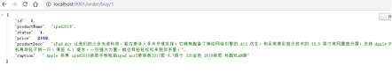 |

 

## 1.3 Feign和Ribbon的联系

**Ribbon**是一个基于 HTTP 和 TCP **客户端** 的负载均衡的工具。它可以 **在客户端** 配置

RibbonServerList（服务端列表），使用 HttpClient 或 RestTemplate 模拟http请求，步骤相当繁琐。

**Feign** 是在 Ribbon的基础上进行了一次改进，是一个使用起来更加方便的 HTTP 客户端。采用接口的方式， 只需要创建一个接口，然后在上面添加注解即可 ，将需要调用的其他服务的方法定义成抽象方法即可，  不需要自己构建http请求。然后就像是调用自身工程的方法调用，而感觉不到是调用远程方法，使得编写客户端变得非常容易

## 1.4 负载均衡

Feign中本身已经集成了Ribbon依赖和自动配置，因此我们不需要额外引入依赖，也不需要再注册RestTemplate 对象。另外，我们可以像上节课中讲的那样去配置Ribbon，可以通过 ribbon.xx 来进行全局配置。也可以通过服务名.ribbon.xx 来对指定服务配置：

启动两个shop_service_product ，重新测试可以发现使用Ribbon的轮询策略进行负载均衡

 

|      |                                          |
| ---- | ---------------------------------------- |
|      | 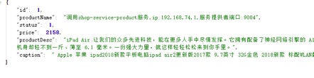 |

# 2 服务调用Feign高级

## 2.1 Feign的配置

从Spring Cloud Edgware开始，Feign支持使用属性自定义Feign。对于一个指定名称的Feign Client（例如该Feign Client的名称为 feignName ），Feign支持如下配置项：

 

|      |          |
| ---- | -------- |
|      |  |

 

feignName：FeginClient的名称connectTimeout ： 建立链接的超时时长readTimeout ： 读取超时时长loggerLevel: Fegin的日志级别errorDecoder ：Feign的错误解码器retryer ： 配置重试requestInterceptors ： 添加请求拦截器decode404 ： 配置熔断不处理404异常

## 2.2 请求压缩

Spring Cloud Feign 支持对请求和响应进行GZIP压缩，以减少通信过程中的性能损耗。通过下面的参数即可开启请求与响应的压缩功能：

 

同时，我们也可以对请求的数据类型，以及触发压缩的大小下限进行设置：

 

|      |          |
| ---- | -------- |
|      |  |

 

注：上面的数据类型、压缩大小下限均为默认值。

## 2.3 日志级别

在开发或者运行阶段往往希望看到Feign请求过程的日志记录，默认情况下Feign的日志是没有开启的。 要想用属性配置方式来达到日志效果，只需在application.yml 中添加如下内容即可：

 

|      |          |
| ---- | -------- |
|      |  |

 

: Feign日志只会对日志级别为debug的做出响应

: 配置Feign的日志Feign有四种

日志级别：

NONE【性能最佳，适用于生产】：不记录任何日志（默认值）

BASIC【适用于生产环境追踪问题】：仅记录请求方法、URL、响应状态代码以及执行时间HEADERS：记录BASIC级别的基础上，记录请求和响应的header。

 

|      |                                          |
| ---- | ---------------------------------------- |
|      | 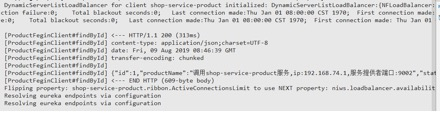 |

FULL【比较适用于开发及测试环境定位问题】：记录请求和响应的header、body和元数 据。

## 2.4 源码分析

通过上面的使用过程，@EnableFeignClients和@FeignClient两个注解就实现了Feign的功能，那我们从

@EnableFeignClients注解开始分析Feign的源码

#### （1）  EnableFeignClients注解

 

|      |          |
| ---- | -------- |
|      |  |

 

通过@EnableFeignClients 引入了FeignClientsRegistrar客户端注册类

#### （2）  FeignClientsRegistrar注册类

 

|      |          |
| ---- | -------- |
|      |  |

 

通过其类结构可知，由于实现了ImportBeanDefinitionRegistrar接口，那么在

registerBeanDefinitions()中就会解析和注册BeanDefinition，主要注册的对象类型有两种：

注册缺省配置的配置信息

注册那些添加了@FeignClient的类或接口 ： 这也是我们讨论的重点

 

public void registerFeignClients(AnnotationMetadata metadata, BeanDefinitionRegistry registry) {

ClassPathScanningCandidateComponentProvider scanner = this.getScanner(); scanner.setResourceLoader(this.resourceLoader);

Map\<String, Object\> attrs = metadata.getAnnotationAttributes(EnableFeignClients.class.getName());

AnnotationTypeFilter annotationTypeFilter = new AnnotationTypeFilter(FeignClient.class);

Class\<?\>[] clients = attrs == null ? null : (Class[]) ((Class[])attrs.get("clients"));

Object basePackages;

if (clients != null && clients.length != 0) {

final Set\<String\> clientClasses = new HashSet(); basePackages = new HashSet();

Class[] var9 = clients;

int var10 = clients.length;

 

 

for(int var11 = 0; var11 \< var10; ++var11) { Class\<?\> clazz = var9[var11];

((Set)basePackages).add(ClassUtils.getPackageName(clazz)); clientClasses.add(clazz.getCanonicalName());

}

 

 

AbstractClassTestingTypeFilter filter = new AbstractClassTestingTypeFilter() {

protected boolean match(ClassMetadata metadata) {

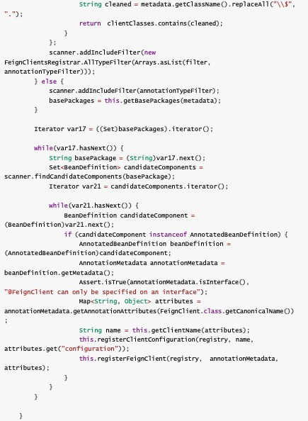

 

该方法主要是扫描类路径，对所有的FeignClient生成对应的 BeanDefinitio 。同时又调用了registerClientConfiguration 注册配置的方法，这里是第二处调用。这里主要是将扫描的目录下， 每个项目的配置类加载的容器当中。调用registerFeignClient 注册对象

#### （3）  注册FeignClient对象

 

|      |          |
| ---- | -------- |
|      |  |

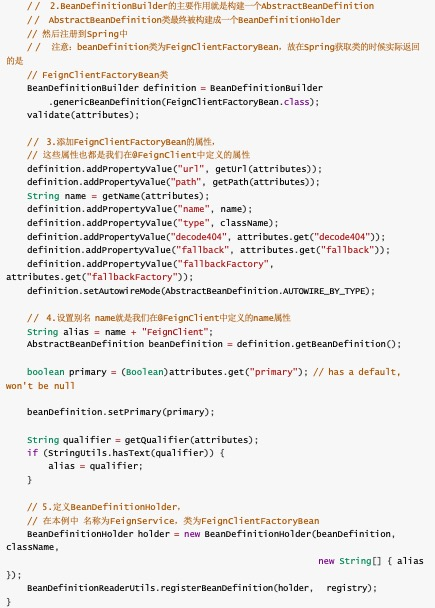

 

 

|      |          |
| ---- | -------- |
|      |  |

通过分析可知：我们最终是向Spring中注册了一个bean，bean的名称就是类或接口的名称（也就是本 例中的FeignService），bean的实现类是FeignClientFactoryBean，其属性设置就是我们在@FeignClient中定义的属性。那么下面我们在Controller中对FeignService的的引入，实际就是引入了

 

#### （4）  FeignClientFactoryBean类

们对@EnableFeignClients注解的源码进行了分析，了解到其主要作用就是把带有@FeignClient注解的 类或接口用FeignClientFactoryBean类注册到Spring中。

 

通过FeignClientFactoryBean 类结构可以发现其实现了FactoryBean类，那么当从

ApplicationContext中获取该bean的时候，实际调用的是其getObject()方法。返回调用getTarget()方法

 

|      |          |
| ---- | -------- |
|      |  |

 

FeignClientFactoryBean实现了FactoryBean的getObject、getObjectType、isSingleton方法； 实现了InitializingBean的afterPropertiesSet方法；实现了ApplicationContextAware的setApplicationContext方法

getObject调用的是getTarget方法，它从applicationContext取出FeignContext，然后构造Feign.Builder并设置了logger、encoder、decoder、contract，之后通过configureFeign根据FeignClientProperties来进一步配置Feign.Builder的retryer、errorDecoder、 request.Options、requestInterceptors、queryMapEncoder、decode404

初步配置完Feign.Builder之后再判断是否需要loadBalance，如果需要则通过loadBalance方法来 设置，不需要则在Client是LoadBalancerFeignClient的时候进行unwrap

#### （5）  发送请求

由上可知，FeignClientFactoryBean.getObject()具体返回的是一个代理类，具体为

FeignInvocationHandler

 

static class FeignInvocationHandler implements InvocationHandler { private final Target target;

private final Map\<Method, MethodHandler\> dispatch;

 

 

FeignInvocationHandler(Target target, Map\<Method, MethodHandler\> dispatch) {

 

Object[0]);

this.target = (Target)Util.checkNotNull(target, "target", new

 

 

this.dispatch = (Map)Util.checkNotNull(dispatch, "dispatch for %s",

new Object[]{target});

}

 

 

public Object invoke(Object proxy, Method method, Object[] args) throws Throwable {

if (!"equals".equals(method.getName())) {

if ("hashCode".equals(method.getName())) { return this.hashCode();

} else {

return "toString".equals(method.getName()) ? this.toString()

: ((MethodHandler)this.dispatch.get(method)).invoke(args);

}

} else {

try {

Object otherHandler = args.length \> 0 && args[0] != null ?

Proxy.getInvocationHandler(args[0]) : null;

return this.equals(otherHandler);

} catch (IllegalArgumentException var5) { return false;

}

}

}

 

public boolean equals(Object obj) {

if (obj instanceof ReflectiveFeign.FeignInvocationHandler) { ReflectiveFeign.FeignInvocationHandler other =

(ReflectiveFeign.FeignInvocationHandler)obj;

return this.target.equals(other.target);

} else {

return false;

}

}

 

public int hashCode() {

return this.target.hashCode();

}

 

 

public String toString() {

return this.target.toString();

}

}

 

 

|      |          |
| ---- | -------- |
|      |  |

FeignInvocationHandler实现了InvocationHandler，是动态代理的代理类。 当执行非Object方法时进入到this.dispatch.get(method)).invoke(args) dispatch是一个map集合，根据方法名称获取MethodHandler。具体实现类为

 

 

SynchronousMethodHandler内部创建了一个RequestTemplate对象，是Feign中的请求模板对象。内部封装了一次请求的所有元数据。

retryer中定义了用户的重试策略。

 

|      |          |
| ---- | -------- |
|      |  |

调用executeAndDecode方法通过client完成请求处理，client的实现类是

 

# 3 服务注册与发现总结

## 3.1 组件的使用方式

### 3.1.1 注册中心

#### （1）  Eureka

搭建注册中心

引入依赖spring-cloud-starter-netflix-eureka-server

配置EurekaServer

通过@EnableEurekaServer 激活Eureka Server端配置

服务注册

服务提供者引入spring-cloud-starter-netflix-eureka-client 依赖通过eureka.client.serviceUrl.defaultZone 配置注册中心地址

#### （2）  consul

搭建注册中心

下载安装consul 启动consul

服务注册

服务提供者引入spring-cloud-starter-consul-discovery 依赖

通过spring.cloud.consul.host 和spring.cloud.consul.port 指定Consul Server的请求地址

### 3.1.2 服务调用

#### （1）  Ribbon

通过Ribbon结合RestTemplate方式进行服务调用只需要在声明RestTemplate的方法上添加注解

@LoadBalanced即可

可以通过{服务名称}.ribbon.NFLoadBalancerRuleClassName 配置负载均衡策略

#### （2）  Feign

服务消费者引入spring-cloud-starter-openfeign 依赖通过@FeignClient 声明一个调用远程微服务接口

启动类上通过@EnableFeignClients 激活Feign

# 4 微服务架构的高并发问题

通过注册中心已经实现了微服务的服务注册和服务发现，并且通过Ribbon实现了负载均衡，已经借助

Feign可以优雅的进行微服务调用。那么我们编写的微服务的性能怎么样呢，是否存在问题呢？

## 4.1                 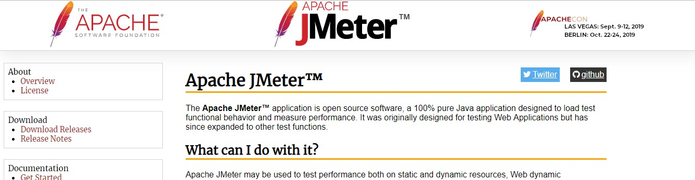      性能工具Jmetter

Apache JMeter是Apache组织开发的基于Java的压力测试工具。用于对软件做压力测试，它最初被设计用于Web应用测试，但后来扩展到其他测试领域。 它可以用于测试静态和动态资源，例如静态文件、Java 小服务程序、CGI 脚本、Java 对象、数据库、FTP 服务器， 等等。JMeter 可以用于对服务器、网络或对象模拟巨大的负载，来自不同压力类别下测试它们的强度和分析整体性能。另外JMeter能够对应 用程序做功能/回归测试，通过创建带有断言的脚本来验证你的程序返回了你期望的结果。为了最大限  度的灵活性，JMeter允许使用正则表达式创建断言。

### 4.1.1 安装Jmetter

Jmetter安装十分简单，使用资料中的apache-jmeter-2.13.zip 完整压缩包，解压找到安装目录下

bin/jmeter.bat 已管理员身份启动即可

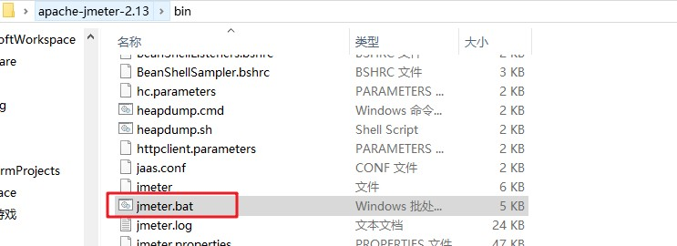

 

### 4.1.2 配置Jmetter

（1） 创建新的测试计划

 

|      |                                          |
| ---- | ---------------------------------------- |
|      | 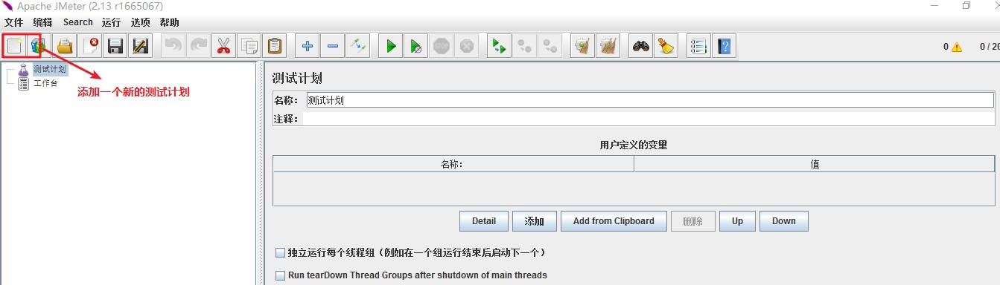 |

（2） 测试计划下创建发起请求的线程组

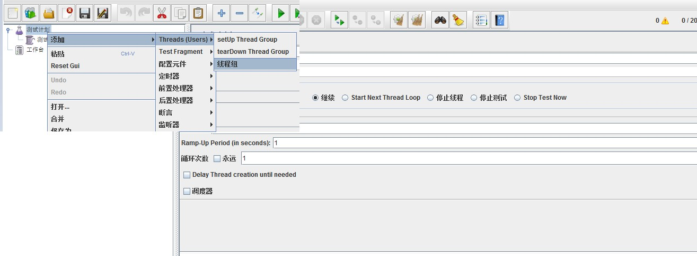

可以配置请求的线程数

以及每个请求发送的请求次数

（3） 创建http请求模板

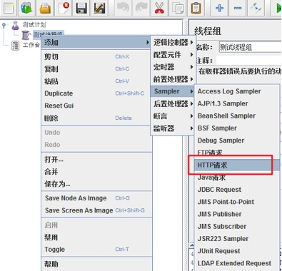

 

（4） 配置测试的接口信息

 

|      |                                          |
| ---- | ---------------------------------------- |
|      | 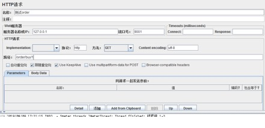 |

## 4.2 系统负载过高存在的问题

### 4.2.1 问题分析

在微服务架构中，我们将业务拆分成一个个的服务，服务与服务之间可以相互调用，由于网络原因或者 自身的原因，服务并不能保证服务的100%可用，如果单个服务出现问题，调用这个服务就会出现网络 延迟，此时若有大量的网络涌入，会形成任务累计，导致服务瘫痪。

在SpringBoot程序中，默认使用内置tomcat作为web服务器。单tomcat支持最大的并发请求是有限的，如果某一接口阻塞，待执行的任务积压越来越多，那么势必会影响其他接口的调用。

### 4.2.2 线程池的形式实现服务隔离

#### （1）  配置坐标

为了方便实现线以线程池的形式完成资源隔离，需要引入如下依赖

 

|      |          |
| ---- | -------- |
|      |  |

 

#### （2）  配置线程池

配置HystrixCommand接口的实现类，再实现类中可以对线程池进行配置

 

|      |          |
| ---- | -------- |
|      |  |

 

#### （3）  配置调用

修改OrderController ，使用自定义的OrderCommand完成调用

 

|      |          |
| ---- | -------- |
|      |  |

# 5 服务熔断Hystrix入门

## 5.1 服务容错的核心知识

### 5.1.1 雪崩效应

在微服务架构中，一个请求需要调用多个服务是非常常见的。如客户端访问A服务，而A服务需要调用B 服务，B服务需要调用C服务，由于网络原因或者自身的原因，如果B服务或者C服务不能及时响应，A服 务将处于阻塞状态，直到B服务C服务响应。此时若有大量的请求涌入，容器的线程资源会被消耗完毕， 导致服务瘫痪。服务与服务之间的依赖性，故障会传播，造成连锁反应，会对整个微服务系统造成灾难 性的严重后果，这就是服务故障的“雪崩”效应。

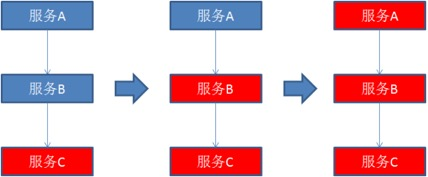

 

雪崩是系统中的蝴蝶效应导致其发生的原因多种多样，有不合理的容量设计，或者是高并发下某一个方 法响应变慢，亦或是某台机器的资源耗尽。从源头上我们无法完全杜绝雪崩源头的发生，但是雪崩的根 本原因来源于服务之间的强依赖，所以我们可以提前评估，做好**熔断，隔离，限流。**

### 5.1.2 服务隔离

顾名思义，它是指将系统按照一定的原则划分为若干个服务模块，各个模块之间相对独立，无强依赖。 当有故障发生时，能将问题和影响隔离在某个模块内部，而不扩散风险，不波及其它模块，不影响整体 的系统服务。

### 5.1.3 熔断降级

熔断这一概念来源于电子工程中的断路器（Circuit  Breaker）。在互联网系统中，当下游服务因访问压力过大而响应变慢或失败，上游服务为了保护系统整体的可用性，可以暂时切断对下游服务的调用。这 种牺牲局部，保全整体的措施就叫做熔断。

 

|      |                                          |
| ---- | ---------------------------------------- |
|      | 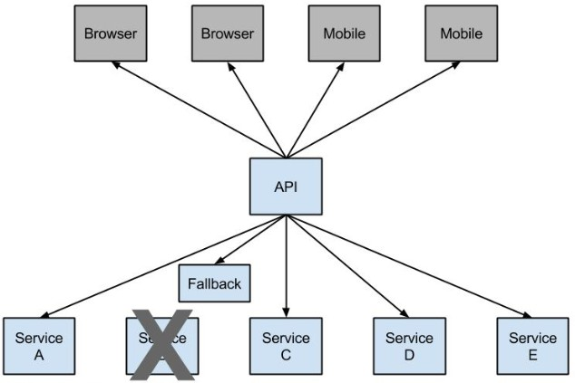 |

所谓降级，就是当某个服务熔断之后，服务器将不再被调用，此时客户端可以自己准备一个本地的

fallback回调，返回一个缺省值。 也可以理解为兜底

### 5.1.4 服务限流

限流可以认为服务降级的一种，限流就是限制系统的输入和输出流量已达到保护系统的目的。一般来说 系统的吞吐量是可以被测算的，为了保证系统的稳固运行，一旦达到的需要限制的阈值，就需要限制流 量并采取少量措施以完成限制流量的目的。比方：推迟解决，拒绝解决，或者者部分拒绝解决等等。

## 5.2 Hystrix介绍

 

|      |                                          |
| ---- | ---------------------------------------- |
|      |  |

Hystrix是由Netflix开源的一个延迟和容错库，用于隔离访问远程系统、服务或者第三方库，防止级联失 败，从而提升系统的可用性与容错性。Hystrix主要通过以下几点实现延迟和容错。

包裹请求：使用HystrixCommand包裹对依赖的调用逻辑，每个命令在独立线程中执行。这使用 了设计模式中的“命令模式”。

跳闸机制：当某服务的错误率超过一定的阈值时，Hystrix可以自动或手动跳闸，停止请求该服务 一段时间。

资源隔离：Hystrix为每个依赖都维护了一个小型的线程池（或者信号量）。如果该线程池已满， 发往该依赖的请求就被立即拒绝，而不是排队等待，从而加速失败判定。

监控：Hystrix可以近乎实时地监控运行指标和配置的变化，例如成功、失败、超时、以及被拒绝 的请求等。

回退机制：当请求失败、超时、被拒绝，或当断路器打开时，执行回退逻辑。回退逻辑由开发人员 自行提供，例如返回一个缺省值。

自我修复：断路器打开一段时间后，会自动进入“半开”状态。

## 5.3 Rest实现服务熔断

**（1）**  **复制** shop_service_order **项目并命名为** shop_service_order_rest_hystrix

略

#### （2）  配置依赖

在shop_service_order_rest_hystrix 工程中添加Hystrix的相关依赖

 

|      |          |
| ---- | -------- |
|      |  |

 

#### （3）  开启熔断

在启动类OrderApplication 中添加@EnableCircuitBreaker 注解开启对熔断器的支持。

 

|      |          |
| ---- | -------- |
|      |  |

 

可以看到，我们类上的注解越来越多，在微服务中，经常会引入上面的三个注解，于是Spring就提供了 一个组合注解：@SpringCloudApplication

#### （4）  配置熔断降级业务逻辑

 

|      |          |
| ---- | -------- |
|      |  |

 

有代码可知，为findProduct 方法编写一个回退方法findProductFallBack，该方法与findProduct 方法具有相同的参数与返回值类型，该方法返回一个默认的错误信息。

在Product  方法上，使用注解@HystrixCommand的fallbackMethod属性，指定熔断触发的降级方法

 

因为熔断的降级逻辑方法必须跟正常逻辑方法保证：**相同的参数列表和返回值声明**。

在findProduct 方法上HystrixCommand(fallbackMethod = "findProductFallBack") 用来声明一个降级逻辑的方法

当shop-service-product 微服务正常时，浏览器访问http://localhost:9001/order/product/1

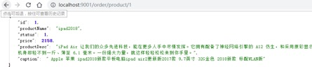

 

 

|      |                                          |
| ---- | ---------------------------------------- |
|      | 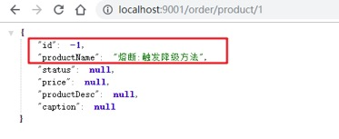 |

可以正常调用服务提供者获取数据。当将商品微服务停止时继续访问

 

此时Hystrix配置已经生效进入熔断降级方法。

#### 默认的Fallback

我们刚才把fallback写在了某个业务方法上，如果这样的方法很多，那岂不是要写很多。所以我们可以 把Fallback配置加在类上，实现默认fallback：

 

|      |                                          |
| ---- | ---------------------------------------- |
|      | 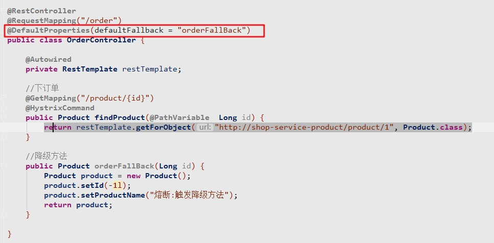 |

#### 超时设置

在之前的案例中，请求在超过1秒后都会返回错误信息，这是因为Hystix的默认超时时长为1，我们可以 通过配置修改这个值：

 

|      |          |
| ---- | -------- |
|      |  |

## 5.4 Feign实现服务熔断

SpringCloud  Fegin默认已为Feign整合了hystrix，所以添加Feign依赖后就不用在添加hystrix，那么怎么才能让Feign的熔断机制生效呢，只要按以下步骤开发：

**（1）**  **复制** shop_service_order **项目并命名为** shop_service_order_feign_hystrix

略

#### （2）  修改application.yml在Fegin中开启hystrix

在Feign中已经内置了hystrix，但是默认是关闭的需要在工程的 application.yml 中开启对hystrix的支持

 

|      |          |
| ---- | -------- |
|      |  |

 

#### （3）  配置FeignClient接口的实现类

基于Feign实现熔断降级，那么降级方法需要配置到FeignClient接口的实现类中

 

|      |          |
| ---- | -------- |
|      |  |

 

**（4）**   

|      |          |
| ---- | -------- |
|      |  |

**修改****FeignClient****添加****hystrix****熔断**在@FeignClient注解中添加降级方法

 

@FeignClient注解中以fallback声明降级方法

# 6 服务熔断Hystrix高级

我们知道，当请求失败，被拒绝，超时的时候，都会进入到降级方法中。但进入降级方法并不意味着断 路器已经被打开。那么如何才能了解断路器中的状态呢？

## 6.1 Hystrix的监控平台

除了实现容错功能，Hystrix还提供了近乎实时的监控，HystrixCommand和 HystrixObservableCommand在执行时，会生成执行结果和运行指标。比如每秒的请求数量，成功数 量等。这些状态会暴露在Actuator提供的/health端点中。只需为项目添加 spring-boot-actuator 依赖，重启项目，访问http://localhost:9001/actuator/hystrix.stream ,即可看到实时的监控数据。

 

|      |                                          |
| ---- | ---------------------------------------- |
|      | 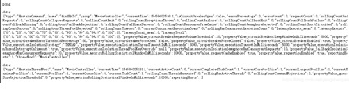 |

### 6.1.1 搭建Hystrix DashBoard监控

刚刚讨论了Hystrix的监控，但访问/hystrix.stream接口获取的都是已文字形式展示的信息。很难通过文  字直观的展示系统的运行状态，所以Hystrix官方还提供了基于图形化的DashBoard（仪表板）监控平台。Hystrix仪表板可以显示每个断路器（被@HystrixCommand注解的方法）的状态。

（1） 导入依赖

 

|      |          |
| ---- | -------- |
|      |  |

 

（2） 添加EnableHystrixDashboard 注解

在启动类使用@EnableHystrixDashboard注解激活仪表盘项目

 

|      |          |
| ---- | -------- |
|      |  |

 

（3） 访问测试

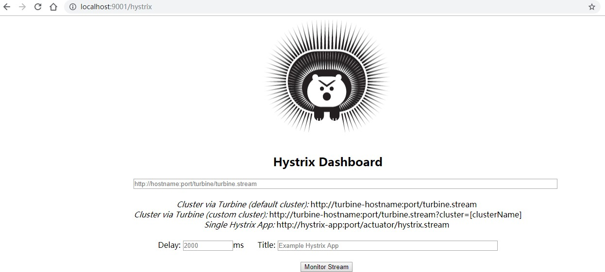

 

 

|      |                                          |
| ---- | ---------------------------------------- |
|      | 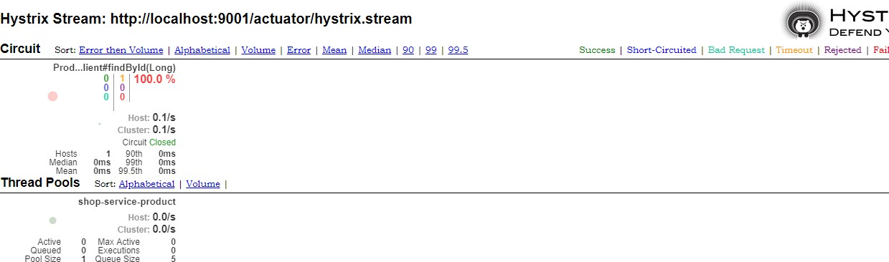 |

输入监控断点展示监控的详细数据

 

 

### 6.1.2断路器聚合监控Turbine

在微服务架构体系中，每个服务都需要配置Hystrix  DashBoard监控。如果每次只能查看单个实例的监控数据，就需要不断切换监控地址，这显然很不方便。要想看这个系统的Hystrix  Dashboard数据就需要用到Hystrix Turbine。Turbine是一个聚合Hystrix 监控数据的工具，他可以将所有相关微服务的Hystrix 监控数据聚合到一起，方便使用。引入Turbine后，整个监控系统架构如下：

 

|      |                                          |
| ---- | ---------------------------------------- |
|      | 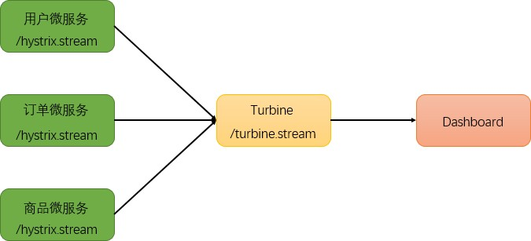 |

 

（1） 搭建TurbineServer

创建工程shop_hystrix_turbine 引入相关坐标

 

（2） 配置多个微服务的hystrix监控

在application.yml的配置文件中开启turbine并进行相关配置

 

|      |          |
| ---- | -------- |
|      |  |

 

eureka相关配置 ： 指定注册中心地址

turbine相关配置：指定需要监控的微服务列表

turbine会自动的从注册中心中获取需要监控的微服务，并聚合所有微服务中的 /hystrix.stream 数据

（3）配置启动类

 

|      |          |
| ---- | -------- |
|      |  |

 

作为一个独立的监控项目，需要配置启动类，开启HystrixDashboard监控平台，并激活Turbine

（4） 测试

浏览器访问http://localhost:8031/hystrix 展示HystrixDashboard。并在url位置输入 [http://local](http://local/) host:8031/turbine.stream，动态根据turbine.stream数据展示多个微服务的监控数据

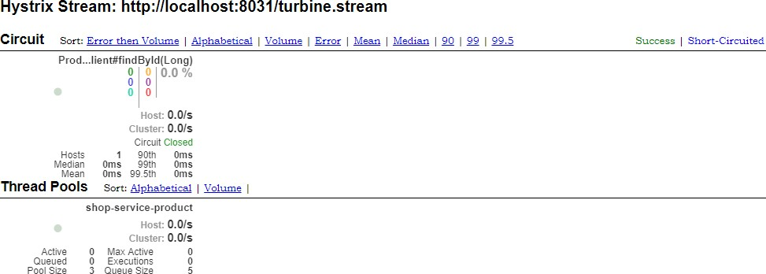

 

## 6.2 熔断器的状态

熔断器有三个状态 CLOSED 、 OPEN 、 HALF_OPEN 熔断器默认关闭状态，当触发熔断后状态变更为OPEN ,在等待到指定的时间，Hystrix会放请求检测服务是否开启，这期间熔断器会变为HALF_OPEN 半开启状态，熔断探测服务可用则继续变更为 CLOSED 关闭熔断器。

 

|      |                                          |
| ---- | ---------------------------------------- |
|      | 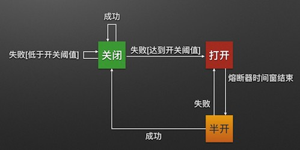 |

Closed：关闭状态（断路器关闭），所有请求都正常访问。代理类维护了最近调用失败的次数， 如果某次调用失败，则使失败次数加1。如果最近失败次数超过了在给定时间内允许失败的阈值， 则代理类切换到断开(Open)状态。此时代理开启了一个超时时钟，当该时钟超过了该时间，则切 换到半断开（Half-Open）状态。该超时时间的设定是给了系统一次机会来修正导致调用失败的错 误。

Open：打开状态（断路器打开），所有请求都会被降级。Hystix会对请求情况计数，当一定时间  内失败请求百分比达到阈值，则触发熔断，断路器会完全关闭。默认失败比例的阈值是50%，请求 次数最少不低于20次。

Half  Open：半开状态，open状态不是永久的，打开后会进入休眠时间（默认是5S）。随后断路器会自动进入半开状态。此时会释放1次请求通过，若这个请求是健康的，则会关闭断路器，否则 继续保持打开，再次进行5秒休眠计时。

为了能够精确控制请求的成功或失败，我们在shop_service_product 的调用业务中加入一段逻辑：

 

|      |          |
| ---- | -------- |
|      |  |

这样如果参数是id为1，一定失败，其它情况都成功。我们准备两个请求窗口：

一个请求：http://localhost:8080/consumer/1，注定失败一个请求：http://localhost:8080/consumer/2，肯定成功

熔断器的默认触发阈值是20次请求，不好触发。休眠时间时5秒，时间太短，不易观察，为了测试方 便，我们可以通过配置修改熔断策略：

 

|      |          |
| ---- | -------- |
|      |  |

 

解读：

requestVolumeThreshold：触发熔断的最小请求次数，默认20 errorThresholdPercentage：触发熔断的失败请求最小占比，默认50% sleepWindowInMilliseconds：熔断多少秒后去尝试请求

当我们疯狂访问id为1的请求时（超过10次），就会触发熔断。断路器会端口，一切请求都会被降级处 理。

此时你访问id为2的请求，会发现返回的也是失败，而且失败时间很短，只有20毫秒左右：

 

|      |                                          |
| ---- | ---------------------------------------- |
|      | 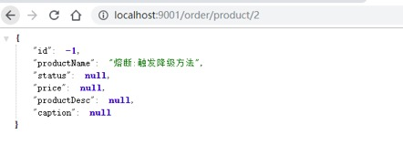 |

 

## 6.3 熔断器的隔离策略

微服务使用Hystrix熔断器实现了服务的自动降级，让微服务具备自我保护的能力，提升了系统的稳定 性，也较好的解决雪崩效应。**其使用方式目前支持两种策略：**

**线程池隔离策略：**使用一个线程池来存储当前的请求，线程池对请求作处理，设置任务返回处理超 时时间，堆积的请求堆积入线程池队列。这种方式需要为每个依赖的服务申请线程池，有一定的资 源消耗，好处是可以应对突发流量（流量洪峰来临时，处理不完可将数据存储到线程池队里慢慢处 理）

**信号量隔离策略：**使用一个原子计数器（或信号量）来记录当前有多少个线程在运行，请求来先判 断计数器的数值，若超过设置的最大线程个数则丢弃改类型的新请求，若不超过则执行计数操作请 求来计数器+1，请求返回计数器-1。这种方式是严格的控制线程且立即返回模式，无法应对突发  流量（流量洪峰来临时，处理的线程超过数量，其他的请求会直接返回，不继续去请求依赖的服  务）

#### 线程池和型号量两种策略功能支持对比如下：

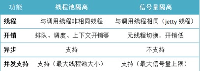

 

hystrix.command.default.execution.isolation.strategy : 配置隔离策略

信号量隔离线程池隔离

hystrix.command.default.execution.isolation.maxConcurrentRequests : 最大信号量上限

## 6.4 Hystrix的核心源码

Hystrix 底层基于 RxJava，RxJava 是响应式编程开发库，因此Hystrix的整个实现策略简单说即：把一个HystrixCommand封装成一个Observable（待观察者），针对自身要实现的核心功能，对Observable进行各种装饰，并在订阅各步装饰的Observable，以便在指定事件到达时，添加自己的业 务。

 

|      |                                          |
| ---- | ---------------------------------------- |
|      | 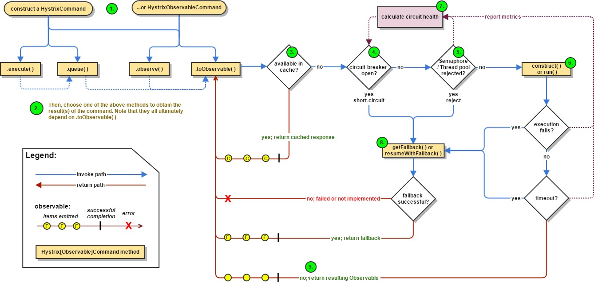 |

 

#### Hystrix主要有4种调用方式：

toObservable() 方法 ：未做订阅，只是返回一个Observable 。

observe() 方法 ：调用 #toObservable() 方法，并向 Observable 注册 rx.subjects.ReplaySubject

发起订阅。

queue() 方法 ：调用 #toObservable() 方法的基础上，调用：Observable#toBlocking() 和

BlockingObservable#toFuture() 返回 Future 对象

execute() 方法 ：调用 #queue() 方法的基础上，调用 Future#get() 方法，同步返回 #run() 的执行结果。

#### 主要的执行逻辑：

\1.  每次调用创建一个新的HystrixCommand,把依赖调用封装在run()方法中.

\2.  执行execute()/queue做同步或异步调用.

\3.  判断熔断器(circuit-breaker)是否打开,如果打开跳到步骤8,进行降级策略,如果关闭进入步骤.

\4.  判断线程池/队列/信号量是否跑满，如果跑满进入降级步骤8,否则继续后续步骤.

\5.  调用HystrixCommand的run方法.运行依赖逻辑，依赖逻辑调用超时,进入步骤8.

\6.  判断逻辑是否调用成功。返回成功调用结果；调用出错，进入步骤8.

\7.  计算熔断器状态,所有的运行状态(成功, 失败, 拒绝,超时)上报给熔断器，用于统计从而判断熔断器状态.

\8.  getFallback()降级逻辑。以下四种情况将触发getFallback调用：

\1.  run()方法抛出非HystrixBadRequestException异常。

\2.  run()方法调用超时

\3.  熔断器开启拦截调用

\4.  线程池/队列/信号量是否跑满

\5.  没有实现getFallback的Command将直接抛出异常，fallback降级逻辑调用成功直接返回，降 级逻辑调用失败抛出异常.

\9.  返回执行成功结果

**6.4.1** **HystrixCommand****注解**

在实际应用过程通过@HystrixCommand注解能够更加简单快速的实现Hystrix的应用，那么我们就直接 从@HystrixCommand注解入手，其中包含了诸多参数配置，如执行隔离策略，线程池定义等，这些参 数就不一一说明了，我们来看看其是如何实现服务降级的。

 

|      |          |
| ---- | -------- |
|      |  |

 

其定义了fallbackMethod方法名，正如其名，其提供了一个定义回退方法映射，在异常触发时此方法名 对应的method将被触发执行，从而实现服务的降级。那么@HystrixCommand注解又是如何被执行的呢，我们找到HystrixCommandAspect.java ，其切点定义如下

 

|      |          |
| ---- | -------- |
|      |  |

 

可以看到被@HystrixCommand 注解的方法将会执行切面处理。

### 6.4.2 环绕通知增强

在HystrixCommandAspect的methodsAnnotatedWithHystrixCommand方法中我们可以看到如下

 

@Around("hystrixCommandAnnotationPointcut() || hystrixCollapserAnnotationPointcut()")

public Object methodsAnnotatedWithHystrixCommand(ProceedingJoinPoint joinPoint) throws Throwable {

Method method = AopUtils.getMethodFromTarget(joinPoint); Validate.notNull(method, "failed to get method from joinPoint: %s", new

Object[]{joinPoint});

if (method.isAnnotationPresent(HystrixCommand.class) && method.isAnnotationPresent(HystrixCollapser.class)) {

throw new IllegalStateException("method cannot be annotated with HystrixCommand and HystrixCollapser annotations at the same time");

} else {

HystrixCommandAspect.MetaHolderFactory metaHolderFactory = (HystrixCommandAspect.MetaHolderFactory)META_HOLDER_FACTORY_MAP.get(HystrixComma ndAspect.HystrixPointcutType.of(method));

MetaHolder metaHolder = metaHolderFactory.create(joinPoint); HystrixInvokable invokable =

HystrixCommandFactory.getInstance().create(metaHolder); ExecutionType executionType =

metaHolder.isCollapserAnnotationPresent() ? metaHolder.getCollapserExecutionType() : metaHolder.getExecutionType();

 

 

 

 

 

 

 

metaHolder);

 

 

 

metaHolder);

try {

Object result;

if (!metaHolder.isObservable()) {

result = CommandExecutor.execute(invokable, executionType,

 

 

} else {

result = this.executeObservable(invokable, executionType,

 

此方法通过环绕通知的形式对目标方法进行增强，主要作用如下：

HystrixInvokable：定义了后续真正执行HystrixCommand的GenericCommand实例定义metaHolder，包含了当前被注解方法的所有相关有效信息

执行方法：  在进入执行体前，其有一个判断条件，判断其是否是一个Observable模式（在Hystrix 中，其实现大量依赖RXJAVA，会无处不在的看到Observable，其是一种观察者模式的实现，具体可以到RxJava项目官方做更多了解）

# 7 服务熔断Hystrix的替换方案

18年底Netflix官方宣布Hystrix 已经足够稳定，不再积极开发 Hystrix，该项目将处于维护模式。就目前来看Hystrix是比较稳定的，并且Hystrix只是停止开发新的版本，并不是完全停止维护，Bug什么的依然会维护的。因此短期内，Hystrix依然是继续使用的。但从长远来看，Hystrix总会达到它的生命周

期，那么Spring  Cloud生态中是否有替代产品呢？

## 7.1 替换方案介绍

#### Alibaba Sentinel

[Sentinel ](https://github.com/alibaba/Sentinel)是阿里巴巴开源的一款断路器实现，目前在Spring Cloud的孵化器项目[Spring Cloud Alibaba](https://github.com/spring-cloud-incubator/spring-cloud-alibaba)

中的一员Sentinel本身在阿里内部已经被大规模采用，非常稳定。因此可以作为一个较好的替代品。

#### Resilience4J

[Resilicence4J ](https://github.com/resilience4j/resilience4j)一款非常轻量、简单，并且文档非常清晰、丰富的熔断工具，这也是Hystrix官方推荐的替代产品。不仅如此，Resilicence4j还原生支持Spring Boot 1.x/2.x，而且监控也不像Hystrix一样弄Dashboard/Hystrix等一堆轮子，而是支持和Micrometer（Pivotal开源的监控门面，Spring Boot 2.x 中的Actuator就是基于Micrometer的）、prometheus（开源监控系统，来自谷歌的论文）、以及Dropwizard metrics（Spring Boot曾经的模仿对象，类似于Spring Boot）进行整合。

## 7.2 Sentinel概述

### 7.2.1 Sentinel简介

 

 

|      |                                          |
| ---- | ---------------------------------------- |
|      |  |

 

随着微服务的流行，服务和服务之间的稳定性变得越来越重要。Sentinel 以流量为切入点，从流量控制、熔断降级、系统负载保护等多个维度保护服务的稳定性。

Sentinel 具有以下特征:

**丰富的应用场景**：Sentinel 承接了阿里巴巴近 10 年的双十一大促流量的核心场景，例如秒杀（即突发流量控制在系统容量可以承受的范围）、消息削峰填谷、集群流量控制、实时熔断下游不可用 应用等。

**完备的实时监控**：Sentinel 同时提供实时的监控功能。您可以在控制台中看到接入应用的单台机器秒级数据，甚至 500 台以下规模的集群的汇总运行情况。

**广泛的开源生态**：Sentinel 提供开箱即用的与其它开源框架/库的整合模块，例如与 Spring Cloud、Dubbo、gRPC 的整合。您只需要引入相应的依赖并进行简单的配置即可快速地接入Sentinel。

**完善的** **SPI 扩展点**：Sentinel 提供简单易用、完善的 SPI 扩展接口。您可以通过实现扩展接口来快速地定制逻辑。例如定制规则管理、适配动态数据源等。

Sentinel 的主要特性：

 

|      |                                          |
| ---- | ---------------------------------------- |
|      | 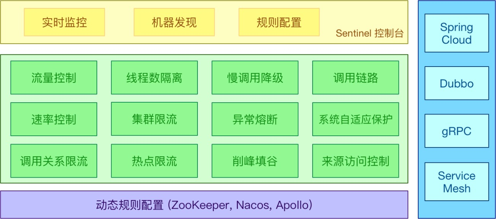 |

### 7.2.2 Sentinel与Hystrix的区别

|                | **Sentinel**                                               | **Hystrix**             | **resilience4j**                 |
| -------------- | ---------------------------------------------------------- | ----------------------- | -------------------------------- |
| 隔离策略       | 信号量隔离（并发线程数限流）                               | 线程池隔离/信号量隔离   | 信号量隔离                       |
| 熔断降级策略   | 基于响应时间、异常比率、异常数                             | 基于异常比率            | 基于异常比率、响应时间           |
| 实时统计实现   | 滑动窗口（LeapArray）                                      | 滑动窗口（基于 RxJava） | Ring Bit Buffer                   |
| 动态规则配置   | 支持多种数据源                                             | 支持多种数据源          | 有限支持                         |
| 扩展性         | 多个扩展点                                                 | 插件的形式              | 接口的形式                       |
| 基于注解的支持 | 支持                                                       | 支持                    | 支持                             |
| 限流           | 基于 QPS，支持基于调用关系的限流                           | 有限的支持              | Rate Limiter                     |
| 流量整形       | 支持预热模式、匀速器模式、预热排队模式                     | 不支持                  | 简单的 Rate Limiter  模式        |
| 系统自适应保护 | 支持                                                       | 不支持                  | 不支持                           |
| 控制台         | 提供开箱即用的控制台，可配置规则、查看秒级监控、机器发现等 | 简单的监控查看          | 不提供控制台，可对接其它监控系统 |

**7.2.3** **迁移方案**

Sentinel官方提供了详细的由Hystrix 迁移到Sentinel 的方法

 

| **Hystrix** **功能**  | **迁移方案**                                                 |
| --------------------- | ------------------------------------------------------------ |
| 线程池隔离/信号量隔离 | Sentinel 不支持线程池隔离；信号量隔离对应 Sentinel 中的线程数限流，详见此处 |
| 熔断器                | Sentinel 支持按平均响应时间、异常比率、异常数来进行熔断降级。从 Hystrix 的异常比率熔断迁移的步骤详见此处 |
| Command  创建         | 直接使用 Sentinel   SphU API 定义资源即可，资源定义与规则配置分离，详见此处 |
| 规则配置              | 在 Sentinel  中可通过 API 硬编码配置规则，也支持多种动态规则源 |
| 注解支持              | Sentinel 也提供注解支持，可以很方便地迁移，详见此处          |
| 开源框架支持          | Sentinel 提供 Servlet、Dubbo、Spring Cloud、gRPC 的适配模块，开箱即用； 若之前使用 Spring Cloud  Netflix，可迁移至 [Spring   Cloud Alibaba](https://github.com/spring-cloud-incubator/spring-cloud-alibaba) |

### 7.2.4 名词解释

Sentinel 可以简单的分为 Sentinel 核心库和 Dashboard。核心库不依赖 Dashboard，但是结合Dashboard 可以取得最好的效果。

使用 Sentinel 来进行熔断保护，主要分为几个步骤:

\1.  定义资源

\2.  定义规则

\3.  检验规则是否生效

**资源**：可以是任何东西，一个服务，服务里的方法，甚至是一段代码。

**规则**：Sentinel  支持以下几种规则：流量控制规则、熔断降级规则、系统保护规则、来源访问控制规则和 热点参数规则。Sentinel 的所有规则都可以在内存态中动态地查询及修改，修改之后立即生效

先把可能需要保护的资源定义好，之后再配置规则。也可以理解为，只要有了资源，我们就可以在任何 时候灵活地定义各种流量控制规则。在编码的时候，只需要考虑这个代码是否需要保护，如果需要保  护，就将之定义为一个资源。

## 7.3 Sentinel中的管理控制台

### 7.3.1 下载启动控制台

#### （1）  获取 Sentinel 控制台

您可以从官方[网站中](https://github.com/alibaba/Sentinel/releases/download/1.6.3/sentinel-dashboard-1.6.3.jar)下载最新版本的控制台 jar 包，下载地址如下：

https://github.com/alibaba/Sentinel/releases/download/1.6.3/sentinel-dashboard-1.6.3.jar

#### （2）  启动

使用如下命令启动控制台：

 

|      |          |
| ---- | -------- |
|      |  |

 

其中                 用于指定 Sentinel 控制台端口为 8080 。

从 Sentinel 1.6.0 起，Sentinel 控制台引入基本的**登录**功能，默认用户名和密码都是 sentinel 。可以参考 [鉴权模块文档 ](https://github.com/alibaba/Sentinel/wiki/控制台#鉴权)配置用户名和密码。

启动 Sentinel 控制台需要 JDK 版本为 1.8 及以上版本。

### 7.3.2 客户端能接入控制台

控制台启动后，客户端需要按照以下步骤接入到控制台。

#### （1）  引入JAR包

客户端需要引入 Transport 模块来与 Sentinel 控制台进行通信。可以通过         引入 JAR 包:

 

|      |          |
| ---- | -------- |
|      |  |

 

#### （2） 配置启动参数

在工程的application.yml中添加Sentinel 控制台配置信息

 

这里的  spring.cloud.sentinel.transport.dashboard 配置控制台的请求路径。

### 7.3.3 查看机器列表以及健康情况

默认情况下Sentinel   会在客户端首次调用的时候进行初始化，开始向控制台发送心跳包。也可以配置

,取消Sentinel控制台懒加载。打开浏览器即可展示Sentinel的管理控制台

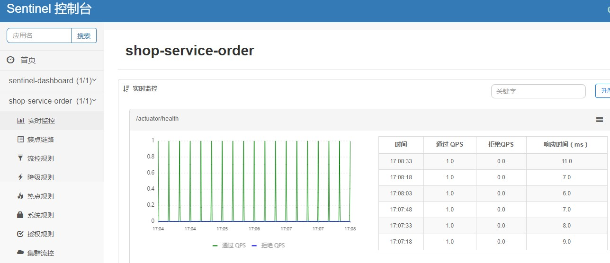

## 7.4 基于Sentinel的服务保护

### 7.4.1 通用资源保护

#### （1）  案例准备

复制工程shop_service_order 并命名为shop_service_order_rest_sentinel

#### （2） 引入依赖

需要注意SpringCloud-Alibaba与SpringCloud的版本关系

 

|      |                                          |
| ---- | ---------------------------------------- |
|      | 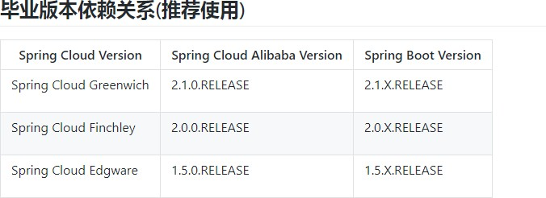 |

父工程引入alibaba实现的SpringCloud

 

子工程中引入sentinel

 

|      |          |
| ---- | -------- |
|      |  |

 

#### （3）  配置熔断降级方法

 

|      |          |
| ---- | -------- |
|      |  |

 

在需要被保护的方法上使用@SentinelResource注解进行熔断配置。与Hystrix不同的是，Sentinel对抛 出异常和熔断降级做了更加细致的区分，通过blockHandler 指定熔断降级方法，通过fallback 指定触发异常执行的降级方法。对于@SentinelResource的其他配置如下表：

 

 

 

 

| **属性**               | **作用**                                                     | **是否必须** |
| ---------------------- | ------------------------------------------------------------ | ------------ |
| value                  | 资源名称                                                     | 是           |
| entryType              | entry类型，标记流量的方向，取值IN/OUT，默认是OUT             | 否           |
| blockHandler           | 处理BlockException的函数名称。函数要求： 1. 必须是 public 2.返回类型与原方法一致 3. 参数类型需要和原方法相匹配，**并在最后加****BlockException** **类型的参数**。 4. 默认需和原方法在同一个类中。若希望使用其他类的函数，可配置 blockHandlerClass ，并指定blockHandlerClass里面的方法。 | 否           |
| blockHandlerClass      | 存放blockHandler的类。对应的处理函数必须static修饰，否则无法解析，其他要求：同blockHandler。 | 否           |
| fallback               | 用于在抛出异常的时候提供fallback处理逻辑。fallback函数可以针对所有类型的异常（除了exceptionsToIgnore 里面排除掉的异常类型） 进行处理。函数要求： 1. 返回类型与原方法一致  2. 参数类型需要和原方法相匹配，**Sentinel 1.6**  **开始，也可在方法最后**加 Throwable  类型的参数。 3.默认需和原方法在同一个类中。若希望使用其他类的函数，可配置 fallbackClass ，并指定fallbackClass里面的方法。 | 否           |
| fallbackClass【1.6】   | 存放fallback的类。对应的处理函数必须static修饰，否则无法解析，其他要求：同fallback。 | 否           |
| defaultFallback【1.6】 | 用于通用的 fallback  逻辑。默认fallback函数可以针对所有类型的异常（除了exceptionsToIgnore 里面排除掉的异常类型） 进行处理。若同时配置了  fallback 和defaultFallback，以fallback为准。函数要求：  1. 返回类型与原方法一致 2. 方法参数列表为空， **或者有一个** Throwable 类型的参数。 3. 默认需要和原方法在同一个类中。若希望使用其他类的函数，可配置 fallbackClass ，并指定fallbackClass 里面的方法。 | 否           |

| **属性**                  | **作用**                                                     | **是否必须** |
| ------------------------- | ------------------------------------------------------------ | ------------ |
| exceptionsToIgnore【1.6】 | 指定排除掉哪些异常。排除的异常不会计入异常统计，也不会进入fallback逻辑，而是原样抛  出。 | 否           |
| exceptionsToTrace         | 需要trace的异常                                              | Throwable    |

 

注：1.6.0 之前的版本 fallback 函数只针对降级异常（ DegradeException ）进行处理，**不能针对业务异常进行处理**。

特别地，若 blockHandler 和 fallback 都进行了配置，则被限流降级而抛出              时只会

进入

限流降级时会将

处理逻辑。若未配置 blockHandler 、 fallback 和 defaultFallback ，则被

**直接抛出**。

### 7.4.2 Rest实现熔断

Spring Cloud Alibaba Sentinel 支持对

bean的时候需要加上

的服务调用使用 Sentinel 进行保护，在构造注解。

 

 

注解的属性支持限流( blockHandler , blockHandlerClass )和降级( fallback , fallbackClass )的处理。

其中 blockHandler 或         属性对应的方法必须是对应                 或

fallbackClass 属性中的静态方法。该方法的参数跟返回值跟

 

致，其中参数多出了一个

 

参数用于获取 Sentinel 捕获的异常。

方法一

比如上述声明如下：

注解中             的

属性对应的方法

 

 

Sentinel RestTemplate 限流的资源规则提供两种粒度：

httpmethod:schema://host:port/path ：协议、主机、端口和路径

httpmethod:schema://host:port ：协议、主机和端口

### 7.4.3 Feign实现熔断

Sentinel 适配了 [Feign ](https://github.com/OpenFeign/feign)组件。如果想使用，除了引入                的依赖外还需要 2 个步骤：

配置文件打开 sentinel 对 feign 的支持： feign.sentinel.enabled=true

加入

#### （1）  引入依赖

依赖使

中的自动化配置类生效：

 

 

#### （2）  开启sentinel 支持

在工程的application.yml中添加sentinel 对 feign 的支持

 

|      |          |
| ---- | -------- |
|      |  |

 

#### （3） 配置FeignClient

和使用Hystrix的方式基本一致，需要配置FeignClient接口以及通过 fallback 指定熔断降级方法

 

|      |          |
| ---- | -------- |
|      |  |

 

#### （4） 配置熔断方法

 

|      |          |
| ---- | -------- |
|      |  |

 

Feign 对应的接口中的资源名策略定义：httpmethod:protocol://requesturl。 @FeignClient 注解中的所有属性，Sentinel 都做了兼容。

[ProductFeginClient 接口中方法 findById 对应的资源名为 GET:http://shop-service- product/product/{str}。](http://shop-service-product/product/)
