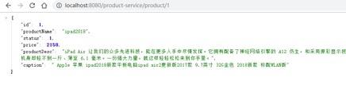

# 1 微服务网关概述

在学习完前面的知识后，微服务架构已经初具雏形。但还有一些问题：不同的微服务一般会有不同的网 络地址，客户端在访问这些微服务时必须记住几十甚至几百个地址，这对于客户端方来说太复杂也难以 维护。如下图：

 

|      |                                          |
| ---- | ---------------------------------------- |
|      |  |

 

 

如果让客户端直接与各个微服务通讯，可能会有很多问题：

客户端会请求多个不同的服务，需要维护不同的请求地址，增加开发难度在某些场景下存在跨域请求的问题

加大身份认证的难度，每个微服务需要独立认证

因此，我们需要一个微服务网关，介于客户端与服务器之间的中间层，所有的外部请求都会先经过微服 务网关。客户端只需要与网关交互，只知道一个网关地址即可，这样简化了开发还有以下优点：

1、易于监控

2、易于认证

3、减少了客户端与各个微服务之间的交互次数

 

## 1.1 服务网关的概念

### 1.1.1 什么是微服务网关

API网关是一个服务器，是系统对外的唯一入口。API网关封装了系统内部架构，为每个客户端提供 一个定制的API。API网关方式的核心要点是，所有的客户端和消费端都通过统一的网关接入微服务，在 网关层处理所有的非业务功能。通常，网关也是提供REST/HTTP的访问API。服务端通过API-GW注册和管理服务。

### 1.1.2 作用和应用场景

网关具有的职责，如身份验证、监控、负载均衡、缓存、请求分片与管理、静态响应处理。当然，最主 要的职责还是与“外界联系”。

## 1.2 常见的API网关实现方式

Kong

基于Nginx+Lua开发，性能高，稳定，有多个可用的插件(限流、鉴权等等)可以开箱即用。

问题：只支持Http协议；二次开发，自由扩展困难；提供管理API，缺乏更易用的管控、配置方 式。

Zuul

Netflix开源，功能丰富，使用JAVA开发，易于二次开发；需要运行在web容器中，如Tomcat。 问题：缺乏管控，无法动态配置；依赖组件较多；处理Http请求依赖的是Web容器，性能不如Nginx；

Traefik

Go语言开发；轻量易用；提供大多数的功能：服务路由，负载均衡等等；提供WebUI

问题：二进制文件部署，二次开发难度大；UI更多的是监控，缺乏配置、管理能力；

Spring Cloud Gateway SpringCloud提供的网关服务Nginx+lua实现

使用Nginx的反向代理和负载均衡可实现对api服务器的负载均衡及高可用 问题：自注册的问题和网关本身的扩展性

## 1.3 基于Nginx的网关实现

### 1.3.1 Nginx介绍

 

|      |                                          |
| ---- | ---------------------------------------- |
|      |  |

 

**1.3.2** **正向****/****反向代理**

#### （1）                       正向代理

正向代理，"它代理的是客户端，代客户端发出请求"，是一个位于客户端和原始服务器(origin  server)之间的服务器，为了从原始服务器取得内容，客户端向代理发送一个请求并指定目标(原始服务器)，然后 代理向原始服务器转交请求并将获得的内容返回给客户端。客户端必须要进行一些特别的设置才能使用 正向代理。

#### （2） 反向代理

 

|      |                                          |
| ---- | ---------------------------------------- |
|      |  |

 

多个客户端给服务器发送的请求，Nginx服务器接收到之后，按照一定的规则分发给了后端的业务处 理服务器进行处理了。此时~请求的来源也就是客户端是明确的，但是请求具体由哪台服务器处理的并 不明确了，Nginx扮演的就是一个反向代理角色。客户端是无感知代理的存在的，反向代理对外都是透 明的，访问者并不知道自己访问的是一个代理。因为客户端不需要任何配置就可以访问。反向代

理，"它代理的是服务端，代服务端接收请求"，主要用于服务器集群分布式部署的情况下，反向代理隐 藏了服务器的信息

如果只是单纯的需要一个最基础的具备转发功能的网关，那么使用Ngnix是一个不错的选择。

### 1.3.3 准备工作

启动 shop_service_order 微服务，单独请求地址：http://127.0.0.1:9001/ 启动 shop_service_product 微服务,单独请求地址：http://127.0.0.1:9002/ 安装资料中提供的ngnix。找到ngnix.exe双击运行即可

 

 

**1.3.4** **配置****Ng****i****nx****的请求转发**

 

|      |          |
| ---- | -------- |
|      |  |

# 2 微服务网关Zuul

## 2.1 Zuul简介

ZUUL是Netflix开源的微服务网关，它可以和Eureka、Ribbon、Hystrix等组件配合使用，Zuul组件的 核心是一系列的过滤器，这些过滤器可以完成以下功能：

动态路由：动态将请求路由到不同后端集群

压力测试：逐渐增加指向集群的流量，以了解性能

负载分配：为每一种负载类型分配对应容量，并弃用超出限定值的请求静态响应处理：边缘位置进行响应，避免转发到内部集群

身份认证和安全: 识别每一个资源的验证要求，并拒绝那些不符的请求。Spring Cloud对Zuul进行了整合和增强。

Spring Cloud对Zuul进行了整合和增强

## 2.2 搭建Zuul网关服务器

#### （1） 创建工程导入依赖

在IDEA中创建ZUUL网关工程 shop_zuul_server ，并添加响应依赖

 

|      |          |
| ---- | -------- |
|      |  |

#### （2） 编写启动类

创建启动类ZuulServerApplication

 

|      |          |
| ---- | -------- |
|      |  |

 

@EnableZuulProxy ： 通过@EnableZuulProxy 注解开启Zuul网管功能

#### （3） 编写配置

创建配置文件application.yml ，并添加相应配置

 

|      |          |
| ---- | -------- |
|      |  |

 

## 2.3 Zuul中的路由转发

最直观的理解：“路由”是指根据请求URL，将请求分配到对应的处理程序。在微服务体系中，Zuul负责 接收所有的请求。根据不同的URL匹配规则，将不同的请求转发到不同的微服务处理。

 

|      |          |
| ---- | -------- |
|      |  |

 

只需要在application.yml文件中配置路由规则即可：

product-service：配置路由id，可以随意取名url：映射路径对应的实际url地址

path：配置映射路径，这里将所有请求前缀为/product-service/的请求，转发到[http://127.0.0.1:](http://127.0.0.1/) 9002处理

配置好Zuul路由之后启动服务，在浏览器中输入http://localhost:8080/product- service/product/1 ，即可访问到订单微服务。

 

|      |                                          |
| ---- | ---------------------------------------- |
|      |  |

### 2.3.1 面向服务的路由

微服务一般是由几十、上百个服务组成，对于一个URL请求，最终会确认一个服务实例进行处理。如果 对每个服务实例手动指定一个唯一访问地址，然后根据URL去手动实现请求匹配，这样做显然就不合  理。

Zuul支持与Eureka整合开发，根据ServiceID自动的从注册中心中获取服务地址并转发请求，这样做的 好处不仅可以通过单个端点来访问应用的所有服务，而且在添加或移除服务实例的时候不用修改Zuul的 路由配置。

（1） 添加Eureka客户端依赖

 

|      |          |
| ---- | -------- |
|      |  |

 

（2） 开启Eureka客户端发现功能

 

|      |          |
| ---- | -------- |
|      |  |

 

（3） 添加Eureka配置，获取服务信息

 

|      |          |
| ---- | -------- |
|      |  |

 

（4） 修改映射配置，通过服务名称获取

因为已经有了Eureka客户端，我们可以从Eureka获取服务的地址信息，因此映射时无需指定IP地址，而 是通过服务名称来访问，而且Zuul已经集成了Ribbon的负载均衡功能。

 

|      |          |
| ---- | -------- |
|      |  |

 

serviceId: 指定需要转发的微服务实例名称

依次启动Eureka，商品微服务，API网关，在浏览器上通过访问 http://localhost:8080/product- service/product/1 查看最终效果。

### 2.3.2 简化的路由配置

在刚才的配置中，我们的规则是这样的：

zuul.routes.\<route\>.path=/xxx/** ： 来指定映射路径。 \<route\> 是自定义的路由名

zuul.routes.\<route\>.serviceId=/product-service ：来指定服务名。

而大多数情况下，我们的\<route\> 路由名称往往和服务名会写成一样的。因此Zuul就提供了一种简化的配置语法： zuul.routes.\<serviceId\>=\<path\>

上面的配置可以简化为一条：

 

|      |          |
| ---- | -------- |
|      |  |

 

### 2.3.3 默认的路由规则

在使用Zuul的过程中，上面讲述的规则已经大大的简化了配置项。但是当服务较多时，配置也是比较繁 琐的。因此Zuul就指定了默认的路由规则：

默认情况下，一切服务的映射路径就是服务名本身。

 

|      |          |
| ---- | -------- |
|      |  |

例如服务名为： shop-service-product ，则默认的映射路径就是： 

/shop

\-

service

\-

 

**2.3.4** **Zuul****加入后的架构**

 

|      |                                          |
| ---- | ---------------------------------------- |
|      |  |

## 2.4 Zuul中的过滤器

通过之前的学习，我们得知Zuul它包含了两个核心功能：对请求的**路由**和**过滤**。其中路由功能负责将外 部请求转发到具体的微服务实例上，是实现外部访问统一入口的基础；而过滤器功能则负责对请求的处 理过程进行干预，是实现请求校验、服务聚合等功能的基础。其实，路由功能在真正运行时，它的路由 映射和请求转发同样也由几个不同的过滤器完成的。所以，过滤器可以说是Zuul实现API网关功能最为 核心的部件，每一个进入Zuul的HTTP请求都会经过一系列的过滤器处理链得到请求响应并返回给客户 端。

那么接下来，我们重点学习的就是Zuul的第二个核心功能：**过滤器**。

### 2.4.1 ZuulFilter简介

Zuul 中的过滤器跟我们之前使用的 javax.servlet.Filter 不一样，javax.servlet.Filter 只有一种类型，可以通过配置 urlPatterns 来拦截对应的请求。而 Zuul 中的过滤器总共有 4 种类型，且每种类型都有对应的使用场景。

\1.  **PRE**：这种过滤器在请求被路由之前调用。我们可利用这种过滤器实现身份验证、在集群中选择请求的微服务、记录调试信息等。

\2.  **ROUTING**：这种过滤器将请求路由到微服务。这种过滤器用于构建发送给微服务的请求，并使用

Apache HttpClient或Netfilx Ribbon请求微服务。

\3.  **POST**：这种过滤器在路由到微服务以后执行。这种过滤器可用来为响应添加标准的HTTP Header、收集统计信息和指标、将响应从微服务发送给客户端等。

\4.  **ERROR**：在其他阶段发生错误时执行该过滤器。

Zuul提供了自定义过滤器的功能实现起来也十分简单，只需要编写一个类去实现zuul提供的接口

 

|      |          |
| ---- | -------- |
|      |  |

 

ZuulFilter是过滤器的顶级父类。在这里我们看一下其中定义的4个最重要的方法

shouldFilter ：返回一个Boolean 值，判断该过滤器是否需要执行。返回true执行，返回false 不执行。

run ：过滤器的具体业务逻辑。

filterType ：返回字符串，代表过滤器的类型。包含以下4种：

pre ：请求在被路由之前执行

routing ：在路由请求时调用

post ：在routing和errror过滤器之后调用

error ：处理请求时发生错误调用

filterOrder ：通过返回的int值来定义过滤器的执行顺序，数字越小优先级越高。

### 2.4.2 生命周期

 

正常流程：

请求到达首先会经过pre类型过滤器，而后到达routing类型，进行路由，请求就到达真正的 服务提供者，执行请求，返回结果后，会到达post过滤器。而后返回响应。

异常流程：

整个过程中，pre或者routing过滤器出现异常，都会直接进入error过滤器，再error处理完毕  后，会将请求交给POST过滤器，最后返回给用户。

如果是error过滤器自己出现异常，最终也会进入POST过滤器，而后返回。

如果是POST过滤器出现异常，会跳转到error过滤器，但是与pre和routing不同的时，请求 不会再到达POST过滤器了。

不同过滤器的场景：

请求鉴权：一般放在pre类型，如果发现没有访问权限，直接就拦截了异常处理：一般会在error类型和post类型过滤器中结合来处理。

服务调用时长统计：pre和post结合使用。

所有内置过滤器列表：

 

### 2.4.3 自定义过滤器

接下来我们来自定义一个过滤器，模拟一个登录的校验。基本逻辑：如果请求中有access-token参数， 则认为请求有效，放行。

 

|      |          |
| ---- | -------- |
|      |  |

 

RequestContext：用于在过滤器之间传递消息。它的数据保存在每个请求的ThreadLocal中。它  用于存储请求路由到哪里、错误、HttpServletRequest、HttpServletResponse都存储在RequestContext中。RequestContext扩展了ConcurrentHashMap，所以，任何数据都可以存储在上下文中

## 2.5 服务网关Zuul的核心源码解析

 

|      |                                          |
| ---- | ---------------------------------------- |
|      |  |

在Zuul中， 整个请求的过程是这样的，首先将请求给zuulservlet处理，zuulservlet中有一个zuulRunner对象，该对象中初始化了RequestContext：作为存储整个请求的一些数据，并被所有的zuulfilter共享。zuulRunner中还有 FilterProcessor，FilterProcessor作为执行所有的zuulfilter的管理器。FilterProcessor从filterloader 中获取zuulfilter，而zuulfilter是被filterFileManager所加载，并支持groovy热加载，采用了轮询的方式热加载。有了这些filter之后，zuulservelet首先执行的Pre类型的

过滤器，再执行route类型的过滤器，最后执行的是post  类型的过滤器，如果在执行这些过滤器有错误的时候则会执行error类型的过滤器。执行完这些过滤器，最终将请求的结果返回给客户端。

#### （1） 初始化

SpringCloud对Zuul的封装使得发布一个ZuulServer无比简单，根据自动装载原则可以在 spring- cloud-netflix-zuul-2.1.0.RELEASE.jar 下找到spring.factories

 

|      |                                          |
| ---- | ---------------------------------------- |
|      |  |

ZuulServerAutoConfiguration，ZuulProxyAutoConfiguration 是Zuul服务端的自动配置类，这些配置类究竟负责什么工作，我们继续来看

 

|      |          |
| ---- | -------- |
|      |  |

 

ZuulProxyAutoConfiguration 继承了                          ，我们先看下这个配置类

 

|      |          |
| ---- | -------- |
|      |  |

 

整理一下这里配置类里面做了哪些事情呢？

CompositeRouteLocator：组合路由定位器，看入参就知道应该是会保存好多个RouteLocator， 构造过程中其实仅包括一个DiscoveryClientRouteLocator。          SimpleRouteLocator：默认的路由定位器，主要负责维护配置文件中的路由配置。ZuulController：Zuul创建的一个Controller，用于将请求交由ZuulServlet处理。ZuulHandlerMapping：这个会添加到SpringMvc的HandlerMapping链中，只有选择了ZuulHandlerMapping的请求才能出发到Zuul的后续流程。

注册ZuulFilterInitializer，通过FilterLoader加载应用中所有的过滤器并将过滤器注册到

FilterRegistry，那我们接下来一起看下过滤器是如何被加载到应用中的

 

|      |          |
| ---- | -------- |
|      |  |

#### （2） 请求转发

在Zuul的自动配置中我们看到了ZuulHandlerMapping ，为SpringMVC中 HandlerMapping 的拓展实现，会自动的添加到HandlerMapping链中。

 

|      |          |
| ---- | -------- |
|      |  |

 

其主要目的就是把所有路径的请求导入到ZuulController上.另外的功效是当觉察RouteLocator路由表变 更,则更新自己dirty状态,重新注册所有Route到ZuulController。

 

|      |          |
| ---- | -------- |
|      |  |

 

在ZuulController 中的handleRequest 方法，会调用已经注册的ZuulServlet 完成业务请求，我们进入ZuulServlet 看下内部是如何处理的

 

|      |          |
| ---- | -------- |
|      |  |

 

#### （3） 过滤器

Zuul默认注入的过滤器可以在spring-cloud-netflix-core.jar 中找到。

 

## 2.6 Zuul网关存在的问题

在实际使用中我们会发现直接使用Zuul会存在诸多问题，包括： 性能问题

Zuul1x版本本质上就是一个同步Servlet，采用多线程阻塞模型进行请求转发。简单讲，每来

一个请求，Servlet容器要为该请求分配一个线程专门负责处理这个请求，直到响应返回客户 端这个线程才会被释放返回容器线程池。如果后台服务调用比较耗时，那么这个线程就会被 阻塞，阻塞期间线程资源被占用，不能干其它事情。我们知道Servlet容器线程池的大小是有 限制的，当前端请求量大，而后台慢服务比较多时，很容易耗尽容器线程池内的线程，造成 容器无法接受新的请求。

不支持任何长连接，如websocket

## 2.7 Zuul网关的替换方案

**Zuul2.x****版本****SpringCloud Gateway**

# 3 微服务网关GateWay

Zuul 1.x 是一个基于阻塞 IO 的 API Gateway 以及 Servlet；直到 2018 年 5 月，Zuul 2.x（基于Netty，也是非阻塞的，支持长连接）才发布，但 Spring Cloud 暂时还没有整合计划。Spring Cloud Gateway 比 Zuul 1.x 系列的性能和功能整体要好。

## 3.1 Gateway简介

### 3.1.1 简介

[Spring Cloud Gateway ](https://cloud.spring.io/spring-cloud-gateway/reference/html/)是 Spring 官方基于 Spring 5.0，Spring Boot 2.0 和 Project Reactor 等技术开发的网关，旨在为微服务架构提供一种简单而有效的统一的 API 路由管理方式，统一访问接口。Spring Cloud Gateway 作为 Spring Cloud 生态系中的网关，目标是替代 Netflix ZUUL，其不仅提供统一的路由方式，并且基于 Filter 链的方式提供了网关基本的功能，例如：安全，监控/埋点，和限流等。它是基于Nttey的响应式开发模式。

| **组件**             | **RPS(request per second)** |
| -------------------- | --------------------------- |
| Spring Cloud Gateway | Requests/sec: 32213.38      |
| Zuul1X               | Requests/sec: 20800.13      |

上表为Spring Cloud Gateway与Zuul的性能对比，从结果可知，Spring Cloud Gateway的RPS是Zuul

的1.6倍

### 3.1.2 核心概念

 

|      |                                          |
| ---- | ---------------------------------------- |
|      |  |

\1.  **路由（****route****）** 路由是网关最基础的部分，路由信息由一个ID、一个目的URL、一组断言工厂和一组Filter组成。如果断言为真，则说明请求URL和配置的路由匹配。

\2.  **断言（****predicates****）** Java8中的断言函数，Spring Cloud Gateway中的断言函数输入类型是Spring5.0框架中的ServerWebExchange。Spring Cloud Gateway中的断言函数允许开发者去定义匹配来自Http Request中的任何信息，比如请求头和参数等。

\3.  **过滤器（****filter****）** 一个标准的Spring webFilter，Spring Cloud Gateway中的Filter分为两种类型， 分别是Gateway Filter和Global Filter。过滤器Filter可以对请求和响应进行处理。

## 3.2 入门案例

### 3.2.1 入门案例

#### （1） 创建工程导入依赖

在项目中添加新的模块shop_gateway_server ，并导入依赖

 

|      |          |
| ---- | -------- |
|      |  |

 

注意SpringCloud Gateway使用的web框架为webflux，和SpringMVC不兼容。引入的限流组件是hystrix。redis底层不再使用jedis，而是lettuce。

#### （2） 配置启动类

 

**（3）** **编写配置文件**

创建application.yml 配置文件

 

|      |          |
| ---- | -------- |
|      |  |

 

id：我们自定义的路由 ID，保持唯一uri：目标服务地址

predicates：路由条件，Predicate  接受一个输入参数，返回一个布尔值结果。该接口包含多种默认方法来将       Predicate       组合成其他复杂的逻辑（比如：与，或，非）。filters：过滤规则，暂时没用。

上面这段配置的意思是，配置了一个 id 为 product-service的路由规则，当访问网关请求地址以product 开头时，会自动转发到地址： http://127.0.0.1:9002/ 。配置完成启动项目即可在浏览器访问进行测试，当我们访问地址http://localhost:8080/product/1 时会展示页面展示如下：

 

|      |                                          |
| ---- | ---------------------------------------- |
|      |  |

### 3.2.2 路由规则

Spring Cloud Gateway 的功能很强大，前面我们只是使用了 predicates 进行了简单的条件匹配，其实Spring Cloud Gataway 帮我们内置了很多 Predicates 功能。在 Spring Cloud Gateway 中 Spring 利用Predicate  的特性实现了各种路由匹配规则，有通过  Header、请求参数等不同的条件来进行作为条件匹配到对应的路由。

 

#### 示例

 

|      |          |
| ---- | -------- |
|      |  |

spring: cloud:

gateway: routes:

\- id: header_route uri: https://xxxx.com predicates:

\- Header=X-Request-Id, \d+

\#路由断言匹配Host匹配，匹配下面Host主机列表,**代表可变参数spring:

cloud:

gateway: routes:

\- id: host_route

uri: https://xxxx.com predicates:

\- Host=**.somehost.org,**.anotherhost.org #路由断言Method匹配，匹配的是请求的HTTP方法

spring: cloud:

gateway: routes:

\- id: method_route uri: https://xxxx.com predicates:

\- Method=GET

\#路由断言匹配，{segment}为可变参数spring:

cloud:

gateway: routes:

\- id: host_route

uri: https://xxxx.com predicates:

\- Path=/foo/{segment},/bar/{segment}

 

\#路由断言Query匹配，将请求的参数param(baz)进行匹配，也可以进行regexp正则表达式匹配 (参数包含foo,并且foo的值匹配ba.)

spring: cloud:

gateway: routes:

\- id: query_route

uri: https://xxxx.com predicates:

\- Query=baz 或 Query=foo,ba.

 

\#路由断言RemoteAddr匹配，将匹配192.168.1.1~192.168.1.254之间的ip地址，其中24为子网掩码位 数即255.255.255.0

spring: cloud:

gateway: routes:

\- id: remoteaddr_route uri: https://example.org predicates:

\- RemoteAddr=192.168.1.1/24

 

### 3.2.3 动态路由

和zuul网关类似，在SpringCloud  GateWay中也支持动态路由：即自动的从注册中心中获取服务列表并访问。

#### （1） 添加注册中心依赖

在工程的pom文件中添加注册中心的客户端依赖（这里以Eureka为例）

 

|      |          |
| ---- | -------- |
|      |  |

 

#### （2） 配置动态路由

修改application.yml 配置文件，添加eureka注册中心的相关配置，并修改访问映射的URL为服务名称

 

|      |          |
| ---- | -------- |
|      |  |

 

uri ： uri以lb: //开头（lb代表从注册中心获取服务），后面接的就是你需要转发到的服务名称

### 3.2.4 重写转发路径

在SpringCloud  Gateway中，路由转发是直接将匹配的路由path直接拼接到映射路径（URI）之后，那么在微服务开发中往往没有那么便利。这里就可以通过RewritePath机制来进行路径重写。

#### （1） 案例改造

修改application.yml ，将匹配路径改为/product-service/**

重新启动网关，我们在浏览器访问http://127.0.0.1:8080/product-service/product/1，会抛出404。这是由于路由转发规则默认转发到商品微服务（ http://127.0.0.1:9002/product-

）路径上，而商品微服务又没有product-service 对应的映射配置。

#### （2） 添加RewritePath重写转发路径

修改application.yml ，添加重写规则。

 

|      |          |
| ---- | -------- |
|      |  |

 

通过RewritePath配置重写转发的url，将/product-service/(?.*)，重写为{segment}，然后转发到订单微服务。比如在网页上请求http://localhost:8080/product-service/product，此时会将请求转发到htt p://127.0.0.1:9002/product/1（ 值得注意的是在yml文档中 $ 要写成 $\ ）

## 3.3 过滤器

Spring Cloud Gateway除了具备请求路由功能之外，也支持对请求的过滤。通过Zuul网关类似，也是通过过滤器的形式来实现的。那么接下来我们一起来研究一下Gateway中的过滤器

### 3.3.1 过滤器基础

#### （1） 过滤器的生命周期

Spring Cloud Gateway 的 Filter 的生命周期不像 Zuul 的那么丰富，它只有两个：“pre” 和 “post”。

PRE： 这种过滤器在请求被路由之前调用。我们可利用这种过滤器实现身份验证、在集群中选择请求的微服务、记录调试信息等。                                      POST：这种过滤器在路由到微服务以后执行。这种过滤器可用来为响应添加标准的 HTTP Header、收集统计信息和指标、将响应从微服务发送给客户端等。

 

#### （2） 过滤器类型

Spring Cloud Gateway 的 Filter 从作用范围可分为另外两种GatewayFilter 与 GlobalFilter。

GatewayFilter：应用到单个路由或者一个分组的路由上。GlobalFilter：应用到所有的路由上。

### 3.3.2 局部过滤器

局部过滤器（GatewayFilter），是针对单个路由的过滤器。可以对访问的URL过滤，进行切面处理。在Spring Cloud Gateway中通过GatewayFilter的形式内置了很多不同类型的局部过滤器。这里简单将Spring  Cloud  Gateway内置的所有过滤器工厂整理成了一张表格，虽然不是很详细，但能作为速览使用。如下：

| **过滤器工厂**              | **作用**                                                     | **参数**                                                     |
| --------------------------- | ------------------------------------------------------------ | ------------------------------------------------------------ |
| AddRequestHeader            | 为原始请求添加Header                                         | Header的名称及值                                             |
| AddRequestParameter         | 为原始请求添加请求参数                                       | 参数名称及值                                                 |
| AddResponseHeader           | 为原始响应添加Header                                         | Header的名称及值                                             |
| DedupeResponseHeader        | 剔除响应头中重复的值                                         | 需要去重的Header名称及去重策略                               |
| Hystrix                     | 为路由引入Hystrix的断路器保护                                | HystrixCommand 的名称                                        |
| FallbackHeaders             | 为fallbackUri的请求头中添加具体的异常信息                    | Header的名称                                                 |
| PrefixPath                   | 为原始请求路径添加前缀                                       | 前缀路径                                                     |
| PreserveHostHeader          | 为请求添加一个preserveHostHeader=true的属性，路由过滤器会检查该属性以决定是否要发送原始的Host | 无                                                           |
| RequestRateLimiter          | 用于对请求限流，限流算法为令牌桶                             | keyResolver、rateLimiter、statusCode、denyEmptyKey、emptyKeyStatus |
| RedirectTo                  | 将原始请求重定向到指定的URL                                  | http状态码及重定向的url                                      |
| RemoveHopByHopHeadersFilter | 为原始请求删除IETF组织规定的一系列Header                     | 默认就会启用，可以通过配置指定仅删除哪些Header               |
| RemoveRequestHeader         | 为原始请求删除某个Header                                     | Header名称                                                   |
| RemoveResponseHeader        | 为原始响应删除某个Header                                     | Header名称                                                   |
| RewritePath                 | 重写原始的请求路径                                           | 原始路径正则表达式以及重写后路径的正则表达式                 |
| RewriteResponseHeader       | 重写原始响应中的某个Header                                   | Header名称，值的正则表达式，重写后的值                       |
| SaveSession                 | 在转发请求之前，强制执行  WebSession::save 操作              | 无                                                           |
| secureHeaders               | 为原始响应添加一系列起安全作用的响应头                       | 无，支持修改这些安全响应头的值                               |
| SetPath                     | 修改原始的请求路径                                           | 修改后的路径                                                 |
| SetResponseHeader           | 修改原始响应中某个Header的值                                 | Header名称，修改后的值                                       |

| **过滤器工厂**     | **作用**                                                     | **参数**                                |
| ------------------ | ------------------------------------------------------------ | --------------------------------------- |
| SetStatus          | 修改原始响应的状态码                                         | HTTP 状态码，可以是数字，也可以是字符串 |
| StripPrefix         | 用于截断原始请求的路径                                       | 使用数字表示要截断的路径的数量          |
| Retry              | 针对不同的响应进行重试                                       | retries、statuses、methods、series      |
| RequestSize        | 设置允许接收最大请求包的大 小。如果请求包大小超过设置的值，则返回 413 Payload  Too  Large | 请求包大小，单位为字节，默认值为5M      |
| ModifyRequestBody  | 在转发请求之前修改原始请求体内容                             | 修改后的请求体内容                      |
| ModifyResponseBody | 修改原始响应体的内容                                         | 修改后的响应体内容                      |
|                    |                                                              |                                         |

每个过滤器工厂都对应一个实现类，并且这些类的名称必须以GatewayFilterFactory 结尾，这是Spring Cloud Gateway的一个约定，例如 AddRequestHeader 对应的实现类为AddRequestHeaderGatewayFilterFactory 。对于这些过滤器的使用方式可以参考官方文档

### 3.3.3 全局过滤器

全局过滤器（GlobalFilter）作用于所有路由，Spring Cloud Gateway 定义了Global Filter接口，用户可以自定义实现自己的Global   Filter。通过全局过滤器可以实现对权限的统一校验，安全性验证等功能，并且全局过滤器也是程序员使用比较多的过滤器。

Spring Cloud Gateway内部也是通过一系列的内置全局过滤器对整个路由转发进行处理如下：

 

|      |                                          |
| ---- | ---------------------------------------- |
|      |  |

 

## 3.4 统一鉴权

内置的过滤器已经可以完成大部分的功能，但是对于企业开发的一些业务功能处理，还是需要我们自己 编写过滤器来实现的，那么我们一起通过代码的形式自定义一个过滤器，去完成统一的权限校验。

### 3.4.1 鉴权逻辑

开发中的鉴权逻辑：

当客户端第一次请求服务时，服务端对用户进行信息认证（登录）

认证通过，将用户信息进行加密形成token，返回给客户端，作为登录凭证以后每次请求，客户端都携带认证的token

服务端对token进行解密，判断是否有效。

 

|      |                                          |
| ---- | ---------------------------------------- |
|      |  |

 

如上图，对于验证用户是否已经登录鉴权的过程可以在网关层统一检验。检验的标准就是请求中是否携 带token凭证以及token的正确性。

### 3.4.2 代码实现

下面的我们自定义一个GlobalFilter，去校验所有请求的请求参数中是否包含“token”，如何不包含请求 参数“token”则不转发路由，否则执行正常的逻辑。

 

|      |          |
| ---- | -------- |
|      |  |

 

自定义全局过滤器需要实现GlobalFilter和Ordered接口。在filter方法中完成过滤器的逻辑判断处理

在getOrder方法指定此过滤器的优先级，返回值越大级别越低

就相当于当前请求和响应的上下文，存放着重要的请求-响应属性、请求实例和响应实例等等。一个请求中的request，response都可以通过 ServerWebExchange 获取

调用chain.filter 继续向下游执行

## 3.5 网关限流

### 3.5.1 常见的限流算法

#### （1） 计数器

计数器限流算法是最简单的一种限流实现方式。其本质是通过维护一个单位时间内的计数器，每次请求 计数器加1，当单位时间内计数器累加到大于设定的阈值，则之后的请求都被拒绝，直到单位时间已经 过去，再将计数器重置为零

 

|      |                                          |
| ---- | ---------------------------------------- |
|      |  |

 

 

#### （2） 漏桶算法

漏桶算法可以很好地限制容量池的大小，从而防止流量暴增。漏桶可以看作是一个带有常量服务时间的 单服务器队列，如果漏桶（包缓存）溢出，那么数据包会被丢弃。 在网络中，漏桶算法可以控制端口的流量输出速率，平滑网络上的突发流量，实现流量整形，从而为网络提供一个稳定的流量。

 

|      |                                          |
| ---- | ---------------------------------------- |
|      |  |

为了更好的控制流量，漏桶算法需要通过两个变量进行控制：一个是桶的大小，支持流量突发增多时可 以存多少的水（burst），另一个是水桶漏洞的大小（rate）。

#### （3） 令牌桶算法

令牌桶算法是对漏桶算法的一种改进，桶算法能够限制请求调用的速率，而令牌桶算法能够在限制调用 的平均速率的同时还允许一定程度的突发调用。在令牌桶算法中，存在一个桶，用来存放固定数量的令 牌。算法中存在一种机制，以一定的速率往桶中放令牌。每次请求调用需要先获取令牌，只有拿到令   牌，才有机会继续执行，否则选择选择等待可用的令牌、或者直接拒绝。放令牌这个动作是持续不断的 进行，如果桶中令牌数达到上限，就丢弃令牌，所以就存在这种情况，桶中一直有大量的可用令牌，这 时进来的请求就可以直接拿到令牌执行，比如设置qps为100，那么限流器初始化完成一秒后，桶中就  已经有100个令牌了，这时服务还没完全启动好，等启动完成对外提供服务时，该限流器可以抵挡瞬时 的100个请求。所以，只有桶中没有令牌时，请求才会进行等待，最后相当于以一定的速率执行。

 

|      |                                          |
| ---- | ---------------------------------------- |
|      |  |

### 3.5.2 基于Filter的限流

SpringCloudGateway官方就提供了基于令牌桶的限流支持。基于其内置的过滤器工厂RequestRateLimiterGatewayFilterFactory 实现。在过滤器工厂中是通过Redis和lua脚本结合的方式进行流量控制。

#### （1） 环境搭建

**导入****redis****的依赖**

首先在工程的pom文件中引入gateway的起步依赖和redis的reactive依赖，代码如下：

 

|      |          |
| ---- | -------- |
|      |  |

 

#### 准备redis

**（2）** **修改****application.yml****配置文件**

在application.yml配置文件中加入限流的配置，代码如下：

 

|      |          |
| ---- | -------- |
|      |  |

 

在application.yml 中添加了redis的信息，并配置了RequestRateLimiter的限流过滤器：

burstCapacity，令牌桶总容量。replenishRate，令牌桶每秒填充平均速率。

key-resolver，用于限流的键的解析器的 Bean 对象的名字。它使用 SpEL 表达式根据#

{@beanName}从 Spring 容器中获取 Bean 对象。

#### （3） 配置KeyResolver

为了达到不同的限流效果和规则，可以通过实现 KeyResolver  接口，定义不同请求类型的限流键。

 

|      |          |
| ---- | -------- |
|      |  |

 

使用Jmetter模拟5组线程访问，会发现如下结果，当达到令牌桶的总容量3时，其他的请求会返回429错 误。

 

|      |                                          |
| ---- | ---------------------------------------- |
|      |  |

 

通过reids的MONITOR可以监听redis的执行过程。这时候Redis中会有对应的数据：

 

|      |                                          |
| ---- | ---------------------------------------- |
|      |  |

大括号中就是我们的限流Key,这边是IP，本地的就是localhost

timestamp:存储的是当前时间的秒数，也就是System.currentTimeMillis() / 1000或者Instant.now().getEpochSecond()

tokens:存储的是当前这秒钟的对应的可用的令牌数量

Spring Cloud Gateway目前提供的限流还是相对比较简单的，在实际中我们的限流策略会有很多种情况，比如：

对不同接口的限流被限流后的友好提示

这些可以通过自定义RedisRateLimiter来实现自己的限流策略，这里我们不做讨论

### 3.5.3 基于Sentinel的限流

Sentinel 支持对 Spring Cloud Gateway、Zuul 等主流的 API Gateway 进行限流。

 

从 1.6.0 版本开始，Sentinel 提供了 Spring Cloud Gateway 的适配模块，可以提供两种资源维度的限流：

route 维度：即在 Spring 配置文件中配置的路由条目，资源名为对应的 routeId

自定义 API 维度：用户可以利用 Sentinel 提供的 API 来自定义一些 API 分组

Sentinel 1.6.0 引入了 Sentinel API Gateway Adapter Common 模块，此模块中包含网关限流的规则和自定义 API 的实体和管理逻辑：

GatewayFlowRule ：网关限流规则，针对 API Gateway 的场景定制的限流规则，可以针对不同route 或自定义的 API 分组进行限流，支持针对请求中的参数、Header、来源 IP 等进行定制化的限流。

ApiDefinition ：用户自定义的 API 定义分组，可以看做是一些 URL 匹配的组合。比如我们可以

定义一个 API 叫 my_api ，请求 path 模式为        和

的都归到

这个 API

分组下面。限流的时候可以针对这个自定义的 API 分组维度进行限流。

#### （1） 环境搭建

导入Sentinel 的响应依赖

 

|      |          |
| ---- | -------- |
|      |  |

 

#### （2）  编写配置类

 

|      |          |
| ---- | -------- |
|      |  |

 

基于Sentinel  的Gateway限流是通过其提供的Filter来完成的，使用时只需注入对应的

实例以及                                  实例即可。

@PostConstruct定义初始化的加载方法，用于指定资源的限流规则。这里资源的名称为order- service ，统计时间是1秒内，限流阈值是1。表示每秒只能访问一个请求。

#### （3） 网关配置

 

|      |          |
| ---- | -------- |
|      |  |

 

 

|      |                                          |
| ---- | ---------------------------------------- |
|      |  |

在一秒钟内多次访问

http://localhost:8080/order-service/order/bu

y/1就可以看到限流启作用了。

 

#### （4） 自定义异常提示

当触发限流后页面显示的是Blocked by Sentinel: FlowException。为了展示更加友好的限流提示， Sentinel支持自定义异常处理。

您可以在                     注册回调进行定制：

setBlockHandler ：注册函数用于实现自定义的逻辑处理被限流的请求，对应接口为BlockRequestHandler 。默认实现为 DefaultBlockRequestHandler ，当被限流时会返回类似于下面的错误信息： Blocked by Sentinel: FlowException 。

 

|      |          |
| ---- | -------- |
|      |  |

 

 

#### （5）  参数限流

上面的配置是针对整个路由来限流的，如果我们只想对某个路由的参数做限流，那么可以使用参数限流 方式：

 

通过指定PARAM_PARSE_STRATEGY_URL_PARAM表示从url中获取参数，setFieldName指定参数名称

**（6）**  **自定义****API****分组**

 

|      |          |
| ---- | -------- |
|      |  |

 

## 3.6 网关高可用

**高可用****HA**（High  Availability）是分布式系统架构设计中必须考虑的因素之一，它通常是指，通过设计减少系统不能提供服务的时间。我们都知道，单点是系统高可用的大敌，单点往往是系统高可用最大的 风险和敌人，应该尽量在系统设计的过程中避免单点。方法论上，高可用保证的原则是“集群化”，或者 叫“冗余”：只有一个单点，挂了服务会受影响；如果有冗余备份，挂了还有其他backup能够顶上。

 

我们实际使用 Spring Cloud Gateway 的方式如上图，不同的客户端使用不同的负载将请求分发到后端的 Gateway，Gateway 再通过HTTP调用后端服务，最后对外输出。因此为了保证 Gateway 的高可用性，前端可以同时启动多个 Gateway 实例进行负载，在 Gateway 的前端使用 Nginx 或者 F5 进行负载转发以达到高可用性。

#### （1） 准备多个GateWay工程

修改shop_gateway_server 的application.yml。添加如下配置

 

|      |          |
| ---- | -------- |
|      |  |

 

通过不同的profiles配置启动两个网关服务，请求端口分别为8080和8081。浏览器验证发现效果是一致 的。

#### （2） 配置ngnix

找到ngnix添加负载均衡配置

 

|      |          |
| ---- | -------- |
|      |  |

 

在浏览器上通过访问http://localhost/order-service/order/buy/1请求的效果和之前是一样的。这次关闭一台网关服务器，还是可以支持部分请求的访问。

## 3.7 执行流程分析

Spring Cloud Gateway 核心处理流程如上图所示，Gateway的客户端向 Spring Cloud Gateway 发送请求，请求首先被HttpWebHandlerAdapter 进行提取组装成网关上下文，然后网关的上下文会传递到DispatcherHandler 。 DispatcherHandler 是所有请求的分发处理器， DispatcherHandler 主要负责分发请求对应的处理器。比如请求分发到对应的RoutePredicateHandlerMapping （路由断言处理映射器）。路由断言处理映射器主要作用用于路由查找，以及找到路由后返回对应的FilterWebHandler 。 FilterWebHandler 主要负责组装Filter链并调用Filter执行一系列的Filter处理， 然后再把请求转到后端对应的代理服务处理，处理完毕之后将Response返回到Gateway客户端。

# 4 微服务的链路追踪概述

## 4.1 微服务架构下的问题

在大型系统的微服务化构建中，一个系统会被拆分成许多模块。这些模块负责不同的功能，组合成系   统，最终可以提供丰富的功能。在这种架构中，一次请求往往需要涉及到多个服务。互联网应用构建在 不同的软件模块集上，这些软件模块，有可能是由不同的团队开发、可能使用不同的编程语言来实现、 有可能布在了几千台服务器，横跨多个不同的数据中心，也就意味着这种架构形式也会存在一些问题：

如何快速发现问题？

如何判断故障影响范围？

如何梳理服务依赖以及依赖的合理性？

如何分析链路性能问题以及实时容量规划？

分布式链路追踪（Distributed   Tracing），就是将一次分布式请求还原成调用链路，进行日志记录，性能监控并将 一次分布式请求的调用情况集中展示。比如各个服务节点上的耗时、请求具体到达哪台机器上、每个服务节点的请求状态等等。

目前业界比较流行的链路追踪系统如：Twitter的**Zipkin**，阿里的**鹰眼**，美团的**Mtrace**，大众点评的**cat**等，大部分都是基于google发表的[**Da****pp****er**](http://bigbully.github.io/Dapper-translation/)。Dapper阐述了分布式系统，特别是微服务架构中链路 追踪的概念、数据表示、埋点、传递、收集、存储与展示等技术细节。

## 4.2 Sleuth概述

### 4.2.1 简介

Spring Cloud Sleuth 主要功能就是在分布式系统中提供追踪解决方案，并且兼容支持了 zipkin，你只需要在pom文件中引入相应的依赖即可。

### 4.2.2 相关概念

Spring Cloud Sleuth 为Spring Cloud提供了分布式根据的解决方案。它大量借用了Google Dapper的设计。先来了解一下Sleuth中的术语和相关概念。

Spring Cloud Sleuth采用的是Google的开源项目Dapper的专业术语。

Span：基本工作单元，例如，在一个新建的span中发送一个RPC等同于发送一个回应请求给RPC，span通过一个64位ID唯一标识，trace以另一个64位ID表示，span还有其他数据信息，比 如摘要、时间戳事件、关键值注释(tags)、span的ID、以及进度ID(通常是IP地址)

span在不断的启动和停止，同时记录了时间信息，当你创建了一个span，你必须在未来的某个时 刻停止它。

Trace：一系列spans组成的一个树状结构，例如，如果你正在跑一个分布式大数据工程，你可能 需要创建一个trace。

Annotation：用来及时记录一个事件的存在，一些核心annotations用来定义一个请求的开始和结束

cs - Client Sent -客户端发起一个请求，这个annotion描述了这个span的开始

sr - Server Received -服务端获得请求并准备开始处理它，如果将其sr减去cs时间戳便可得到网络延迟

ss - Server Sent -注解表明请求处理的完成(当请求返回客户端)，如果ss减去sr时间戳便可得到服务端需要的处理请求时间

cr - Client Received -表明span的结束，客户端成功接收到服务端的回复，如果cr减去cs时间戳便可得到客户端从服务端获取回复的所有所需时间

 

## 4.3 链路追踪Sleuth入门

接下来通过之前的项目案例整合Sleuth，完成入门案例的编写

（1） 配置依赖

修改微服务工程引入Sleuth依赖

 

|      |          |
| ---- | -------- |
|      |  |

 

（2） 修改配置文件

修改application.yml添加日志级别

 

|      |          |
| ---- | -------- |
|      |  |

 

每个微服务都需要添加如上的配置。启动微服务，调用之后，我们可以在控制台观察到sleuth的日志输 出。

 

|      |                                          |
| ---- | ---------------------------------------- |
|      |  |

其中ff8ff8b803a3b558 是TraceId，后面跟着的是SpanId，依次调用有一个全局的TraceId，将调用链路串起来。仔细分析每个微服务的日志，不难看出请求的具体过程。

查看日志文件并不是一个很好的方法，当微服务越来越多日志文件也会越来越多，通过Zipkin可以将日 志聚合，并进行可视化展示和全文检索。

## 4.4 Zipkin的概述

Zipkin 是 Twitter 的一个开源项目，它基于 Google Dapper 实现，它致力于收集服务的定时数据，以解决微服务架构中的延迟问题，包括数据的收集、存储、查找和展现。 我们可以使用它来收集各个服务器上请求链路的跟踪数据，并通过它提供的 REST API 接口来辅助我们查询跟踪数据以实现对分布式系统的监控程序，从而及时地发现系统中出现的延迟升高问题并找出系统性能瓶颈的根源。除了面向开发 的 API 接口之外，它也提供了方便的 UI 组件来帮助我们直观的搜索跟踪信息和分析请求链路明细，比如：可以查询某段时间内各用户请求的处理时间等。 Zipkin 提供了可插拔数据存储方式：In-

Memory、MySql、Cassandra 以及 Elasticsearch。

 

|      |                                          |
| ---- | ---------------------------------------- |
|      |  |

上图展示了 Zipkin 的基础架构，它主要由 4 个核心组件构成：

Collector：收集器组件，它主要用于处理从外部系统发送过来的跟踪信息，将这些信息转换为Zipkin    内部处理的    Span    格式，以支持后续的存储、分析、展示等功能。Storage：存储组件，它主要对处理收集器接收到的跟踪信息，默认会将这些信息存储在内存中， 我们也可以修改此存储策略，通过使用其他存储组件将跟踪信息存储到数据库中。

RESTful API：API 组件，它主要用来提供外部访问接口。比如给客户端展示跟踪信息，或是外接系统访问以实现监控等。

Web UI：UI 组件，基于 API 组件实现的上层应用。通过 UI 组件用户可以方便而有直观地查询和分析跟踪信息。

Zipkin 分为两端，一个是 Zipkin 服务端，一个是 Zipkin 客户端，客户端也就是微服务的应用。

客户端会配置服务端的 URL 地址，一旦发生服务间的调用的时候，会被配置在微服务里面的 Sleuth 的监听器监听，并生成相应的 Trace 和 Span 信息发送给服务端。

发送的方式主要有两种，一种是 HTTP 报文的方式，还有一种是消息总线的方式如 RabbitMQ。

不论哪种方式，我们都需要：

一个 Eureka 服务注册中心，这里我们就用之前的一个 Zipkin 服务端。

多个微服务，这些微服务中配置Zipkin  客户端。

## 4.5 Zipkin Server的部署和配置

项目来当注册中心。

#### （1） Zipkin Server下载

 

|      |          |
| ---- | -------- |
|      |  |

从spring boot 2.0开始，官方就不再支持使用自建Zipkin Server的方式进行服务链路追踪，而是直接提供了编译好的 jar 包来给我们使用。可以从官方网站下载[先下载Zipkin的web UI](https://search.maven.org/remote_content?g=io.zipkin.java&a=zipkin-server&v=LATEST&c=exec)，我们这里下载的是

 

#### （2） 启动

在命令行输入 java -jar zipkin-server-2.12.9-exec.jar 启动 Zipkin Server

 

|      |                                          |
| ---- | ---------------------------------------- |
|      |  |

默认Zipkin Server的请求端口为 **9411**

Zipkin  Server的启动参数可以通过官方提供的[yml配置文件查找](https://github.com/openzipkin/zipkin/blob/master/zipkin-server/src/main/resources/zipkin-server-shared.yml)

在浏览器输入 http://127.0.0.1:9411即可进入到Zipkin Server的管理后台

## 4.6 客户端Zipkin+Sleuth整合

通过查看日志分析微服务的调用链路并不是一个很直观的方案，结合zipkin可以很直观地显示微服务之 间的调用关系。

（1） 客户端添加依赖

客户端指的是需要被追踪的微服务

 

|      |          |
| ---- | -------- |
|      |  |

 

（2） 修改客户端配置文件

 

|      |          |
| ---- | -------- |
|      |  |

指定了zipkin  server的地址，下面制定需采样的百分比，默认为0.1，即10%，这里配置1，是记录全部的sleuth信息，是为了收集到更多的数据（仅供测试用）。在分布式系统中，过于频繁的采样会影响系 统性能，所以这里配置需要采用一个合适的值。

（3）  测试

以此启动每个微服务，启动Zipkin Service。通过浏览器发送一次微服务请求。打开 Zipkin Service

控制台，我们可以根据条件追踪每次请求调用过程

 

|      |                                          |
| ---- | ---------------------------------------- |
|      |  |

 

 

|      |                                          |
| ---- | ---------------------------------------- |
|      |  |

单击该trace可以看到请求的细节

## 4.7 基于消息中间件收集数据

在默认情况下，Zipkin客户端和Server之间是使用HTTP请求的方式进行通信（即同步的请求方式），在 网络波动，Server端异常等情况下可能存在信息收集不及时的问题。Zipkin支持与rabbitMQ整合完成异 步消息传输。

加了MQ之后，通信过程如下图所示：

 

|      |                                          |
| ---- | ---------------------------------------- |
|      |  |

### 4.7.1 RabbitMQ的安装与启动

略

### 4.7.2 服务端启动

 

RABBIT_ADDRESSES ： 指定RabbitMQ地址RABBIT_USER： 用户名（默认guest） RABBIT_PASSWORD ： 密码（默认guest）

启动Zipkin   Server之后，我们打开RabbitMQ的控制台可以看到多了一个Queue

 

|      |                                          |
| ---- | ---------------------------------------- |
|      |  |

 

其中 zipkin 就是为我们自动创建的Queue队列

### 7.7.3 客户端配置

#### （1） 配置依赖

 

|      |          |
| ---- | -------- |
|      |  |

 

导入 spring-rabbit 依赖，是Spring提供的对rabbit的封装，客户端会根据配置自动的生产消息并发送到目标队列中

#### （2） 配置消息中间件rabbit mq地址等信息

 

|      |          |
| ---- | -------- |
|      |  |

 

修改消息的投递方式，改为rabbit即可。添加rabbitmq的相关配置

#### （3） 测试

关闭Zipkin Server，并随意请求连接。打开rabbitmq管理后台可以看到，消息已经推送到rabbitmq。当Zipkin Server启动时，会自动的从rabbitmq获取消息并消费，展示追踪数据

可以看到如下效果：

请求的耗时时间不会出现突然耗时特长的情况

当ZipkinServer不可用时（比如关闭、网络不通等），追踪信息不会丢失，因为这些信息会保存在

Rabbitmq服务器上，直到Zipkin服务器可用时，再从Rabbitmq中取出这段时间的信息

## 4.8 存储跟踪数据

Zipkin  Server默认时间追踪数据信息保存到内存，这种方式不适合生产环境。因为一旦Service关闭重启或者服务崩溃，就会导致历史数据消失。Zipkin支持将追踪数据持久化到mysql数据库或者存储到elasticsearch中。这里已mysql为例。

### 4.8.1 准备数据库

可以从官网找到Zipkin  Server持久mysql的数据库脚本。

 

|      |          |
| ---- | -------- |
|      |  |

ALTER TABLE zipkin_spans ADD INDEX(`trace_id_high`, `trace_id`, `id`) COMMENT 'for joining with zipkin_annotations';

ALTER TABLE zipkin_spans ADD INDEX(`trace_id_high`, `trace_id`) COMMENT 'for getTracesByIds';

ALTER TABLE zipkin_spans ADD INDEX(`name`) COMMENT 'for getTraces and getSpanNames';

ALTER TABLE zipkin_spans ADD INDEX(`start_ts`) COMMENT 'for getTraces ordering and range';

 

CREATE TABLE IF NOT EXISTS zipkin_annotations (

`trace_id_high` BIGINT NOT NULL DEFAULT 0 COMMENT 'If non zero, this means the trace uses 128 bit traceIds instead of 64 bit',

`trace_id` BIGINT NOT NULL COMMENT 'coincides with zipkin_spans.trace_id',

 

 

`span_id` BIGINT NOT NULL COMMENT 'coincides with zipkin_spans.id',

`a_key` VARCHAR(255) NOT NULL COMMENT 'BinaryAnnotation.key or Annotation.value if type == -1',

`a_value` BLOB COMMENT 'BinaryAnnotation.value(), which must be smaller than 64KB',

`a_type` INT NOT NULL COMMENT 'BinaryAnnotation.type() or -1 if Annotation',

`a_timestamp` BIGINT COMMENT 'Used to implement TTL; Annotation.timestamp or zipkin_spans.timestamp',

`endpoint_ipv4` INT COMMENT 'Null when Binary/Annotation.endpoint is

null',

`endpoint_ipv6` BINARY(16) COMMENT 'Null when Binary/Annotation.endpoint

is null, or no IPv6 address',

`endpoint_port` SMALLINT COMMENT 'Null when Binary/Annotation.endpoint is

null',

`endpoint_service_name` VARCHAR(255) COMMENT 'Null when

Binary/Annotation.endpoint is null'

) ENGINE=InnoDB ROW_FORMAT=COMPRESSED CHARACTER SET=utf8 COLLATE

utf8_general_ci;

 

 

ALTER TABLE zipkin_annotations ADD UNIQUE KEY(`trace_id_high`, `trace_id`,

`span_id`, `a_key`, `a_timestamp`) COMMENT 'Ignore insert on duplicate'; ALTER TABLE zipkin_annotations ADD INDEX(`trace_id_high`, `trace_id`,

`span_id`) COMMENT 'for joining with zipkin_spans';

ALTER TABLE zipkin_annotations ADD INDEX(`trace_id_high`, `trace_id`) COMMENT 'for getTraces/ByIds';

ALTER TABLE zipkin_annotations ADD INDEX(`endpoint_service_name`) COMMENT 'for getTraces and getServiceNames';

ALTER TABLE zipkin_annotations ADD INDEX(`a_type`) COMMENT 'for getTraces';

 

 

ALTER TABLE zipkin_annotations ADD INDEX(`a_key`) COMMENT 'for getTraces'; ALTER TABLE zipkin_annotations ADD INDEX(`trace_id`, `span_id`, `a_key`)

COMMENT 'for dependencies job';

 

 

CREATE TABLE IF NOT EXISTS zipkin_dependencies (

`day` DATE NOT NULL,

`parent` VARCHAR(255) NOT NULL,

`child` VARCHAR(255) NOT NULL,

`call_count` BIGINT

) ENGINE=InnoDB ROW_FORMAT=COMPRESSED CHARACTER SET=utf8 COLLATE

utf8_general_ci;

 

 

ALTER TABLE zipkin_dependencies ADD UNIQUE KEY(`day`, `parent`, `child`);

### 4.8.2 配置启动服务端

 

|      |          |
| ---- | -------- |
|      |  |

 

STORAGE_TYPE : 存储类型

MYSQL_HOST： mysql主机地址MYSQL_TCP_PORT：mysql端口MYSQL_DB： mysql数据库名称MYSQL_USER：mysql用户名MYSQL_PASS ：mysql密码

配置好服务端之后，可以在浏览器请求几次。回到数据库查看会发现数据已经持久化到mysql中

 

|      |                                          |
| ---- | ---------------------------------------- |
|      |  |
