# 1   Spring Cloud Stream

在实际的企业开发中，消息中间件是至关重要的组件之一。消息中间件主要解决应用解耦，异步消 息，流量削锋等问题，实现高性能，高可用，可伸缩和最终一致性架构。不同的中间件其实现方式，内 部结构是不一样的。如常见的RabbitMQ和Kafka，由于这两个消息中间件的架构上的不同，像 RabbitMQ有exchange，kafka有Topic，partitions分区，这些中间件的差异性导致我们实际项目开发给我们造成了一定的困扰，我们如果用了两个消息队列的其中一种，后面的业务需求，我想往另外一种 消息队列进行迁移，这时候无疑就是一个灾难性的，一大堆东西都要重新推倒重新做，因为它跟我们的 系统耦合了，这时候 springcloud Stream 给我们提供了一种解耦合的方式。

## 1.1 概述

Spring Cloud Stream由一个中间件中立的核组成。应用通过Spring Cloud Stream插入的input(相当于消费者consumer，它是从队列中接收消息的)和output(相当于生产者producer，它是从队列中发送消 息的。)通道与外界交流。通道通过指定中间件的Binder实现与外部代理连接。业务开发者不再关注具 体消息中间件，只需关注Binder对应用程序提供的抽象概念来使用消息中间件实现业务即可。

 

|      |                                          |
| ---- | ---------------------------------------- |
|      | 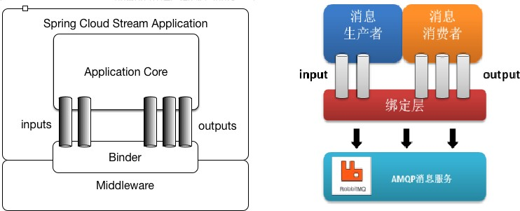 |

 

**说明：**最底层是消息服务，中间层是绑定层，绑定层和底层的消息服务进行绑定，顶层是消息生产者和 消息消费者，顶层可以向绑定层生产消息和和获取消息消费

## 1.2 核心概念

#### 绑定器

Binder 绑定器是Spring Cloud Stream中一个非常重要的概念。在没有绑定器这个概念的情况下，我们的Spring  Boot应用要直接与消息中间件进行信息交互的时候，由于各消息中间件构建的初衷不同，它们的实现细节上会有较大的差异性，这使得我们实现的消息交互逻辑就会非常笨重，因为对具体的中间 件实现细节有太重的依赖，当中间件有较大的变动升级、或是更换中间件的时候，我们就需要付出非常 大的代价来实施。

通过定义绑定器作为中间层，实现了应用程序与消息中间件(Middleware)细节之间的隔离。通过向应用 程序暴露统一的Channel通过，使得应用程序不需要再考虑各种不同的消息中间件的实现。当需要升级 消息中间件，或者是更换其他消息中间件产品时，我们需要做的就是更换对应的Binder绑定器而不需要 修改任何应用逻辑 。甚至可以任意的改变中间件的类型而不需要修改一行代码。

Spring Cloud Stream支持各种binder实现，下表包含GitHub项目的链接。

|      |                                          |
| ---- | ---------------------------------------- |
|      |  |
|      |                                          |
|      |  |

 

| [**RabbitMQ**](https://github.com/spring-cloud/spring-cloud-stream-binder-rabbit) |
| ------------------------------------------------------------ |
| [Apache Kafka](https://github.com/spring-cloud/spring-cloud-stream-binder-kafka) |
| [Amazon Kinesis](https://github.com/spring-cloud/spring-cloud-stream-binder-aws-kinesis) |
| [Google PubSub *(**partner maintained**)*](https://github.com/spring-cloud/spring-cloud-gcp/tree/master/spring-cloud-gcp-pubsub-stream-binder) |
| [Solace PubSub+   *(**partner maintained**)*](https://github.com/SolaceProducts/spring-cloud-stream-binder-solace) |
| [Azure Event Hubs   *(**partner maintained**)*](https://github.com/Microsoft/spring-cloud-azure/tree/master/spring-cloud-azure-eventhub-stream-binder) |

 

通过配置把应用和spring cloud stream 的 binder 绑定在一起，之后我们只需要修改 binder 的配置来达到动态修改topic、exchange、type等一系列信息而不需要修改一行代码。

#### 发布/订阅模型

在Spring Cloud Stream中的消息通信方式遵循了发布-订阅模式，当一条消息被投递到消息中间件之

后，它会通过共享的 Topic 主题进行广播，消息消费者在订阅的主题中收到它并触发自身的业务逻辑处理。这里所提到的 Topic 主题是Spring Cloud Stream中的一个抽象概念，用来代表发布共享消息给消费者的地方。在不同的消息中间件中， Topic 可能对应着不同的概念，比如：在RabbitMQ中的它对应了Exchange、而在Kakfa中则对应了Kafka中的Topic。

 

 

|      |                                          |
| ---- | ---------------------------------------- |
|      | 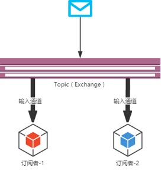 |

 

## 1.3 入门案例

### 1.3.1 准备工作

案例中通过rabbitMQ作为消息中间件，完成SpringCloud Stream的案例。需要自行安装

### 1.3.2 消息生产者

#### （1） 创建工程引入依赖

|      |                                          |
| ---- | ---------------------------------------- |
|      |  |
|      |                                          |
|      |  |

 

 

  <dependency>  <groupId>org.springframework.cloud</groupId>  <artifactId>spring-cloud-starter-stream-rabbit</artifactId>  </dependency>  

 

**（2）** **定义****bingding**

发送消息时需要定义一个接口，不同的是接口方法的返回对象是 **MessageChannel**，下面是 Spring Cloud Stream 内置的接口：

 

  public interface Source { String  OUTPUT = "output";     @Output("output") MessageChannel output();  }  

这就接口声明了一个 binding 命名为 “output”。这个binding 声明了一个消息输出流，也就是消息的生产者。

#### （3） 配置application.yml

 

  spring: cloud:  stream: bindings:  output:  destination: itcast-default contentType: text/plain  

contentType：用于指定消息的类型。具体可以参考 spring cloud stream docs destination：指定了消息发送的目的地，对应 RabbitMQ，会发送到 exchange 是default 的所有消息队列中。

#### （4） 测试发送消息

 

  @SpringBootApplication @EnableBinding(Source.class)  public class  Application implements CommandLineRunner {     @Autowired @Qualifier("output") MessageChannel output;     @Override  public void run(String... strings) throws Exception {  //发送MQ消息  output.send(MessageBuilder.withPayload("hello world").build());  }     public static void main(String[] args) { SpringApplication.run(Application.class);  }  }  

|      |                                          |
| ---- | ---------------------------------------- |
|      |  |
|      |                                          |
|      |  |

​                         **1.3.3** **消息消费者**                 

 

 

**（1）** **创建工程引入依赖**

 

|      |          |
| ---- | -------- |
|      |  |

 

#### （2） 定义bingding

同发送消息一致，在Spring Cloud Stream中接受消息，需要定义一个接口，如下是内置的一个接口。

 

|      |          |
| ---- | -------- |
|      |  |

 

注释 @Input 对应的方法，需要返回 SubscribableChannel ，并且参入一个参数值。这就接口声明了一个 binding 命名为 “**input**” 。

#### （3） 配置application.yml

 

|      |          |
| ---- | -------- |
|      |  |

 

destination：指定了消息获取的目的地，对应于MQ就是 exchange，这里的exchange就是 itcast- default

#### （4）  测试

 

|      |          |
| ---- | -------- |
|      |  |

 

定义一个 class （这里直接在启动类），并且添加注解**@EnableBinding(Sink.class)** ，其中就是上述的接口。同时定义一个方法（此处是 input）标明注解为

**@StreamListener(Processor.INPUT)**，方法参数为 Message 。

|      |                                          |
| ---- | ---------------------------------------- |
|      |  |
|      |                                          |
|      |  |

​                         启动后，默认是会创建一个临时队列，临时队列绑定的exchange为 “itcast-default ”，routing key    为 **“#”**。                 

 

 

所有发送 exchange 为“itcast-default ” 的MQ消息都会被投递到这个临时队列，并且触发上述的方法。

## 1.4 自定义消息通道

Spring Cloud Stream 内置了两种接口，分别定义了 binding 为 “input” 的输入流，和 “output” 的输出流，而在我们实际使用中，往往是需要定义各种输入输出流。使用方法也很简单。

 

|      |          |
| ---- | -------- |
|      |  |

 

一个接口中，可以定义无数个输入输出流，可以根据实际业务情况划分。上述的接口，定义了一个 订单输入，和订单输出两个 binding。

使用时，需要在 **@EnableBinding** 注解中，添加自定义的接口。

使用 **@StreamListener** 做监听的时候，需要指定 **OrderProcessor.INPUT_ORDER**

 

|      |          |
| ---- | -------- |
|      |  |

 

如上配置，指定了 destination 为 mqTestOrder 的输入输出流。

## 1.5 消息分组

通常在生产环境，我们的每个服务都不会以单节点的方式运行在生产环境，当同一个服务启动多个实例 的时候，这些实例都会绑定到同一个消息通道的目标主题（Topic）上。默认情况下，当生产者发出一 条消息到绑定通道上，这条消息会产生多个副本被每个消费者实例接收和处理，但是有些业务场景之   下，我们希望生产者产生的消息只被其中一个实例消费，这个时候我们需要为这些消费者设置消费组来 实现这样的功能。

 

 

 

 

 

 

 

 

 

 

 

 

实现的方式非常简单，我们只需要在服务消费者端设置

spring.cloud.stream.bindings.input.group 属性即可，比如我们可以这样实现：

 

|      |          |
| ---- | -------- |
|      |  |

 

在同一个group中的多个消费者只有一个可以获取到消息并消费

## 1.6 消息分区

有一些场景需要满足, 同一个特征的数据被同一个实例消费, 比如同一个id的传感器监测数据必须被同一个实例统计计算分析, 否则可能无法获取全部的数据。又比如部分异步任务，首次请求启动task，二次请求取消task，此场景就必须保证两次请求至同一实例.

 

 

 

 

 

 

 

 

 

 

 

 

 

#### 消息消费者配置

 

|      |          |
| ---- | -------- |
|      |  |

 

从上面的配置中，我们可以看到增加了这三个参数：

\1.   spring.cloud.stream.bindings.input.consumer.partitioned ：通过该参数开启消费者分区功能；

\2.   spring.cloud.stream.instanceCount ：该参数指定了当前消费者的总实例数量；

\3.   spring.cloud.stream.instanceIndex ：该参数设置当前实例的索引号，从0开始，最大值为spring.cloud.stream.instanceCount 参数 - 1。我们试验的时候需要启动多个实例，可以通过运行参数来为不同实例设置不同的索引值。

#### 消息生产者配置

 

|      |          |
| ---- | -------- |
|      |  |

|      |                                          |
| ---- | ---------------------------------------- |
|      |  |
|      |                                          |
|      |  |

 

 

 

从上面的配置中，我们可以看到增加了这两个参数：

\1.   pring.cloud.stream.bindings.output.producer.partitionKeyExpression ：通过该参数指定了分区键的表达式规则，我们可以根据实际的输出消息规则来配置SpEL来生成合适的分区  键；

\2.   spring.cloud.stream.bindings.output.producer.partitionCount ：该参数指定了消息分

区的数量。

到这里消息分区配置就完成了，我们可以再次启动这两个应用，同时消费者启动多个，但需要注意的是 要为消费者指定不同的实例索引号，这样当同一个消息被发给消费组时，我们可以发现只有一个消费实 例在接收和处理这些相同的消息。

# 2                       SpringCloud Config

## 2.1 什么是配置中心

### 2.1.1 配置中心概述

对于传统的单体应用而言，常使用配置文件来管理所有配置，比如SpringBoot的application.yml文件， 但是在微服务架构中全部手动修改的话很麻烦而且不易维护。微服务的配置管理一般有以下需求：

集中配置管理，一个微服务架构中可能有成百上千个微服务，所以集中配置管理是很重要的。 不同环境不同配置，比如数据源配置在不同环境（开发，生产，测试）中是不同的。

运行期间可动态调整。例如，可根据各个微服务的负载情况，动态调整数据源连接池大小等 配置修改后可自动更新。如配置内容发生变化，微服务可以自动更新配置

综上所述对于微服务架构而言，一套统一的，通用的管理配置机制是不可缺少的总要组成部分。常见的 做法就是通过配置服务器进行管理。

### 2.1.2 常见配置中心

**Spring Cloud Config**为分布式系统中的外部配置提供服务器和客户端支持。

**Apollo**（阿波罗）是携程框架部门研发的分布式配置中心，能够集中化管理应用不同环境、不同集群的 配置，配置修改后能够实时推送到应用端，并且具备规范的权限、流程治理等特性，适用于微服务配置 管理场景。

**Disconf** 专注于各种「分布式系统配置管理」的「通用组件」和「通用平台」, 提供统一的「配置管理服务」包括 百度、滴滴出行、银联、网易、拉勾网、苏宁易购、顺丰科技 等知名互联网公司正在使用!

「disconf」在「2015 年度新增开源软件排名 TOP 100(OSC开源中国提供)」中排名第16强。Disconf的功能特点描述图：

## 2.2 Spring Cloud Config简介

Spring Cloud Config项目是一个解决分布式系统的配置管理方案。它包含了Client和Server两个部分， server提供配置文件的存储、以接口的形式将配置文件的内容提供出去，client通过接口获取数据、并 依据此数据初始化自己的应用。

 

 

 

 

 

 

 

 

 

Spring Cloud Config为分布式系统中的外部配置提供服务器和客户端支持。使用Config Server，您可以为所有环境中的应用程序管理其外部属性。它非常适合spring应用，也可以使用在其他语言的应用  上。随着应用程序通过从开发到测试和生产的部署流程，您可以管理这些环境之间的配置，并确定应用 程序具有迁移时需要运行的一切。服务器存储后端的默认实现使用git，因此它轻松支持标签版本的配置 环境，以及可以访问用于管理内容的各种工具。

Spring Cloud Config服务端特性：

HTTP，为外部配置提供基于资源的API（键值对，或者等价的YAML内容） 属性值的加密和解密（对称加密和非对称加密）

通过使用@EnableConfigServer在Spring boot应用中非常简单的嵌入。

Config客户端的特性（特指Spring应用）

绑定Config服务端，并使用远程的属性源初始化Spring环境。属性值的加密和解密（对称加密和非对称加密）

## 2.3 Spring Cloud Config入门

### 2.3.1 准备工作

Config Server是一个可横向扩展、集中式的配置服务器，它用于集中管理应用程序各个环境下的配置， 默认使用Git存储配置文件内容，也可以使用SVN存储，或者是本地文件存储。这里使用git作为学习的 环境

使用GitHub时，国内的用户经常遇到的问题是访问速度太慢，有时候还会出现无法连接的情况。如果我 们希望体验Git飞一般的速度，可以使用国内的Git托管服务——码云（gitee.com）。和GitHub相比， 码云也提供免费的Git仓库。此外，还集成了代码质量检测、项目演示等功能。对于团队协作开发，码  云还提供了项目管理、代码托管、文档管理的服务。

（1）   浏览器打开gitee.com，注册用户 ，注册后登陆码云管理控制台

 

|      |                                          |
| ---- | ---------------------------------------- |
|      | 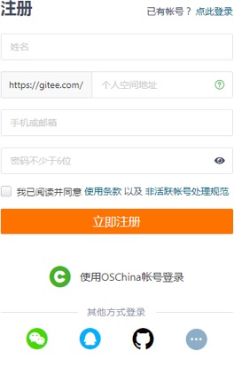 |

 

**（2）**  创建项目**config-repo**

（3）    

|      |                                          |
| ---- | ---------------------------------------- |
|      | 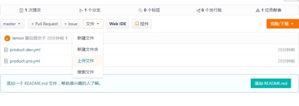 |

上传配置文件，将product_service工程的application.yml改名为product-dev.yml后上传

文件命名规则：

{application}-{profile}.yml

{application}-{profile}.properties

application为应用名称 profile指的开发环境（用于区分开发环境，测试环境、生产环境等）

### 2.3.2 搭建服务端程序

#### （1） 引入依赖

|      |                                          |
| ---- | ---------------------------------------- |
|      |  |
|      |                                          |
|      |  |

​                         创建工程 shop_config_server 并引入对应依赖                 

 

 

|      |          |
| ---- | -------- |
|      |  |

 

**（2）** **配置启动类**

 

|      |          |
| ---- | -------- |
|      |  |

 

@EnableConfigServer : 通过此注解开启注册中心服务端功能

#### （3） 配置application.yml

 

|      |          |
| ---- | -------- |
|      |  |

 

通过 spring.cloud.config.server.git.uri : 配置git服务地址通过`spring.cloud.config.server.git.username: 配置git用户名通过`spring.cloud.config.server.git.password: 配置git密码

#### （4） 测试

启动此微服务，可以在浏览器上，通过server端访问到git服务器上的文件

 

 

 

 

 

 

 

 

 

 

 

 

 

 

 

### 2.3.3 修改客户端程序

#### （1） 引入依赖

 

|      |          |
| ---- | -------- |
|      |  |

 

**（2）** **删除****application.yml**

springboot的应用配置文件，需要通过Config-server获取，这里不再需要。

#### （3） 添加bootstrap.yml

使用加载级别更高的 bootstrap.yml 文件进行配置。启动应用时会检查此配置文件，在此文件中指定配置中心的服务地址。会自动的拉取所有应用配置并启用

 

|      |          |
| ---- | -------- |
|      |  |

 

### 2.3.4 手动刷新

我们已经在客户端取到了配置中心的值，但当我们修改GitHub上面的值时，服务端（Config Server） 能实时获取最新的值，但客户端（Config Client）读的是缓存，无法实时获取最新值。SpringCloud已经为我们解决了这个问题，那就是客户端使用post去触发refresh，获取最新数据，需要依赖spring- boot-starter-actuator

|      |                                          |
| ---- | ---------------------------------------- |
|      |  |
|      |                                          |
|      |  |

 

 

 

对应的controller类加上@RefreshScope

 

|      |          |
| ---- | -------- |
|      |  |

 

配置文件中开发端点

 

|      |          |
| ---- | -------- |
|      |  |

 

在postman中访问http://localhost:9002/actuator/bus-refresh,使用post提交,查看数据已经发生了变 化

## 2.4 配置中心的高可用

在之前的代码中，客户端都是直接调用配置中心的server端来获取配置文件信息。这样就存在了一个问 题，客户端和服务端的耦合性太高，如果server端要做集群，客户端只能通过原始的方式来路由， server端改变IP地址的时候，客户端也需要修改配置，不符合springcloud服务治理的理念。 springcloud提供了这样的解决方案，我们只需要将server端当做一个服务注册到eureka中，client端去eureka中去获取配置中心server端的服务既可。

### 2.4.1 服务端改造

#### （1） 添加依赖

|      |                                          |
| ---- | ---------------------------------------- |
|      |  |
|      |                                          |
|      |  |

 

 

 

**（2）** **配置文件**

 

|      |          |
| ---- | -------- |
|      |  |

 

这样server端的改造就完成了。先启动eureka注册中心，在启动server端，在浏览器中访问：

就会看到server端已经注册了到注册中心了。

 

|      |                                          |
| ---- | ---------------------------------------- |
|      | 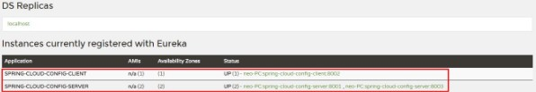 |

### 2.4.2 服务端改造

#### （1） 添加依赖

 

|      |          |
| ---- | -------- |
|      |  |

 

**（2）** **配置文件**

 

|      |          |
| ---- | -------- |
|      |  |

|      |                                          |
| ---- | ---------------------------------------- |
|      |  |
|      |                                          |
|      |  |

 

 

 

### 2.4.3 高可用

 

|      |                                          |
| ---- | ---------------------------------------- |
|      | 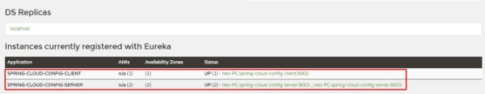 |

为了模拟生产集群环境，我们改动server端的端口为1000，再启动一个server端来做服务的负载，提供高可用的server端支持。

 

如上图就可发现会有两个server端同时提供配置中心的服务，防止某一台down掉之后影响整个系统的 使用。

我们先单独测试服务端，分别访问： http://localhost:10000/product-pro.yml 、

http://localhost:10001/product-pro.yml 返回信息：

 

|      |          |
| ---- | -------- |
|      |  |

|      |                                          |
| ---- | ---------------------------------------- |
|      |  |
|      |                                          |
|      |  |

​                         说明两个server端都正常读取到了配置信息。    **2.5** **消息总线****bus**                 

 

 

 

在微服务架构中，通常会使用轻量级的消息代理来构建一个共用的消息主题来连接各个微服务实例，它 广播的消息会被所有在注册中心的微服务实例监听和消费，也称消息总线。

SpringCloud中也有对应的解决方案，SpringCloud Bus 将分布式的节点用轻量的消息代理连接起来， 可以很容易搭建消息总线，配合SpringCloud config 实现微服务应用配置信息的动态更新。

 

 

|      |                                          |
| ---- | ---------------------------------------- |
|      | 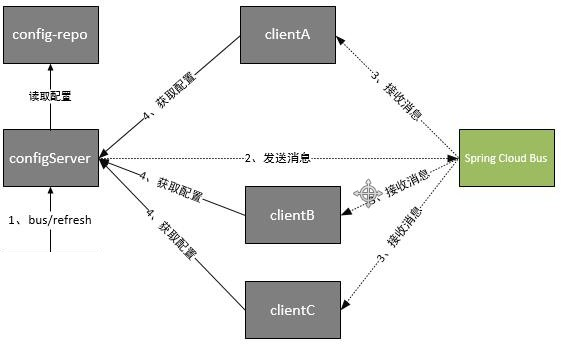 |

 

根据此图我们可以看出利用Spring Cloud Bus做配置更新的步骤:

提交代码触发post请求给bus/refresh

server端接收到请求并发送给Spring Cloud Bus Spring Cloud bus接到消息并通知给其它客户端

其它客户端接收到通知，请求Server端获取最新配置全部客户端均获取到最新的配置

## 2.6 消息总线整合配置中心

#### （1） 引入依赖

 

|      |          |
| ---- | -------- |
|      |  |

|      |                                          |
| ---- | ---------------------------------------- |
|      |  |
|      |                                          |
|      |  |

 

 

 

**（2）****服务端配置**

 

|      |          |
| ---- | -------- |
|      |  |

 

#### （3）微服务客户端配置

 

|      |          |
| ---- | -------- |
|      |  |

 

需要在码云对应的配置文件中添加rabbitmq的配置信息

 

 

 

 

 

 

 

 

 

 

 

 

 

 

重新启动对应的eureka-server ， config-server ， product-service。配置信息刷新后，只需要向配置中心发送对应的请求，即可刷新每个客户端的配置

# 3 开源配置中心Apollo

 

|      |                                          |
| ---- | ---------------------------------------- |
|      | 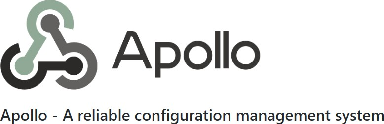 |

 

Apollo（阿波罗）是携程框架部门研发的分布式配置中心，能够集中化管理应用不同环境、不同集群的 配置，配置修改后能够实时推送到应用端，并且具备规范的权限、流程治理等特性，适用于微服务配置 管理场景。服务端基于Spring Boot和Spring Cloud开发，打包后可以直接运行，不需要额外安装Tomcat等应用容器。

## 3.1 Apollo概述

pollo（阿波罗）是携程框架部门研发的开源配置管理中心，能够集中化管理应用不同环境、不同集群 的配置，配置修改后能够实时推送到应用端，并且具备规范的权限、流程治理等特性。

正是基于配置的特殊性，所以Apollo从设计之初就立志于成为一个有治理能力的配置发布平台，目前提 供了以下的特性：

#### 统一管理不同环境、不同集群的配置

Apollo提供了一个统一界面集中式管理不同环境（environment）、不同集群（cluster）、不同命名空间（namespace）的配置。

同一份代码部署在不同的集群，可以有不同的配置，比如zookeeper的地址等

通过命名空间（namespace）可以很方便地支持多个不同应用共享同一份配置，同时还允许应用对共享的配置进行覆盖

#### 配置修改实时生效（热发布）

|      |                                          |
| ---- | ---------------------------------------- |
|      |  |
|      |                                          |
|      |  |

​                         用户在Apollo修改完配置并发布后，客户端能实时（1秒）接收到最新的配置，并通知到应用程序                 

 

 

**版本发布管理**

所有的配置发布都有版本概念，从而可以方便地支持配置的回滚

#### 灰度发布

支持配置的灰度发布，比如点了发布后，只对部分应用实例生效，等观察一段时间没问题后 再推给所有应用实例

#### 权限管理、发布审核、操作审计

应用和配置的管理都有完善的权限管理机制，对配置的管理还分为了编辑和发布两个环节， 从而减少人为的错误。

所有的操作都有审计日志，可以方便地追踪问题

#### 客户端配置信息监控

可以在界面上方便地看到配置在被哪些实例使用

#### 提供Java和.Net原生客户端

提供了Java和.Net的原生客户端，方便应用集成

支持Spring Placeholder, Annotation和Spring Boot的ConfigurationProperties，方便应用使用（需要Spring 3.1.1+）

同时提供了Http接口，非Java和.Net应用也可以方便地使用

#### 提供开放平台API

Apollo自身提供了比较完善的统一配置管理界面，支持多环境、多数据中心配置管理、权  限、流程治理等特性。不过Apollo出于通用性考虑，不会对配置的修改做过多限制，只要符合基本的格式就能保存，不会针对不同的配置值进行针对性的校验，如数据库用户名、密  码，Redis服务地址等

对于这类应用配置，Apollo支持应用方通过开放平台API在Apollo进行配置的修改和发布，并且具备完善的授权和权限控制

#### 部署简单

配置中心作为基础服务，可用性要求非常高，这就要求Apollo对外部依赖尽可能地少

目前唯一的外部依赖是MySQL，所以部署非常简单，只要安装好Java和MySQL就可以让

Apollo跑起来

Apollo还提供了打包脚本，一键就可以生成所有需要的安装包，并且支持自定义运行时参数

## 3.2 Apollo的实现方式

 

|      |                                          |
| ---- | ---------------------------------------- |
|      | 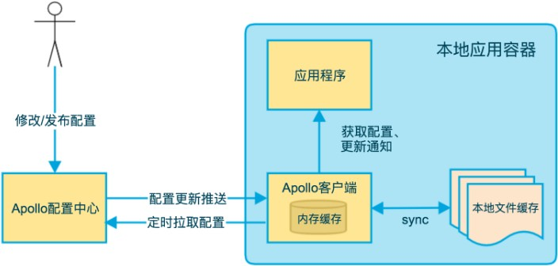 |

上图简要描述了Apollo客户端的实现原理：

\1.  客户端和服务端保持了一个长连接，从而能第一时间获得配置更新的推送。

|      |                                          |
| ---- | ---------------------------------------- |
|      |  |
|      |                                          |
|      |  |

 

\2.  客户端还会定时从Apollo配置中心服务端拉取应用的最新配置。

这是一个fallback机制，为了防止推送机制失效导致配置不更新

客户端定时拉取会上报本地版本，所以一般情况下，对于定时拉取的操作，服务端都会返回

304 - Not Modified

定时频率默认为每5分钟拉取一次，客户端也可以通过在运行时指定System  Property:

apollo.refreshInterval 来覆盖，单位为分钟。

\3.  客户端从Apollo配置中心服务端获取到应用的最新配置后，会保存在内存中

\4.  客户端会把从服务端获取到的配置在本地文件系统缓存一份

在遇到服务不可用，或网络不通的时候，依然能从本地恢复配置

\5.  应用程序从Apollo客户端获取最新的配置、订阅配置更新通知

## 3.3 搭建Apollo服务端

### 3.3.1 环境要求

#### Java

 

Apollo服务端：1.8+ Apollo客户端：1.7+

由于需要同时运行服务端和客户端，所以建议安装Java 1.8+。

#### MySQL

版本要求：5.6.5+

Apollo的表结构对 timestamp 使用了多个default声明，所以需要5.6.5以上版本

### 3.3.2 环境搭建

#### （1） 下载Apollo

通过官网提供的[下载连接](https://github.com/nobodyiam/apollo-build-scripts)下载安装包

#### （2） 配置数据库

Apollo服务端共需要两个数据库： ApolloPortalDB 和 ApolloConfigDB ，我们把数据库、表的创建和样例数据都分别准备了sql文件，只需要导入数据库即可。

注意：如果你本地已经创建过Apollo数据库，请注意备份数据。我们准备的sql文件会清空Apollo 相关的表。

#### （3） 配置数据库连接

Apollo服务端需要知道如何连接到你前面创建的数据库，所以需要编辑[demo.sh](https://github.com/nobodyiam/apollo-build-scripts/blob/master/demo.sh)，修改ApolloPortalDB

和ApolloConfigDB相关的数据库连接串信息。

 

|      |          |
| ---- | -------- |
|      |  |

|      |                                          |
| ---- | ---------------------------------------- |
|      |  |
|      |                                          |
|      |  |

​                         **（****4****）    启动****Apollo****配置中心**    启动脚本会在本地启动3个服务，分别使用8070, 8080,    8090端口，请确保这3个端口当前没有被使用。                 

 

 

 

 

当看到如下输出后，就说明启动成功了！

 

|      |          |
| ---- | -------- |
|      |  |

 

#### （5） 测试

通过浏览器打开 http://ip:8070 即可访问Apollo配置中心的前端页面

 

|      |                                          |
| ---- | ---------------------------------------- |
|      | 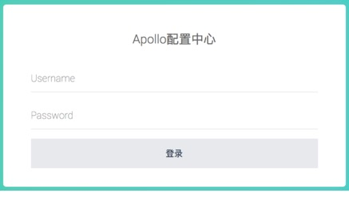 |

输入默认用户名密码apollo/admin即可登录到应用中

 

|      |                                          |
| ---- | ---------------------------------------- |
|      | 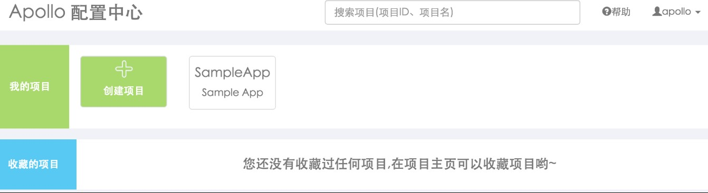 |

## 3.4 客户端集成

|      |                                          |
| ---- | ---------------------------------------- |
|      |  |
|      |                                          |
|      |  |

​                         **（****1****） 引入依赖**    Apollo的客户端jar包已经上传到中央仓库，应用在实际使用时只需要按照如下方式引入即可。                 

 

 

 

 

#### （2） Spring Boot集成

Spring Boot支持通过application.properties/bootstrap.properties来配置，该方式能使配置在更早的阶段注入，比如使用 @ConditionalOnProperty 的场景或者是有一些spring-boot-starter在启动阶段就需要读取配置做一些事情（如[dubbo-spring-boot-project](https://github.com/apache/incubator-dubbo-spring-boot-project)），所以对于Spring Boot环境建议通过以下方式来接入Apollo(需要0.10.0及以上版本）。

使用方式很简单，只需要在application.properties/bootstrap.properties中按照如下样例配置即可。

\1.  注入默认 application namespace的配置示例

 

|      |          |
| ---- | -------- |
|      |  |

 

\2. 注入非默认 application namespace或多个namespace的配置示例

 

|      |          |
| ---- | -------- |
|      |  |

 

\3. 将Apollo配置加载提到初始化日志系统之前(1.2.0+)

从1.2.0版本开始，如果希望把日志相关的配置（如 logging.level.root=info 或 logback- spring.xml 中的参数）也放在Apollo管理，那么可以额外配置apollo.bootstrap.eagerLoad.enabled=true 来使Apollo的加载顺序放到日志系统加载之前，不过这会导致Apollo的启动过程无法通过日志的方式输出(因为执行Apollo加载的时候，日志系统压根没有准备好呢！所以在Apollo代码中使用Slf4j的日志输出便没有任何内容)，更多信息可以参考[PR 1614](https://github.com/ctripcorp/apollo/pull/1614)。参考配置示例如下：

 

|      |          |
| ---- | -------- |
|      |  |