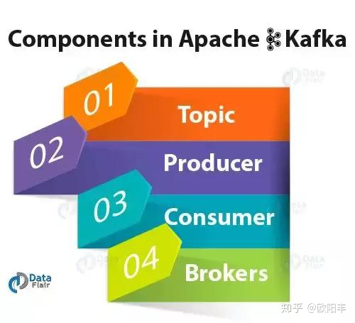
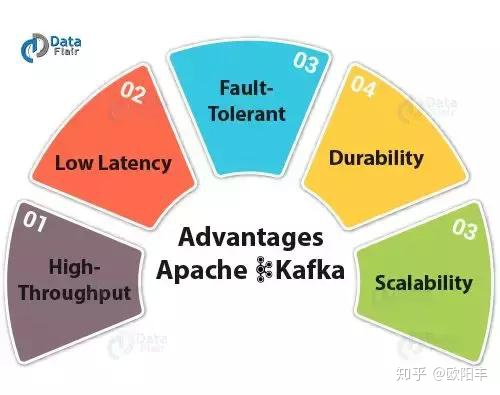

## Kafka学习

Apache Kafka的受欢迎程度很高，Kafka拥有充足的就业机会和职业前景。此外，在这个时代拥有kafka知识是一条快速增长的道路。所以，在这篇文章中，我们收集了Apache Kafka面试中常见的问题，并提供了答案。因此，如果您希望参加Apache Kafka面试，这是一份不错的指南。这将有助于您成功参加Kafka面试。

> 文章有些长，每题都附带了答案解析，希望你们看了能够有所收获，同时觉得不错的朋友可以转发支持下和关注下我，以后还会有更多精选文章分享给大家！

## 一、最佳Apache Kafka面试问题和解答

这是Kafka最受欢迎的面试问题清单，以及任何面试官都可能问到的答案。所以，继续学习直到本文的结尾，希望对你有帮助！

### 问题1：什么是Apache Kafka?

> 答：Apache Kafka是一个发布 - 订阅开源消息代理应用程序。这个消息传递应用程序是用“scala”编码的。基本上，这个项目是由Apache软件启动的。Kafka的设计模式主要基于事务日志设计。

### 问题2：Kafka中有哪几个组件?

答：Kafka最重要的元素是：

 

 

> 主题：Kafka主题是一堆或一组消息。生产者：在Kafka，生产者发布通信以及向Kafka主题发布消息。消费者：Kafka消费者订阅了一个主题，并且还从主题中读取和处理消息。经纪人：在管理主题中的消息存储时，我们使用Kafka Brokers。

### 问题3：解释偏移的作用。

> 答：给分区中的消息提供了一个顺序ID号，我们称之为偏移量。因此，为了唯一地识别分区中的每条消息，我们使用这些偏移量。

### 问题4：什么是消费者组？

> 答：消费者组的概念是Apache Kafka独有的。基本上，每个Kafka消费群体都由一个或多个共同消费一组订阅主题的消费者组成。

### 问题5：ZooKeeper在Kafka中的作用是什么？

> 答：Apache Kafka是一个使用Zookeeper构建的分布式系统。虽然，Zookeeper的主要作用是在集群中的不同节点之间建立协调。但是，如果任何节点失败，我们还使用Zookeeper从先前提交的偏移量中恢复，因为它做周期性提交偏移量工作。

问题6：没有ZooKeeper可以使用Kafka吗？

> 答：绕过Zookeeper并直接连接到Kafka服务器是不可能的，所以答案是否定的。如果以某种方式，使ZooKeeper关闭，则无法为任何客户端请求提供服务。

### 问题8：为什么Kafka技术很重要？

答：Kafka有一些优点，因此使用起来很重要：

 

 

> 高吞吐量：我们在Kafka中不需要任何大型硬件，因为它能够处理高速和大容量数据。此外，它还可以支持每秒数千条消息的消息吞吐量。低延迟：Kafka可以轻松处理这些消息，具有毫秒级的极低延迟，这是大多数新用例所要求的。容错：Kafka能够抵抗集群中的节点/机器故障。耐久性：由于Kafka支持消息复制，因此消息永远不会丢失。这是耐久性背后的原因之一。可扩展性：卡夫卡可以扩展，而不需要通过添加额外的节点而在运行中造成任何停机。

### 问题9：Kafka的主要API有哪些？

答：Apache Kafka有4个主要API：

> 生产者API 消费者API 流 API 连接器API

### 问题10：什么是消费者或用户？

> 答：Kafka消费者订阅一个主题，并读取和处理来自该主题的消息。此外，有了消费者组的名字，消费者就给自己贴上了标签。换句话说，在每个订阅使用者组中，发布到主题的每个记录都传递到一个使用者实例。确保使用者实例可能位于单独的进程或单独的计算机上。Apache Kafka对于新手的面试问题：1,2,4,7,8,9,10Apache Kafka对于有经验的人的面试问题：3,5,6

## 二、比较棘手的Kafka面试问题和答案

### 问题11：解释领导者和追随者的概念。

> 答：在Kafka的每个分区中，都有一个服务器充当领导者，0到多个服务器充当追随者的角色。

问题12：是什么确保了Kafka中服务器的负载平衡？

> 答：由于领导者的主要角色是执行分区的所有读写请求的任务，而追随者被动地复制领导者。因此，在领导者失败时，其中一个追随者接管了领导者的角色。基本上，整个过程可确保服务器的负载平衡。

### 问题13：副本和ISR扮演什么角色？

> 答：基本上，复制日志的节点列表就是副本。特别是对于特定的分区。但是，无论他们是否扮演领导者的角色，他们都是如此。此外，ISR指的是同步副本。在定义ISR时，它是一组与领导者同步的消息副本。

### 问题14：为什么Kafka的复制至关重要？

> 答：由于复制，我们可以确保发布的消息不会丢失，并且可以在发生任何机器错误、程序错误或频繁的软件升级时使用。

### 问题15：如果副本长时间不在ISR中，这意味着什么？

> 答：简单地说，这意味着跟随者不能像领导者收集数据那样快速地获取数据。

### 问题16：启动Kafka服务器的过程是什么？

> 答：初始化ZooKeeper服务器是非常重要的一步，因为Kafka使用ZooKeeper，所以启动Kafka服务器的过程是：要启动ZooKeeper服务器：>bin/zooKeeper-server-start.sh config/zooKeeper.properties接下来，启动Kafka服务器：>bin/kafka-server-start.sh config/server.properties

### 问题17：在生产者中，何时发生QueueFullException？

> 答：每当Kafka生产者试图以代理的身份在当时无法处理的速度发送消息时，通常都会发生QueueFullException。但是，为了协作处理增加的负载，用户需要添加足够的代理，因为生产者不会阻止。

### 问题18：解释Kafka Producer API的作用。

> 答：允许应用程序将记录流发布到一个或多个Kafka主题的API就是我们所说的Producer API。

### 问题19：Kafka和Flume之间的主要区别是什么？

> 答：Kafka和Flume之间的主要区别是：工具类型 Apache Kafka——Kafka是面向多个生产商和消费者的通用工具。 Apache Flume——Flume被认为是特定应用程序的专用工具。复制功能Apache Kafka——Kafka可以复制事件。Apache Flume——Flume不复制事件。

### 问题20：Apache Kafka是分布式流处理平台吗？如果是，你能用它做什么？

> 答：毫无疑问，Kafka是一个流处理平台。它可以帮助：1.轻松推送记录2.可以存储大量记录，而不会出现任何存储问题3.它还可以在记录进入时对其进行处理。Apache Kafka对于新手的面试问题：11,13,14,16,17,18,19Apache Kafka对于有经验的人的面试问题：12,15,20

## 三、高级Kafka面试问题

### 问题21：你能用Kafka做什么？

> 答：它可以以多种方式执行，例如：>>为了在两个系统之间传输数据，我们可以用它构建实时的数据流管道。>>另外，我们可以用Kafka构建一个实时流处理平台，它可以对数据快速做出反应。

### 问题22：在Kafka集群中保留期的目的是什么？

> 答：保留期限保留了Kafka群集中的所有已发布记录。它不会检查它们是否已被消耗。此外，可以通过使用保留期的配置设置来丢弃记录。而且，它可以释放一些空间。

### 问题23：解释Kafka可以接收的消息最大为多少？

> 答：Kafka可以接收的最大消息大小约为1000000字节。

### 问题24：传统的消息传递方法有哪些类型？

> 答：基本上，传统的消息传递方法有两种，如：排队：这是一种消费者池可以从服务器读取消息并且每条消息转到其中一个消息的方法。发布-订阅：在发布-订阅中，消息被广播给所有消费者。

### 问题25：ISR在Kafka环境中代表什么？

> 答：ISR指的是同步副本。这些通常被分类为一组消息副本，它们被同步为领导者。

### 问题26：什么是Kafka中的地域复制？

> 答：对于我们的集群，Kafka MirrorMaker提供地理复制。基本上，消息是通过MirrorMaker跨多个数据中心或云区域复制的。因此，它可以在主动/被动场景中用于备份和恢复；也可以将数据放在离用户更近的位置，或者支持数据位置要求。

### 问题27：解释多租户是什么？

> 答：我们可以轻松地将Kafka部署为多租户解决方案。但是，通过配置主题可以生成或使用数据，可以启用多租户。此外，它还为配额提供操作支持。

### 问题28：消费者API的作用是什么？

> 答：允许应用程序订阅一个或多个主题并处理生成给它们的记录流的API，我们称之为消费者API。

### 问题29：解释流API的作用？

> 答：一种允许应用程序充当流处理器的API，它还使用一个或多个主题的输入流，并生成一个输出流到一个或多个输出主题，此外，有效地将输入流转换为输出流，我们称之为流API。

### 问题30：连接器API的作用是什么？

> 答：一个允许运行和构建可重用的生产者或消费者的API，将Kafka主题连接到现有的应用程序或数据系统，我们称之为连接器API。Apache Kafka对于新手的面试问题：21, 23, 25, 26, 27, 28, 29, 30Apache Kafka对于有经验的人的面试问题：24, 22

### 问题31：解释生产者是什么？

> 答：生产者的主要作用是将数据发布到他们选择的主题上。基本上，它的职责是选择要分配给主题内分区的记录。

### 问题32：比较RabbitMQ与Apache Kafka

> 答：Apache Kafka的另一个选择是RabbitMQ。那么，让我们比较两者：功能Apache Kafka– Kafka是分布式的、持久的和高度可用的，这里共享和复制数据RabbitMQ中没有此类功能性能速度Apache Kafka–达到每秒100000条消息。RabbitMQ–每秒20000条消息。

### 问题33：比较传统队列系统与Apache Kafka

> 答：让我们比较一下传统队列系统与Apache Kafka的功能：消息保留 传统的队列系统 - 它通常从队列末尾处理完成后删除消息。 Apache Kafka中，消息即使在处理后仍然存在。这意味着Kafka中的消息不会因消费者收到消息而被删除。基于逻辑的处理传统队列系统不允许基于类似消息或事件处理逻辑。Apache Kafka允许基于类似消息或事件处理逻辑。

### 问题34：为什么要使用Apache Kafka集群？

> 答：为了克服收集大量数据和分析收集数据的挑战，我们需要一个消息队列系统。因此Apache Kafka应运而生。其好处是：只需存储/发送事件以进行实时处理，就可以跟踪Web活动。通过这一点，我们可以发出警报并报告操作指标。此外，我们可以将数据转换为标准格式。此外，它允许对主题的流数据进行连续处理。由于它的广泛使用，它秒杀了竞品，如ActiveMQ，RabbitMQ等。

### 问题35：解释术语“Log Anatomy”

> 答：我们将日志视为分区。基本上，数据源将消息写入日志。其优点之一是，在任何时候，都有一个或多个消费者从他们选择的日志中读取数据。下面的图表显示，数据源正在写入一个日志，而用户正在以不同的偏移量读取该日志。

 

 

### 问题36：Kafka中的数据日志是什么？

> 答：我们知道，在Kafka中，消息会保留相当长的时间。此外，消费者还可以根据自己的方便进行阅读。尽管如此，有一种可能的情况是，如果将Kafka配置为将消息保留24小时，并且消费者可能停机超过24小时，则消费者可能会丢失这些消息。但是，我们仍然可以从上次已知的偏移中读取这些消息，但仅限于消费者的部分停机时间仅为60分钟的情况。此外，关于消费者从一个话题中读到什么，Kafka不会保持状态。

### 问题37：解释如何调整Kafka以获得最佳性能。

> 答：因此，调优Apache Kafka的方法是调优它的几个组件：1.调整Kafka生产者2.Kafka代理调优3.调整Kafka消费者

### 问题38：Apache Kafka的缺陷

> 答：Kafka的局限性是：1.没有完整的监控工具集2.消息调整的问题3.不支持通配符主题选择4.速度问题

### 问题39：列出所有Apache Kafka业务

> 答：Apache Kafka的业务包括：添加和删除Kafka主题如何修改Kafka主题如何关机在Kafka集群之间镜像数据找到消费者的位置扩展您的Kafka群集自动迁移数据退出服务器数据中心

### 问题40：解释Apache Kafka用例？

答：Apache Kafka有很多用例，例如：

 

 

> Kafka指标可以使用Kafka进行操作监测数据。此外，为了生成操作数据的集中提要，它涉及到从分布式应用程序聚合统计信息。Kafka日志聚合 从组织中的多个服务收集日志。流处理在流处理过程中，Kafka的强耐久性非常有用。Apache Kafka对于新手的面试问题：31, 32, 33, 34, 38, 39, 40Apache Kafka对于有经验的人的面试问题：35, 36, 37

## 四、基于特征的Kafka面试问题

### 问题41：Kafka的一些最显著的应用。

> 答：Netflix，Mozilla，Oracle

### 问题42：Kafka流的特点。

> 答：Kafka流的一些最佳功能是Kafka Streams具有高度可扩展性和容错性。Kafka部署到容器，VM，裸机，云。我们可以说，Kafka流对于小型，中型和大型用例同样可行。此外，它完全与Kafka安全集成。编写标准Java应用程序。完全一次处理语义。而且，不需要单独的处理集群。

### 问题43：Kafka的流处理是什么意思？

> 答：连续、实时、并发和以逐记录方式处理数据的类型，我们称之为Kafka流处理。

### 问题44：系统工具有哪些类型？

> 答：系统工具有三种类型：1.Kafka迁移工具：它有助于将代理从一个版本迁移到另一个版本。2.Mirror Maker：Mirror Maker工具有助于将一个Kafka集群的镜像提供给另一个。3.消费者检查:对于指定的主题集和消费者组，它显示主题，分区，所有者。

### 问题45：什么是复制工具及其类型？

> 答：为了增强持久性和更高的可用性，这里提供了复制工具。其类型为创建主题工具列表主题工具添加分区工具

### 问题46：Java在Apache Kafka中的重要性是什么？

> 答：为了满足Kafka标准的高处理速率需求，我们可以使用java语言。此外，对于Kafka的消费者客户，Java也提供了良好的社区支持。所以，我们可以说在Java中实现Kafka是一个正确的选择。

### 问题47：说明Kafka的一个最佳特征。

> 答：Kafka的最佳特性是“各种各样的用例”。这意味着Kafka能够管理各种各样的用例，这些用例对于数据湖来说非常常见。例如日志聚合、Web活动跟踪等。

### 问题48：解释术语“主题复制因子”。

> 答：在设计Kafka系统时，考虑主题复制是非常重要的。

### 问题49：解释一些Kafka流实时用例。

> 答：《纽约时报》：该公司使用它来实时存储和分发已发布的内容到各种应用程序和系统，使其可供读者使用。基本上，它使用Apache Kafka和Kafka流。Zalando：作为ESB（企业服务总线）作为欧洲领先的在线时尚零售商，Zalando使用Kafka。LINE：基本上，为了相互通信，LINE应用程序使用Apache Kafka作为其服务的中心数据中心。

### 问题50：Kafka提供的保证是什么？

> 答：他们是生产者向特定主题分区发送的消息的顺序相同。此外，消费者实例按照它们存储在日志中的顺序查看记录。此外，即使不丢失任何提交给日志的记录，我们也可以容忍最多N-1个服务器故障。Apache Kafka对于新手的面试问题：41, 42, 43, 44, 45, 47, 49Apache Kafka对于有经验的人的面试问题：46, 48