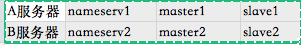

# RocketMQ 问题


## 01.为什么要用RocketMq？


### 总得来说，RocketMq具有以下几个优势：


- 吞吐量高：单机吞吐量可达十万级

- 可用性高：分布式架构

- 消息可靠性高：经过参数优化配置，消息可以做到0丢失

- 功能支持完善：MQ功能较为完善，还是分布式的，扩展性好

- 支持10亿级别的消息堆积：不会因为堆积导致性能下降

- 源码是java：方便我们查看源码了解它的每个环节的实现逻辑，并针对不同的业务场景进行扩展

- 可靠性高：天生为金融互联网领域而生，对于要求很高的场景，尤其是电商里面的订单扣款，以及业务削峰，在大量交易涌入时，后端可能无法及时处理的情况

- 稳定性高：RoketMQ在上可能更值得信赖，这些业务场景在阿里双11已经经历了多次考验

  


## 02.RocketMq的部署架构了解吗？


这个是rocketMq的集群架构图，里面包含了四个主要部分：NameServer集群,Producer集群,Cosumer集群以及Broker集群


- NameServer 担任路由消息的提供者。生产者或消费者能够通过NameServer查找各Topic相应的Broker IP列表分别进行发送消息和消费消息。nameServer由多个无状态的节点构成，节点之间**无任何信息同步**

  

  broker会定期向NameServer以发送心跳包的方式，轮询向所有NameServer注册以下元数据信息：

  

  **1）broker的基本信息（ip port等）**

  

  **2）主题topic的地址信息**

  

  **3）broker集群信息**

  

  **4）存活的broker信息**

  

  **5）filter 过滤器**

  

  也就是说，每个NameServer注册的信息都是一样的，而且是当前系统中的所有broker的元数据信息

  

- Producer负责生产消息，一般由业务系统负责生产消息。一个消息生产者会把业务应用系统里产生的消息发送到broker服务器。RocketMQ提供多种发送方式，同步发送、异步发送、顺序发送、单向发送。同步和异步方式均需要Broker返回确认信息，单向发送不需要

  

- Broker，消息中转角色，负责存储消息、转发消息。在RocketMQ系统中负责接收从生产者发送来的消息并存储、同时为消费者的拉取请求作准备

  

- Consumer负责消费消息，一般是后台系统负责异步消费。一个消息消费者会从Broker服务器拉取消息、并将其提供给应用程序。从用户应用的角度而言提供了两种消费形式：拉取式消费、推动式消费

  


## 03.它有哪几种部署类型？分别有什么特点？


RocketMQ有4种部署类型


### 1）单Master


单机模式, 即只有一个Broker, 如果Broker宕机了, 会导致RocketMQ服务不可用, 不推荐使用


### 2）多Master模式


组成一个集群, 集群每个节点都是Master节点, 配置简单, 性能也是最高, 某节点宕机重启不会影响RocketMQ服务


缺点：如果某个节点宕机了, 会导致该节点存在未被消费的消息在节点恢复之前不能被消费


### 3）多Master多Slave模式，异步复制


每个Master配置一个Slave, 多对Master-Slave, Master与Slave消息采用异步复制方式, 主从消息一致只会有毫秒级的延迟


优点是弥补了多Master模式（无slave）下节点宕机后在恢复前不可订阅的问题。在Master宕机后, 消费者还可以从Slave节点进行消费。采用异步模式复制，提升了一定的吞吐量。总结一句就是，采用


### 多Master多Slave模式，异步复制模式进行部署，系统将会有较低的延迟和较高的吞吐量


缺点就是如果Master宕机, 磁盘损坏的情况下, 如果没有及时将消息复制到Slave, 会导致有少量消息丢失


### 4）多Master多Slave模式，同步双写


与多Master多Slave模式，异步复制方式基本一致，唯一不同的是消息复制采用同步方式，只有master和slave都写成功以后，才会向客户端返回成功


优点：数据与服务都无单点，Master宕机情况下，消息无延迟，服务可用性与数据可用性都非常高


缺点就是会降低消息写入的效率，并影响系统的吞吐量


实际部署中，一般会根据业务场景的所需要的性能和消息可靠性等方面来选择后两种


## 04.你自己部署过RocketMq吗？简单说一下你当时部署的过程


由于我们项目中主要使用rocketMq做链路跟踪功能，因此需要比较高的性能，并且偶尔丢失几条消息也关系不大，所以我们就选择多Master多Slave模式，异步复制方式进行部署


部署过程简单说一下：

我部署的是双master和双slave模式集群，并部署了两个nameserver节点

1）服务器分配

分配是两台服务器，A和B，其中A服务器部署nameserv1,master1,slave2;B服务器部署nameserv2,master2和slave1节点





2）broker的配置

分别配置rocketmq安装目录下四个配置文件：


- 
- 
- 
- 

```
master1:/conf/2m-2s-async/broker-a.propertiesslave2:/conf/2m-2s-async/broker-b-s.propertiesmaster2:/conf/2m-2s-async/broker-b.propertiesslave1:/conf/2m-2s-async/broker-a-s.properties
```


总的思路是：

a.master节点的brokerId为0，slave节点的brokerId为1（大于0即可）；

b.同一组broker的broker-Name相同，如master1和slave1都为broker-a;

c.每个borker节点配置相同的NameServer;

d.复制方式配置：master节点配置为ASYNC-MASTER，slave节点配置为SLAVE即可；

e.刷盘方式分为同步刷盘和异步刷盘，为了保证性能而不去考虑少量消息的丢失，因此同意配置为异步刷盘


3）启动集群


**a 检查修改参数**


启动前分别检查修改runbroker.sh和runserver.sh两个文件中的JVM参数，默认的JAVA_OPT参数的值比较大，若直接启动可能会失败，需要根据实际情况重新配置


**b 分别启动两个namerser节点
**


- 

```
nohup sh bin/mqnamesrv > /dev/null 2>&1 &
```


**查看日志**


- 

```
tail -f ~/logs/rocketmqlogs/namesrv.log
```


**c 分别启动4个broker节点
**


**maste1**


- 
- 

```
nohup sh bin/mqbroker -c /usr/local/rocketmq/conf/2m-2s-async/broker-a.properties &
```


**slave1**


- 
- 

```
nohup sh bin/mqbroker -c /usr/local/rocketmq/conf/2m-2s-async/broker-a-s.properties &
```


**maste2**


- 
- 

```
nohup sh bin/mqbroker -c /usr/local/rocketmq/conf/2m-2s-async/broker-b.properties &
```


**slave2**


- 
- 

```
nohup sh bin/mqbroker -c /usr/local/rocketmq/conf/2m-2s-async/broker-b-s.properties &
```


查看日志：


- 

```
tail -f ~/logs/rocketmqlogs/broker.log
```


**总结：**集群环境部署，主要就是以上三个步骤，需要注意的是过程中broker配置文件的配置正确性，还需要注意一下启动前对jvm参数的检查**
**


## 05.rocketmq如何保证高可用性？


1）集群化部署NameServer。Broker集群会将所有的broker基本信息、topic信息以及两者之间的映射关系，轮询存储在每个NameServer中（也就是说每个NameServer存储的信息完全一样）。因此，NameServer集群化，不会因为其中的一两台服务器挂掉，而影响整个架构的消息发送与接收；


2）集群化部署多broker。producer发送消息到broker的master，若当前的master挂掉，则会自动切换到其他的master


cosumer默认会访问broker的master节点获取消息，那么master节点挂了之后，该怎么办呢？它就会自动切换到同一个broker组的slave节点进行消费


那么你肯定会想到会有这样一个问题：consumer要是直接消费slave节点，那master在宕机前没有来得及把消息同步到slave节点，那这个时候，不就会出现消费者不就取不到消息的情况了？


这样，就引出了下一个措施，来保证消息的高可用性


3）设置同步复制


前面已经提到，消息发送到broker的master节点上，master需要将消息复制到slave节点上，rocketmq提供两种复制方式：同步复制和异步复制


异步复制，就是消息发送到master节点，只要master写成功，就直接向客户端返回成功，后续再异步写入slave节点


同步复制，就是等master和slave都成功写入内存之后，才会向客户端返回成功


那么，要保证高可用性，就需要将复制方式配置成同步复制，这样即使master节点挂了，slave上也有当前master的所有备份数据，那么不仅保证消费者消费到的消息是完整的，并且当master节点恢复之后，也容易恢复消息数据


在master的配置文件中直接配置brokerRole：SYNC_MASTER即可


## 06.rocketmq的工作流程是怎样的？


RocketMq的工作流程如下：


**1）首先启动NameServer**。NameServer启动后监听端口，等待Broker、Producer以及Consumer连上来


**2）启动Broker**。启动之后，会跟所有的NameServer建立并保持一个长连接，定时发送心跳包。心跳包中包含当前Broker信息(ip、port等)、Topic信息以及Borker与Topic的映射关系


**3）创建Topic**。创建时需要指定该Topic要存储在哪些Broker上，也可以在发送消息时自动创建Topic


**4）Producer发送消息**。启动时先跟NameServer集群中的其中一台建立长连接，并从NameServer中获取当前发送的Topic所在的Broker；然后从队列列表中轮询选择一个队列，与队列所在的Broker建立长连接，进行消息的发送


**5）Consumer消费消息**。跟其中一台NameServer建立长连接，获取当前订阅Topic存在哪些Broker上，然后直接跟Broker建立连接通道，进行消息的消费


## 07.RocketMq使用哪种方式消费消息，pull还是push？


RocketMq提供两种方式：pull和push进行消息的消费


而RocketMq的push方式，本质上也是采用pull的方式进行实现的。也就是说这两种方式本质上都是采用consumer轮询从broker拉取消息的


push方式里，consumer把轮询过程封装了一层，并注册了MessageListener监听器。当轮询取到消息后，便唤醒MessageListener的consumeMessage()来消费，对用户而言，**感觉好像消息是被推送过来的**

**
**

其实想想，消息统一都发到了broker，而broker又不会主动去push消息，那么消息肯定都是需要消费者主动去拉的喽~


## 08.RocketMq如何负载均衡？


1）producer发送消息的负载均衡：默认会**轮询**向Topic的所有queue发送消息，以达到消息平均落到不同的queue上；而由于queue可以落在不同的broker上，就可以发到不同broker上（当然也可以指定发送到某个特定的queue上）


2）consumer订阅消息的负载均衡：假设有5个队列，两个消费者，则第一个消费者消费3个队列，第二个则消费2个队列，以达到平均消费的效果。而需要注意的是，当consumer的数量大于队列的数量的话，根据rocketMq的机制，多出来的队列不会去消费数据，因此建议consumer的数量小于或者等于queue的数量，避免不必要的浪费


## 09.RocketMq的存储机制了解吗？


RocketMq采用文件系统进行消息的存储，相对于ActiveMq采用关系型数据库进行存储的方式就更直接，性能更高了


**RocketMq与Kafka在****写消息****与****发送消息****上，继续沿用了Kafka的这两个方面：****顺序写****和****零拷贝**


**1）顺序写**

我们知道，操作系统每次从磁盘读写数据的时候，都需要找到数据在磁盘上的地址，再进行读写。而如果是机械硬盘，寻址需要的时间往往会比较长

而一般来说，如果把数据存储在内存上面，少了寻址的过程，性能会好很多；但Kafka 的数据存储在磁盘上面，依然性能很好，这是为什么呢？

这是因为，Kafka采用的是顺序写，直接追加数据到末尾。实际上，磁盘顺序写的性能极高，在磁盘个数一定，转数一定的情况下，基本和内存速度一致

因此，磁盘的顺序写这一机制，极大地保证了Kafka本身的性能

2）零拷贝

比如：读取文件，再用socket发送出去这一过程


```
buffer = File.read
Socket.send(buffer)
```


传统方式实现：
先读取、再发送，实际会经过以下四次复制

1、将磁盘文件，读取到操作系统内核缓冲区**Read Buffer**
2、将内核缓冲区的数据，复制到应用程序缓冲区**Application Buffer**
3、将应用程序缓冲区**Application Buffer**中的数据，复制到socket网络发送缓冲区
4、将**Socket buffer**的数据，复制到**网卡**，由网卡进行网络传输


传统方式，读取磁盘文件并进行网络发送，经过的四次数据copy是非常繁琐的

重新思考传统IO方式，会注意到**在读取磁盘文件后，不需要做其他处理，直接用网络发送出去的这种场景下**，第二次和第三次数据的复制过程，不仅没有任何帮助，反而带来了巨大的开销。那么这里使用了**零拷贝**，也就是说，直接由内核缓冲区**Read Buffer**将数据复制到**网卡**，省去第二步和第三步的复制。


那么采用零拷贝的方式发送消息，必定会大大减少读取的开销，使得RocketMq读取消息的性能有一个质的提升


此外，还需要再提一点，零拷贝技术采用了MappedByteBuffer内存映射技术，采用这种技术有一些限制，其中有一条就是传输的文件不能超过2G，这也就是为什么RocketMq的存储消息的文件CommitLog的大小规定为1G的原因


小结：RocketMq采用文件系统存储消息，并采用顺序写写入消息，使用零拷贝发送消息，极大得保证了RocketMq的性能


## 10.RocketMq的存储结构是怎样的？


如图所示，消息生产者发送消息到broker，都是会按照顺序存储在CommitLog文件中，每个commitLog文件的大小为1G


CommitLog-存储所有的消息元数据，包括Topic、QueueId以及message


CosumerQueue-消费逻辑队列：存储消息在CommitLog的offset


IndexFile-索引文件：存储消息的key和时间戳等信息，使得RocketMq可以采用key和时间区间来查询消息


也就是说，rocketMq将消息均存储在CommitLog中，并分别提供了CosumerQueue和IndexFile两个索引，来快速检索消息


## 11.RocketMq如何进行消息的去重？


我们知道，只要通过网络交换数据，就无法避免因为网络不可靠而造成的消息重复这个问题。比如说RocketMq中，当consumer消费完消息后，因为网络问题未及时发送ack到broker,broker就不会删掉当前已经消费过的消息，那么，该消息将会被重复投递给消费者去消费


虽然rocketMq保证了同一个消费组只能消费一次，但会被不同的消费组重复消费，因此这种重复消费的情况不可避免


RocketMq本身并不保证消息不重复，这样肯定会因为每次的判断，导致性能打折扣，所以它将去重操作直接放在了消费端：


1）消费端处理消息的业务逻辑保持幂等性。那么不管来多少条重复消息，可以实现处理的结果都一样

2）还可以建立一张日志表，使用消息主键作为表的主键，在处理消息前，先insert表，再做消息处理。这样可以避免消息重复消费


## 12.RocketMq性能比较高的原因？


就是前面在文件存储机制中所提到的：RocketMq采用文件系统存储消息，采用顺序写的方式写入消息，使用零拷贝发送消息，这三者的结合极大地保证了RocketMq的性能