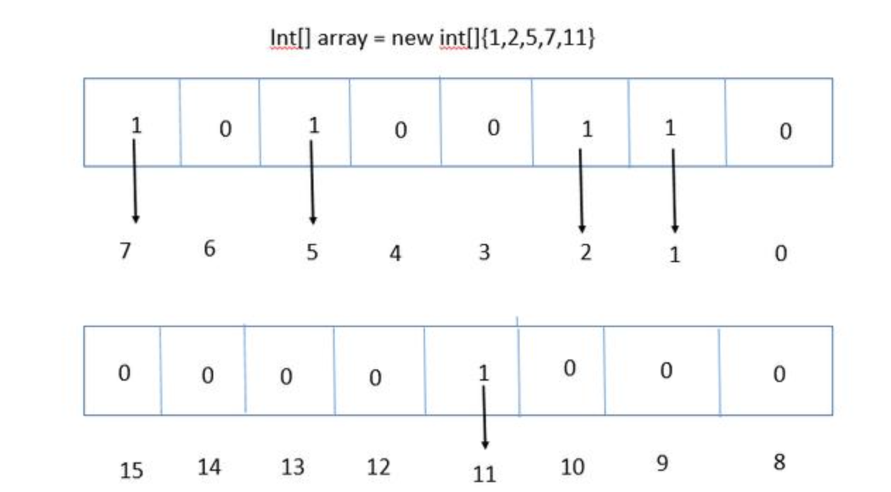
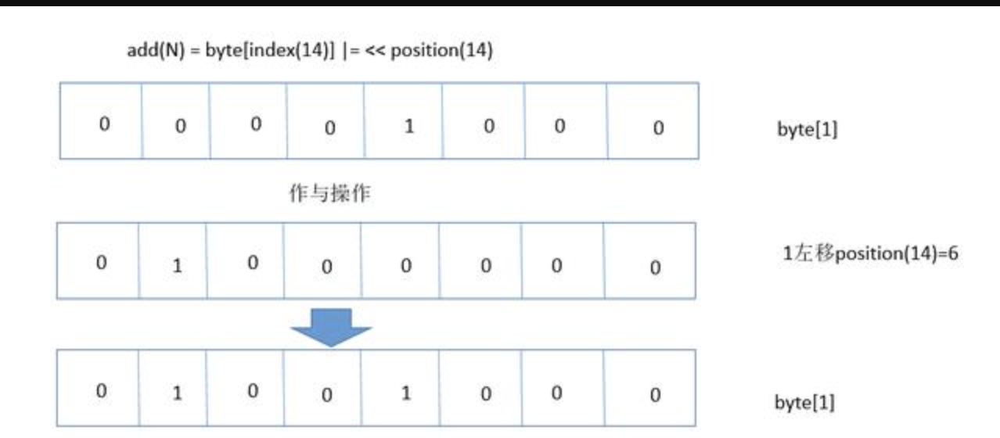
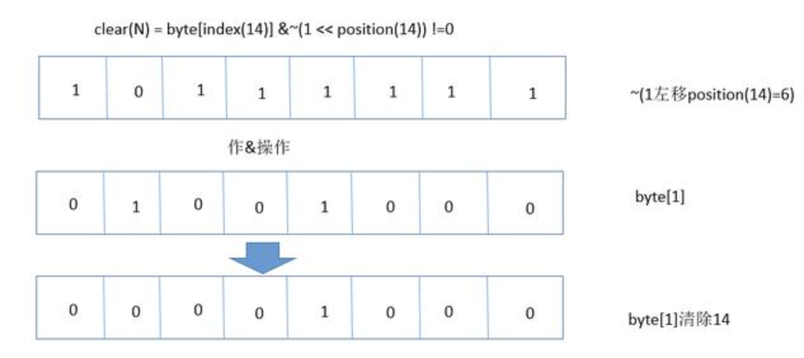
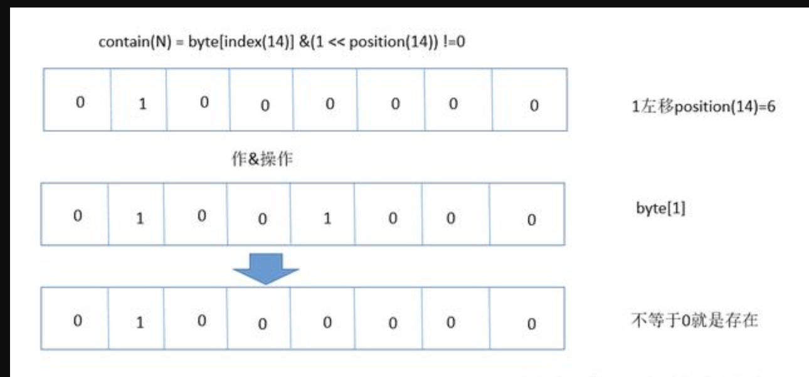

# BitMap数据结构详解

## 问题案例:

### (1).腾讯40 亿个 QQ 号码如何去重？内存限制1G.

### (2).40亿个互不相同的QQ号码排序?内存限制1G.

### (3).40亿个互不相同的QQ号码，求这些QQ号码的中位数?内存限制1G.

### (4).文件中有40亿个互不相同的QQ号码，求这些QQ号码的top-K?内存限制1G.

### (5).文件中有80亿个QQ号码，试判断其中是否存在相同的QQ号码，内存限制1G.

## 问题引入:

有一个无序有界的int数组

```java
int[] 数组={1,2,5,7}
```

初步估计占用内存 

```shell
4 x4=16字节
```

**因为一个 int 占用4个Byte(1Byte=8bit),这里只有4个数**

****

可以很快找到需要的数。

**但是假如有10亿个这样的数呢?**

10亿个不重复并且没有排过序的无符号的int整数，给出一个整数，找出给定的某个数,怎么办?

### 需求分析：

#### 方案一: 使用大内存

**Int**类型在Java中的存储占用 **4个Byte=32Bit** 。[内存单位详解](memory-unit)

**10亿 x 4 / (1024 x 1024 x 1024) = 3.72G左右。**

```shell
10亿=1,000,000,000

10亿个int= 10亿 x 4 btyes

1G  = 2 ^ 30 bytes = 1024 bytes x 1024 bytes x 1024 bytes
1M  = 2 ^ 20 bytes = 1024 bytes x 1024 bytes
1KB = 2 ^ 10 bytes = 1024 bytes
```

**缺点:**

这样的一个大的数据做查找和排序，内存也一定崩溃

#### 方案二: 存盘

这些数据可以不用一次性加载而是存盘.

**缺点:**

存盘必然消耗IO。

我们要求的是高性能，这个方案直接不考虑。

#### 方案三:  用BitMap思想来解决问题

```java
1byte = 8bit
```

- **如果每一个bit的值就是: 有或者没有，也就是二进制的0或1**

- **如果用bit的位置代表数组值: 0代表没有，1代表没有**

如图:



**那么10亿的数据所需的空间就是3.72G/32**  ( 一个int需要4byte保存, 4byte=4 x 8 = 32bit)

****

- 节省32倍的空间:一个占用32bit的数据现在只占用了1bit

- 排序:时间复杂度变成了O(1) 

这样的数据之间没有关联性，要是读取的，可以用多线程的方式去读取。

时间复杂度方面也是O(Max/n)，其中Max为byte[]数组的大小，n为线程大小。

#### 三、应用与代码

**我们先搞清楚一个问题.**

一个数怎么快速定位它的索引号，也就是说搞清楚**byte[index]的index**是多少，**position**是哪一位

**例如: add(14)**.  

14已经超出byte[0]的映射范围，在byte[1]范围之类。那么怎么快速定位它的索引呢。

如果找到它的索引号，又怎么定位它的位置呢。

```shell
 Index(N)代表N的索引号
```

```shell
 Position(N)代表N的所在的位置号。
```

- **Index(N) =  N/8  = N >> 3;**
- **Position(N) = N%8 = N & 0x07;**

**(1) add(int num)**

要向bitmap里add数据该怎么办呢?

add的目的是为了将所在的位置从0变成1.其他位置不变.



#### 实例代码：

```java
public void add(int num){ 
        // num/8得到byte[]的index 
        int arrayIndex = num >> 3;  

        // num%8得到在byte[index]的位置 
        int position = num & 0x07;  

        //将1左移position后，那个位置自然就是1，
        //然后和以前的数据做|，这样，那个位置就替换成1了。 
        bits[arrayIndex] |= 1 << position;  
    } 
```

**(2) clear(int num)**

对1进行左移，然后取反，最后与byte[index]作与操作。



#### 实例代码：

```java
public void clear(int num){ 
        // num/8得到byte[]的index 
        int arrayIndex = num >> 3;  

        // num%8得到在byte[index]的位置 
        int position = num & 0x07;  

        //将1左移position后，那个位置自然就是1，然后对取反，再与当前值做&，即可清除当前的位置了. 
        bits[arrayIndex] &= ~(1 << position);  

    } 
```

**(3) contain(int num)**



#### 实例代码：

```java
public boolean contain(int num){ 
       // num/8得到byte[]的index 
       int arrayIndex = num >> 3;  

       // num%8得到在byte[index]的位置 
       int position = num & 0x07;  

       //将1左移position后，那个位置自然就是1，然后和以前的数据做&，判断是否为0即可 
       return (bits[arrayIndex] & (1 << position)) !=0;  
   } 
```

#### 全部代码:

```java
public class BitMap { 
    //保存数据的 
    private byte[] bits; 

    //能够存储多少数据 
    private int capacity; 


    public BitMap(int capacity){ 
        this.capacity = capacity; 

        //1bit能存储8个数据，那么capacity数据需要多少个bit呢，capacity/8+1,右移3位相当于除以8 
        bits = new byte[(capacity >>3 )+1]; 
    } 

    public void add(int num){ 
        // num/8得到byte[]的index 
        int arrayIndex = num >> 3;  

        // num%8得到在byte[index]的位置 
        int position = num & 0x07;  

        //将1左移position后，那个位置自然就是1，然后和以前的数据做|，这样，那个位置就替换成1了。 
        bits[arrayIndex] |= 1 << position;  
    } 

    public boolean contain(int num){ 
        // num/8得到byte[]的index 
        int arrayIndex = num >> 3;  

        // num%8得到在byte[index]的位置 
        int position = num & 0x07;  

        //将1左移position后，那个位置自然就是1，然后和以前的数据做&，判断是否为0即可 
        return (bits[arrayIndex] & (1 << position)) !=0;  
    } 

    public void clear(int num){ 
        // num/8得到byte[]的index 
        int arrayIndex = num >> 3;  

        // num%8得到在byte[index]的位置 
        int position = num & 0x07;  

        //将1左移position后，那个位置自然就是1，然后对取反，再与当前值做&，即可清除当前的位置了. 
        bits[arrayIndex] &= ~(1 << position);  

    } 

    public static void main(String[] args) { 
        BitMap bitmap = new BitMap(100); 
        bitmap.add(7); 
        System.out.println("插入7成功"); 

        boolean isexsit = bitmap.contain(7); 
        System.out.println("7是否存在:"+isexsit); 

        bitmap.clear(7); 
        isexsit = bitmap.contain(7); 
        System.out.println("7是否存在:"+isexsit); 
    } 
} 
```

**总结：**

**Bitmap**典型的应用场景为：大量数据的**快速排序、查找、去重**

其被广泛用于数据库和搜索引擎中，通过利用位级并行，它们可以显著加快查询速度。

但是，**位图索引会占用大量的内存**，因此我们会更喜欢**压缩位图索引**。


常用的bitmap压缩算法有Oracle’s BBC、WAH、Concise、Roaring。前三者都是基于run-length encoding的思路，RLE的思路是说对于重复出现的值，通过值加上重复出现的次数表示，从而到达数据的压缩

[bitmap压缩算法对比](https://bug1874.com/03-22-2017/bitmap-compress-algorithm.html)

https://blog.csdn.net/njpjsoftdev/article/details/52955638https://blog.csdn.net/njpjsoftdev/article/details/52955638
