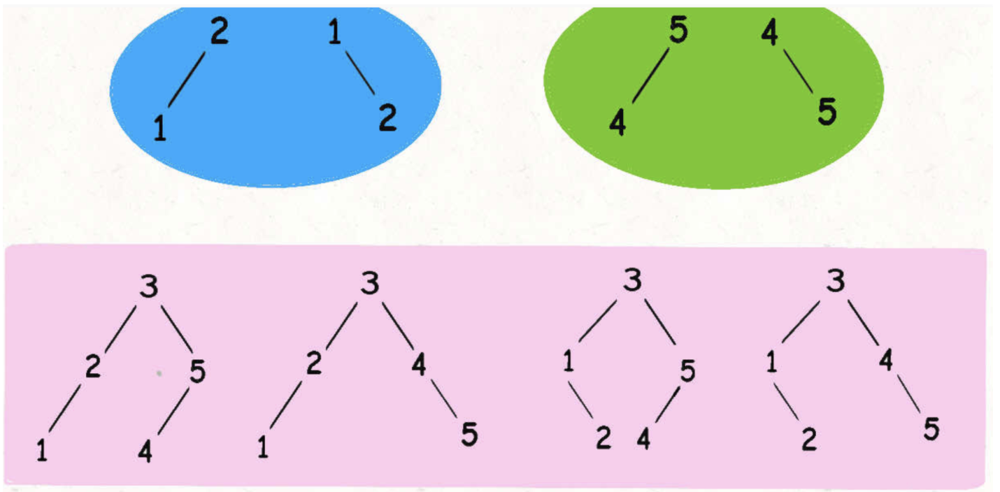

Given an integer `n`, return *the number of structurally unique **BST'**s (binary search trees) which has exactly* `n` *nodes of unique values from* `1` *to* `n`.

**Example 1:**


```
Input: n = 3
Output: 5
```

**Example 2:**

```
Input: n = 1
Output: 1
```

**Constraints:**

- `1 <= n <= 19`


**Before implementing this functionality, we have to have clear a clear understanding of the implementation of combination algorithm.**

Because we are based on the combination algorithm,

I am not going to go into detail here,i provide an implementation here,read this code we have to understand the realization principle of  implement combination algorithm

```jsx
/**
 *  e.g: javascript 

 var output = [];
 getC([1,2,3], 2, 0, [], output);
 console.log(output);

 0: (2) [1, 2]
 1: (2) [1, 3]
 2: (2) [2, 3]

---------------------------
recurision step:
start = 0, init=[]
start = 1, init=[1]
start = 2, init=[1,2]
start = 3, init=[1,3]
start = 2, init=[2]
start = 3, init=[2,3]
start = 3, init=[3]

 */
function getC(array, size, start, init, output) {
    console.log(`start = ${start}, init=${JSON.stringify(init)}`)
    if (init.length >= size) {
        output.push(init);
    } else {
        for (let i = start; i < array.length; i++) {
            getC(array, size, i + 1, init.concat(array[i]), output);
        }
    }
}
```

The detail of the recursive process:


# Let's analyze this problem

For example, input

```jsx
n=3
```

The algorithm should return **5**

**Cos there are five different BST storage structures.the specific structure is as follows:**


In fact, the essence of this problem is **exhaustion**

## First of all, let's make it clear that there are several cases of the root node

- there are obviously five root node in the example,  cos every number can be the root node
- If we choose **`3` as the root node, the left subtree is the combination of `{1,2}` and the right subtree is combination of  `{4,5}`**
- The multiplication of the number of combination of the left subtree and the number of combination of right subtree is the number of BSTs when 3 is the root node




**we now understand his combination, but how to calculate it?**

In fact, all you need is **recursion**

```java
// definition: the number of the close interval [start,end],
//which can be combined into count(int start, int end) BSTs
int count(int start, int end){}
```